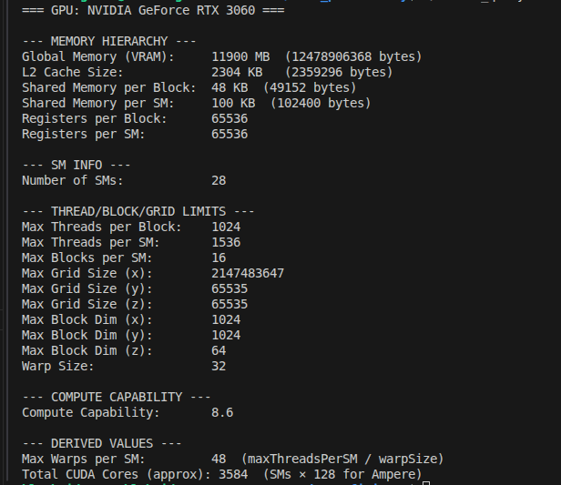

A cuda-enabled parallel computing system includes both hardware and software components,and here we deal with the necessary hardware component ----> " a CUDA-enabled GPU " .

# GPU Computing Ecosystems

This document highlights the differences between the primary high-performance GPU programming stacks: NVIDIA's CUDA, AMD's ROCm, and Intel's oneAPI.

## Comparison Summary

| Feature | NVIDIA | AMD | Intel |
| :--- | :--- | :--- | :--- |
| **Primary Stack** | CUDA | ROCm | oneAPI |
| **Programing Language** | CUDA C++ | HIP / C++ | SYCL / C++ |
| **Portability** | Fixed (NVIDIA only) | High (Can run on NVIDIA/AMD) | Universal (CPU, GPU, FPGA) |
| **Library Maturity** | Industry-leading | Very Strong (AI-focused) | Growing (Science-focused) |
| **Best For** | Max performance, AI Training | Cost-effective AI, Open source | Cross-platform, Enterprise |

### NVIDIA: CUDA (Proprietary)

CUDA is the industry standard for high-performance computing, but it is locked to NVIDIA hardware. It offers the most mature ecosystem with highly optimized libraries like cuBLAS and cuDNN.

### AMD: ROCm & HIP (Open/Portable)

AMD uses ROCm as its primary stack. The **HIP (Heterogeneous-computing Interface for Portability)** C++ runtime allows developers to write code that can run on both AMD and NVIDIA GPUs. The `HIPIFY` tool can automatically port most CUDA codebases to HIP.

### Intel: oneAPI & SYCL (Universal)

Intel's oneAPI aims for cross-architecture unity (CPUs, GPUs, and FPGAs). It uses **SYCL**, a standard-based C++ programming model that is fully hardware-agnostic.

---

1.First,we should start on how to determine if our system has a cuda-enabled GPU or not ,and this procedure depends on operating system (windows,OS X , Linux) that applies to your system ;

### Checking for CUDA-enabled/NVIDIA GPU on Windows

---> Right-click on the desktop,if th epop-up menu doesnt have an entry for the " NVIDIA Control Panel "  ,then read "Upgrading Compute Capability" topic below ,and if  " NVIDIA Control Panel " is available , click to open it and then click the " Home " icon  , and a sample "Home window " is shown , the bottle line of the green " NVIDIA CONTROL  Panel" rectangle shows the model of the NVIDIA GPU installed on the system(ex : Geforce RTX 3060) and once identified the GPU model , proceed to the topic "Determining Compute Capability" below .

### Checking for CUDA-enabled/NVIDIA GPU on OS X

---> From the Apple menu,select "About This Mac" where the "Displays" tab provides information about both the monitor and GPU on your system , note the model of your graphics  card (gpu-graphics processing unit) (if you  have one) and proceed to the topic  "Determining Compute Capability" below , and if no NVIDIA GPU is listed , proceed to the section on "Upgrading Compute Capability" below .

### Checking for CUDA-enabled/NVIDIA GPU on Linux

From the command line [which can be accessed under Ubuntu via the keyboard shortcut Ctrl+Alt+t],enter the following command :

" lspci | grep -i nvidia "

---> to produce a list of peripheral  devices installed on your system ("ls" is short for "list" and "pci" is the "communications-bus" that connects between the CPU and peripheral devices such as your graphics card(GPU) and  "-i" flag is given to "grep" to ignore the case-sensitivity of the search term "nvidia" , and "grep" is a command that searches for a specific pattern in a file or stream of text and the full list of installed PCI devices  is piped to "grep" ---> the pattern-matching tool,to search the list for nvidia in a case-sensitive manner,as indicated by " -i " )

-on a typical system it produced the following output :

" 01:00.0 VGA compatible controller: NVIDIA Corporation GA106 [GeForce RTX 3060 Lite Hash Rate] (rev a1) " ---> indicating the presence of a GeForce RTX 3060  graphics card  ,
and if your system has no installed NVIDIA card,proceed to the topic "Upgrading-Compute-Capability" below or else if you do have installed NVIDIA card ,note the model and proceed to the section -
-on "Determining-Compute-Capability" below .

### Determining Compute Capability of  NVIDIA-GPU on Linux

---> to find the compute capability of an NVIDIA-GPU on Linux , you can use several tools epending on whether you have the NVIDIA driver or the full CUDA Toolkit installed :

1. Using nvidia-smi (If you have the NVIDIA driver installed (even without the full CUDA Toolkit), use this command and best for drivers only) :

Command : " nvidia-smi --query-gpu=compute_cap --format=csv  "
 and if you want name too of that gpu/graphics-card ---> you can try this command :
 command : "nvidia-smi --query-gpu=name,compute_cap --format=csv "
 --->outputs the GPU name and its compute capability (and this specific query field requires CUDA Toolkit 11.6+ or modern-drivers ,check  "nvidia-smi --help" for more details )
  and without that " --format=csv " flag too, you can try ,it will give the same result , and  if any doubts on these commans ,use this command : " nvidia-smi --help "

1. Using "deviceQuery" (Best for CUDA Toolkit) :
--->If you have the CUDA Toolkit installed , NVIDIA provides a utility specially for detailed hardware information ,
--->Location : Usually found at " /usr/local/cuda/extras/demo_suite/deviceQuery "
try this command : " /usr/local/cuda/extras/demo_suite/deviceQuery | grep "Capability" "if its cuda-12.8 --->mention cuda-12.8 instead of just "cuda" and if its cuda-13.0 that u r having,mention cuda-13.0 insead of just "cuda" in above command ,and so on ...,
--->this directly shows the  "CUDA Capability Major/Minor version number " (ex: the terminal might show "8.6" in which 8 is the major version number and 6 is the minor version number, and both of these version numbers tells us the Architecture Generation and incremental improvements respectively (search in nvidia documentaions for more info )) ,

2. Using "nvcc" (To check supported architectures) :
---> To see which compute capabilities your installed compiler can target for building software :
use this command : " nvcc --help | grep -A 20 "gpu-architecture" "
and if you want to  make sure your terminal always points to the correct and newest CUDA version without typing long paths , run this command to see where your system thinks nvcc is living :
command : "which nvcc"
(ex : a terminal might output : " /usr/local/cuda-13.0/bin/nvcc " --->indicating the system is using cuda-13.0) and

### Quick Reference : Compute Capabilities of NVIDIA GPU's

| GPU Architecture | Compute Capability | GPU Models |
| :--- | :--- | :--- |
| Tesla | 1.x | Tesla C1060 |
| Fermi | 2.x | GTX 500 series |
| Kepler | 3.x | GTX 700 series (some models) |
| Maxwell | 5.x | GTX 900 series |
| Pascal | 6.x | GTX 10 series, Titan X (Pascal) |
| Volta | 7.0 | Tesla V100 (The first "Tensor Cores GPU") |
| Turing | 7.5 | RTX 20 series, Titan RTX, T4 (RTX was born here) |
| Ampere | 8.0, 8.6 | RTX 30 series, A100 |
| Ada Lovelace | 8.9 | RTX 40 series/L-40S |
| Hopper | 9.0 | H100, H200 |
| Blackwell | 10.0 | B100, B200 |

if the OS is other than linux then : visit "<https://developer.nvidia.com/cuda-gpus>"  and then go to the appropriate column  to find the compute capability of your GPU ;  

### Hardware Nomenclature

--->Names like Geforce RTX 3060 actually designate a graphics card ,   not gpu itself , in this case the graphics card includes a model GA106 gpu that has "Ampere class architecture " and compute-capability 8.6 , but when discussing CUDA  hardware , there are 4-major designations :
1.Model name (ex : Geforce RTX 3060) ;
2.Model number (ex : GA106 chip) ;
3.Compute capability (ex : 8.6) ;  
4.Architecture class (ex : Ampere class architecture) .  

now you may ask a doubt like whats this model number?Is that chip is what we mean by actual gpu or what?Can i say i have a GA106 chip or GA106GPU?or else both are different or same?or else all thjose 4 components/designations mentioned above are combinedly a GPU?or else Geforce RTX 3060 is a what the real GPU?if no t,whats this GeForce RTX 3060 called?
---> see for all the questions asked above, we shouldnt get confused and mix things up ,for clear clarity we should move ourselves from "Consumer language"(what gamers say/call) to "Engineer Language"(what CUDA developers say) :

# 1.The GeForce RTX 3060 is the Graphics card

In professional circles , this is the Card or the Board (or sometimes just "the GPU" in casual conversation) ,
---> what it is : The physical product you hold in your hand, and it includes GA106 chip,the 12GB of VRAM chips,the fans,the plastic shroud,the RGB lights, and the HDMI ports ,
---> Analogy : Think of it like a "Computer" (the whole box with fans, lights, and ports) vs the "CPU" (the chip inside)  or else this is a car (the whole body with wheels,seats,lights,and ports) vs the engine (the chip inside) ,
---> So, when you say "I have a GeForce RTX 3060", you are referring to the entire graphics card (the whole package) , not just the chip inside it .

# 2.The GA106 is the GPU (The chip/gpu chip)

when the author says "GPU" ,he is specifically talking about the silicon chip soldered onto the center of that board ,
---> what it is : This is the "brain ", and its the actual square piece of silicon where the math happens and with this chip in a system, one can absolutely say,"I have a GA106 GPU ",thats 100% technically correct, but its better to say "I have GA106 chip" or "I have GA106 GPU chip" to avoid confusion ,
---> So, when someone says "I have a GA106 GPU", he/she is referring to the actual silicon chip (the brain) , not the entire graphics card (the whole package) ,
---> Analogy : Think of it like a "CPU" (the chip inside) vs a "Computer" (the whole box with fans, lights, and ports/Graphics card) or else this is an engine (the chip inside) vs a car (the whole body with wheels,seats,lights,and ports/Graphics card) .

# 3.Ampere is the Architecture

This is not a physical thing you can touch; it is the blueprint design ,

  ---> What it is: It describes how the transistors inside the GA106 are organized. Every GA106 chip is built using the Ampere blueprint ,
  ---> Analogy: This is the Technology Platform (e.g., "Internal Combustion Engine technology") .

# 4.Compute Capability is the Feature Set

Think of this as the Software Version of the Hardware.

   ---> What it is : It tells the compiler (nvcc) what "tricks" the GA106 can do. It’s like a list of supported commands.
   ---> Analogy : This is the Fuel Requirement or the Operating Manual (e.g., "Requires 93 Octane fuel").

# 5.What does the author mean by GPU?

When the author says, "Names like GeForce RTX 3060 actually designate a graphics card, not the GPU itself," he means:

The GPU is the GA106 , and he wants us to stop thinking about the "Box Name" and start thinking about the "Silicon Name"
Why? Because of "The Mix-up" :
NVIDIA sometimes puts different GPUs inside the same Card Name :

   ---> Some RTX 3060 Cards were made with a GA106 GPU , and other RTX 3060 Cards were made with a "cut down" GA104 GPU (a bigger chip that was slightly broken, so they disabled parts of it to make it act like a 3060),
and if we are the engineers writing a low-level driver, we shouldn't care what  that the box says "3060" or some other thing ,we just  need to know if we are talking to a GA106 or a GA104 ,
so,
He is warning us that one name doesn't tell the whole story,
For example :  there are two versions of the RTX 3060 , one has a GA106 chip and one has a GA104 chip,and they are both called "RTX 3060" on the box, but their "internal designation" is different,
---> whas the difference btn gpu's of different architectures :
(ex : Geforce RTX 3060's GA106 gpu vs ADA RTX 6000's AD102 gpu) :
    Ampere Architecture gpu's ranges in  compute capabilities from 8.0 to 8.6  and -

- Ada Lovelace Architecture (like the RTX 6000 Ada) is CC 8.9 ,

NVIDIA chose the version number 8.9 for "Ada" because it is a massive evolution of Ampere (8.x), but not a "ground-up" total rewrite like 9.0 (Hopper) , and t understand the differences btn two diff architectures gpu's ,lets first understand the differnces btn two same architectures gpu's :  
The Difference in "DNA" :
If two cards are both 8.6 (here  are the specific GA10x series chips used in each card:

    RTX 3090 / 3090 Ti : Uses the GA102 chip (specifically GA102 ) ; 
    RTX 3080 / 3080 Ti : Uses the GA102 chip (specifically GA102 ) ; 
    RTX 3070 / 3070 Ti : Uses the GA104 chip ; 
    RTX 3060 / 3060 Ti : Uses the GA106 or GA104 (for Ti variant) chips ) ; 

    The Layout (DNA) is IDENTICAL :  all of the  above chips (GA102,GA104,GA106) have the exact same "blueprint" for a single Streaming Multiprocessor (SM) , those all  handle math the same way , but 
    The Quantity is DIFFERENT :  Think of it like a Hotel ,  the 3060 is a hotel with 28 rooms (SMs) and  the 3080 is the same hotel design , but it has 68 rooms (SMs) , 
    The Structure : The "hallways" (data paths) and "utilities" (cache) are the same , there are just more of them in the higher-end card , 
    Small chip (GA106 / RTX 3060) vs Large chip (GA102 / RTX 3090) : 
    To understand the physical performance difference despite having the identical 8.6 Compute Capability, we look at the hardware engineering specifications:
    
    ---> GA106 (RTX 3060): 28 SMs, 192-bit Memory Bus, ~170 Watts TDP.
    ---> GA102 (RTX 3090): 82 SMs, 384-bit Memory Bus, ~350 Watts TDP.
    
    *What does "192-bit" vs "384-bit" Memory Bus Width mean physically?*
    The term "bus width" refers directly to the literal number of microscopic copper wire traces precisely printed into the PCB (Printed Circuit Board). These traces govern communication by electrically connecting the central GPU processor to the surrounding GDDR VRAM (Video RAM) memory modules. 
    
    *   **192-bit**: Geometrically, there operate exactly 192 distinct physical copper wire lines linking the GPU to the memory. Consequently, during a single synchronized clock microsecond pulse, precisely 192 isolated electrical data bits (composed of logical voltages 1s and 0s) are transferred into the GPU in parallel.
    *   **384-bit**: This architecture comprises exactly 384 individual physical copper wire lines. It is referred to as "wider" purely geographically: etching 384 separate parallel copper lanes across the circuit board physically consumes significantly more spatial silicon area and wiring real estate than routing 192 lanes.
    
    *Why does this strictly dictate performance?* 
    In memory-bound algorithms common to CUDA programming, calculating speed is governed by how fast memory matrices reach the multiprocessors. By utilizing twice as many physical connecting wires, the 384-bit architecture structurally transmits double the exact volume of electrical data per clock cycle compared to the 192-bit architecture. Therefore, although both chips interpret the same architectural instruction subset (Compute Capability 8.6), the larger chip computes datasets overwhelmingly faster because its computational cores are never structurally starved waiting for data transmission across the PCB.
    
    Consequently, though the assigned compute capability classification remains identical, the actual computation time experienced scaling real workloads will differ substantially predominantly due to these disparate quantities of SMs, parallel memory bus wiring lane counts, and thermal power caps. , and then , 
    both of these are CC 8.6 , this means they speak the exact same dialect of the Ampere language : 
    the 3090 just has more "mouths" (cores) speaking it at the same time  whereas the 3060 has fewer "mouths"(cores) but the words they say are identical ,  
    ---> Why do they do this : 
    It's about manufacturing yield ,it is very hard to bake a "perfect" giant chip without a single dust particle ruining it and it's much easier to bake smaller chips ,so, they design a "Family" of chips (GA102, 104, 106) that all speak the same language (CC 8.6) but have different "muscle" levels , 

and now you may ask  doubt  What changes when the "Architecture" changes (8.6 ---> 8.9)?
When we move from Ampere (8.6) to Ada (8.9), the actual "DNA" changes :

    New Features: Ada added "Shader Execution Reordering" (SER) ,  Ampere physically cannot do this and ,it’s like adding a new brain function ; 
    Instruction Efficiency: A single core in an 8.9 chip might be 2x faster at a specific type of AI math than a core in an 8.6 chip, even if they are clocked at the same speed ; 
    The Version Number: That’s why the book focuses on CC , and  if you write code using an "89-only" feature, your 8.6 card will say : "I don't speak that language" ,

 . The Relationship: Architecture vs. Compute Capability

    Architecture (Ampere) : This is the Generation, it defines the broad "How-To" manual and it says : "All Ampere cards will have 3rd Gen Tensor Cores and 2nd Gen RT Cores" , 
    Compute Capability (8.0 vs 8.6) : This is the Version Number of the instruction set,and it tells you exactly what "extra features" or "limitations" the specific chip has , 

2. Why does the RTX 3090 have CC 8.6 while an A100 has CC 8.0 ?
It sounds backwards, right? Usually, a higher number is better,but in the world of NVIDIA, these numbers often represent specialization ,
---> Compute capability 8.0(ex : NVIDIA A100) is used for Data center/AI/supercomputing applications with huge(164 KB) shared memory per SM , and with large L1 cache size,optimized for FP64(double-precision) math speed , whereas Compute-capability 8.6(ex : an NVIDIA RTX 3060/3090) is specially targeted audience of gamers/creators/local workstations with smaller(100 KB) shared memory per SM and smaller L1-Cache size and optimized for FP32(single-precision) math speed ,

The Difference :

    CC 8.0 (The Scientist) : The A100 GPU  is built for massive scientific simulations (like weather or physics) and it needs a massive "desk" (Shared Memory) to hold data while it works ,whereas 
    CC 8.6 (The Gamer/Worker) : the RTX 3060 is built for speed , and it has a slightly "newer" instruction set (hence .6) that allows it to process twice as many FP32 operations per clock cycle compared to the older 8.0 design, but it has a smaller "desk" (Shared Memory) ,

3. What changes when CC changes (but Architecture stays the same) ?
When the CC version moves from 8.0 to 8.6, the "Core Blueprint" stays the same, but three main things can change:

    Register Count / Shared Memory : The amount of fast, on-chip memory available to each thread might grow or shrink ,  this is the biggest headache for programmers because it changes how many "workers" (threads) we can fit on a chip at once ; 
    Throughput Ratios : An 8.6 card might be able to do 128 math operations per cycle, while an   8.0 card does 64, and  the "language" is the same, but the "speed" of certain math operations is tuned differently; 
    Specific Instruction Support : Sometimes, a .x update adds a tiny new feature ,  for example, CC 8.6 added specialized hardware support for "Asynchronous Copy" from global memory to shared memory , 

4. How does this affect OUR code ?
If you are writing CUDA code :

    If you compile for Compute 8.0, it will run perfectly on your 8.6 card (it’s "backwards compatible").
    If you write code specifically using a feature found only in 8.6, it will crash if you try to run it on an A100 (CC 8.0).

So,the 4-major designations of a GPU :
1.Marketing Name ---> GeForce RTX 3060 --> (the Card or Board and this is what we buy at the store,it tells us the physical size and the number of fans) ;  
2.Silicon ID ---> GA106 ---> The GPU ( The Chip and a single "Card" might use different chip versions,and also engineers look at this to see exactly which "Engine" is inside )  ;  
3.Blueprint ---> Ampere ---> The Architecture class (This tells us the "DNA" of the card and it defines the layout of the cores and how they talk to memory and also tells about the generation of the card) ;
4.Instruction Set ---> 8.6 ---> The Compute Capability (Crucial for coding,and this tells us exactly which cuda functions will work and which will crash);

For our purposes , the primary focus is on the graphics card name/Model name/number(becoz that is the most available identifier when inspecting your system or shopping for new hardware) and compute capability (becoz that is what matters for coding and performance) .

### Upgrading Compute Capability

The possibilities for upgrading your compute capability depend on whether your current hardware configuration is set by the manufacturer (typical for Mac and notebooks/laptops) or open for modification (typical for Windows and Linux desktop systems).

#### Mac or Notebook Computer with a CUDA-enabled GPU

If you are using a notebook (laptop) or a Mac, you generally have limited access to installing new hardware components (like a new GPU chip). Therefore, "upgrading" the compute capability usually means purchasing an entirely new system that includes a modern CUDA-enabled card.

Apple uses different GPU vendors, so finding a Mac with an NVIDIA graphics card requires shopping for specific older models, as recent Macs do not support NVIDIA GPUs natively.

For Windows/Linux notebook computers, systems featuring a CUDA-enabled NVIDIA GPU constitute a specific segment of the market, often labeled as "gaming notebooks". A very practical configuration is an **"Optimus"** system:

- An integrated GPU (like Intel) to serve basic display needs (sending graphics to your monitor).
- A dedicated NVIDIA GPU used exclusively for heavy computing (executing CUDA code).

Given the restricted physical space in notebooks, **Power Consumption** becomes the primary constraint before considering any hardware upgrade and detailed info about how this power consumtion is measured and what it means is explained below :

#### Power Consumption, TDP, and Heat Production (In-Depth Physical Explanation)

The book highlights a comparison between high-end mobile GPUs (dissipating ~100W) and a "sweet spot" system (like a GeForce 840M) that consumes only about 30W. To effectively plan software scaling and hardware capability, we must evaluate what these power metrics mean purely physically and mathematically, strictly avoiding loose analogies.

**1. Energy and Power: Joules vs. Watts**

- **Joule (Unit of Energy)**: A Joule is the strict physical measurement of energy transferred or work done. **To physically experience exactly 1 Joule from past experience**: If you hold a small apple (weighing approximately 100 grams) in your hand and lift it straight upward against Earth's gravity by exactly 1 meter, the precise physical effort expended by your muscles to perform that lifting action is exactly 1 Joule of energy.
- **Watt (Unit of Power)**: Power is the *rate* at which energy is used. 1 Watt is defined mathematically as the continuous consumption of **exactly 1 Joule of energy every single second**.
- **Computational Application**: When the specification limits a GPU to **30 Watts**, it means the hardware is drawing exactly 30 Joules of electrical energy from the power supply every single second it operates at maximum load. A high-end GPU rated at **100 Watts** receives and processes 100 Joules of energy per second continuously.

**2. Thermal Design Power (TDP) and Heat Generation**
Due to the First Law of Thermodynamics, energy cannot be destroyed. Because computer chips do not perform external physical mechanical work (like spinning a wheel), nearly 100% of the electrical energy they draw is inherently converted into thermal energy (heat) resulting from electrons moving through electrical resistance within the silicon micro-transistors.

- **TDP (Thermal Design Power)**: The "30W" rating on a specification sheet is specifically the TDP. It defines the absolute maximum amount of thermal energy (heat measured in Watts) that the silicon chip will dissipate when running an intensive 100% utilization workload spanning over all of its CUDA computational cores. By calculating TDP, engineers dictate the maximum physical heat limit the cooling system is mandated to successfully draw away from the hardware.
- **Load vs. Idle Power Draw**: A 30W GPU does not consume 30W continuously at all times. If the GPU is operating at idle (0-5% utilization, such as displaying a static PDF or your desktop wallpaper), it draws significantly less energy, typically settling at only 2 to 5 Joules per second (2-5 Watts). Power consumption scales linearly and approaches the 30W upper threshold only when a dense sequence of CUDA mathematical operations fully engages the streaming multiprocessors.
- **Cooling Physical Limitations**:
  - **30 Watt Systems (The Sweet Spot)**: Continually dissipating 30 Joules of thermal energy per second is low enough that "passive heat dissipation" strategies or tiny low-RPM fans are fully effective. As a result, the physical notebook chassis remains lightweight and audibly quiet.
  - **100 Watt Systems**: A GPU chip dissipating 100 Joules of thermal energy per second within a tightly packed notebook inevitably reaches critical junction temperatures, theoretically capable of fatally melting motherboard solder joints. Removing 100 Joules/sec is extremely difficult; it strictly requires thick copper heat-exhaust ducting alongside massive, high-RPM mechanical fans. Consequently, these notebooks are physically bulky, heavy, and very loud.

**3. Measurement of Battery Capacity: Watt-hours (Wh)**
Because notebook computers operate untethered using direct-current chemical batteries, their storage capacity is quantified as an absolute finite reserve of total energy, not an instantaneous flow rate.

- **Watt-hour (Wh)**: This metric specifically maps to the total mathematical energy required to deliver exactly 1 Watt of power continuously for exactly 1 hour.
- **Physical Calculation Methodology**: If a notebook contains a **60Wh battery**, its internal chemical structure possesses enough total energy reserve to uniformly sustain an output load of 60 Watts for precisely 60 minutes.
  - When the **30W GPU** is saturated at an absolute 100% CUDA load profile, computing the depletion time reveals the battery can independently sustain it for exactly 2 hours `(60Wh ÷ 30W = 2.0 hours)`.
  - Conversely, if driving the **100W GPU** under maximum parallel utilization, the battery's energy reserve will be completely depleted in only 0.6 hours, translating to a runtime of exactly 36 minutes `(60Wh ÷ 100W = 0.6 hours)`.

**4. Grid Electricity Measurement and Financial Cost Calculation**
When connected directly to building mains electricity, the utility metering continuously integrates your instantaneous power demands over the elapsed time interval to generate a financial statement.

- **Kilowatt-hour (kWh) / The "Unit"**: Commercial electricity worldwide is financially billed exclusively by the "Unit". **1 Unit mathematically equals exactly 1 kWh**.
  - 1 KiloWatt = exactly 1,000 Watts.
  - 1 kWh mathematically measures a continuous power draw of 1,000 Joules per second maintained for exactly 3,600 consecutive seconds (1 hour).
  - The total absolute physical energy encapsulated within 1 billed kWh Unit equates to 3,600,000 Joules.
- **Real-World Cost Calculation Formula**:
  - Assume an engineer executes continuous parallel compute jobs leveraging a notebook's 30W GPU at 100% loading for 10 consecutive hours every day.
  - **Daily Base Energy Demand**: `30 Watts × 10 Hours = 300 Watt-hours (Wh)`.
  - **Conversion to Normalized Billing Units**: `300 Wh ÷ 1000 = 0.3 kWh` (representing 0.3 Units tracked by the power meter per day).
  - **Monthly Aggregate Scale**: `0.3 Units/day × 30 days = 9 Units directly allocated per month`.
  - **Financial Impact Assessment**: In regional grids such as TANGEDCO in Chennai (e.g., Besant Nagar), after exceeding any respective subsidized base tiers, domestic metering operates upon progressive pricing bi-monthly slabs. Utilizing an estimated median tier price of ₹6.00 INR per unit:
  - `9 Units × ₹6.00/unit = ₹54.00 INR`. This represents the exact incremental monthly financial liability strictly attributed to powering the silicon GPU under the defined 10-hour daily stress condition.

Mastering CUDA proficiency transcends the codebase; it is crucial to understand that scaling code onto more significant hardware introduces fundamental physical restrictions bound mathematically by Joules, wattage power deliveries, and cooling thermodynamics.

#### Desktop Computer

If you have a desktop PC, upgrading is generally more straightforward as you can install an add-on GPU directly into the motherboard if the chassis has sufficient physical space.

**1. Key Hardware Requirements:**

- **PCIe x16 slots**: Look for these long peripheral connectors on the motherboard. They are often labeled with identifiers like `PCIEX16_1` or `PCIEX16_2` printed directly on the PCB.
- **Power Supply Unit (PSU) Capacity**: Check the total wattage of your power supply (e.g., a 300W PSU is typically sufficient for mid-range cards, but high-end cards require much more).
- **PCIe Power Connectors**: High-performance GPUs require direct power from the PSU via 6-pin or 6+2-pin cables.

**2. GPU Categories for Desktops:**

- **Slot-Powered Cards**: Some entry-level/mid-range cards (e.g., GeForce GTX 750 Ti) draw their full ~60W directly from the PCIe slot and require no additional power cables. These are ideal for compact systems.
- **High-Power Cards**: GPUs like the GeForce GTX 980 or modern RTX series require auxiliary power through dedicated PCIe connectors to ensure stable operation under load.
- **Form Factors**: For extremely small cases, "single-height" or "half-width" cards (like the GeForce GT 620) are necessary to fit the physical volume constraints.

**3. The Dual-GPU Configuration Strategy:**
A professional "luxury" setup involves using two graphics cards simultaneously:

- **Display GPU (Primary)**: A lower-end card (e.g., GT 610) installed in the primary slot to handle the monitor output and OS GUI.
- **Compute GPU (Secondary)**: A higher-end card (e.g., GTX 980) dedicated strictly to executing CUDA kernels.
- **Benefit**: This decoupling ensures the desktop interface remains responsive and "lag-free" even while the compute GPU is running at 100% utilization.

**4. Physical Installation Procedure:**

1. **Shutdown**: Turn off the power and unplug the system. Open the desktop case.
2. **Insertion**: Align the GPU's "tabs" with an available PCIe x16 slot. Note that it only fits in one orientation (with the metal bracket at the back of the case).
3. **Securing**: Push the card firmly into the slot and secure its bracket to the case using a screw.
4. **Powering**: If the card has power sockets, connect the 6-pin or 8-pin cables from the PSU.
5. **Initialization**: Close the case and boot up. The system should recognize the new hardware and download drivers. Verify using the `nvidia-smi` or `deviceQuery` tools.

**5. Verification Resources:**
Before purchasing, select a card of interest and check detailed specifications (wattage, compute capability, and connector requirements) at: [NVIDIA's CUDA GPUs Page](https://developer.nvidia.com/cuda-gpus).

#### Hardware Deep Dive: Slots, Lanes, and Power

To master the hardware setup shown in the documentation (specifically Figure A.3), we must understand the electrical engineering and operating system logic behind these components.

**1. PCIe x16: Full Form and Lane Mechanics**

- **Full Form**: **Peripheral Component Interconnect Express**.
- **The "x16" Designation**: This refers to the number of **Lanes**. A lane is a physical data path consisting of two differential signaling pairs (four wires total).
- **Bandwidth**: Think of lanes like lanes on a highway. An **x16** slot has 16 individual data "highways" working in parallel. An **x1** slot (the small ones mentioned below) has only one. Consequently, an x16 slot can transfer 16 times as much data per clock cycle as an x1 slot.
- **Physical vs. Electrical**: Both the blue (top) and white (bottom) slots in the figure are **physically x16** in length. However, motherboards often differ electrically:
  - **Primary (Top) Slot**: Usually wired for full **electrical x16** speed with a direct path to the CPU.
  - **Secondary (Lower) Slot**: Often wired for **electrical x8** or **x4**. It can hold a large card, but it communicates at a lower speed because it has fewer active copper wires connected to the chip.

**2. The Small Slots: PCIe x1**
The small slots (labeled `PCIe 3.0` in Figure A.3b) located above and below the x16 slots are **PCIe x1** slots.

- **Purpose**: These are for low-bandwidth devices that don't require massive data throughput, such as Wi-Fi cards, sound cards, or extra USB controllers.
- **Layout Logic**: They also provide physical "clearance" space. High-end GPUs have thick heatsinks (often called "dual-slot" or "triple-slot" coolers). These coolers effectively "cover up" the smaller slots underneath them, rendering them unusable but providing the GPU with the air-gap it needs for cooling.

**3. GPU Placement: Standard Practice vs. The "Book" Setup**

- **Performance Standard**: Usually, the most powerful "Compute" GPU is placed in the **top-most slot (`_1`)** for direct-to-CPU lane access and lowest latency.
- **The Figure A.4 setup (GT 610 Top / GTX 980 Bottom)**: The book intentionally reverses this for several practical engineering reasons:
  - **BIOS Display Priority**: Motherboards prioritize the top slot for the initial startup screen. Placing the "Display" card (GT 610) here ensures you always see the boot menu.
  - **Physical Clearance**: High-end cards (GTX 980) are very bulky. Placing them in the top slot can block RAM access or physically hit the massive CPU cooler.
  - **Thermals**: Putting the smaller, cooler card on top and the heavy, hot card on the bottom creates a better thermal gap for the CPU's intake.

**4. Task Allocation: Who controls what?**

- **The OS (Display)**: The operating system (Windows/Linux) allocates tasks based on the **Monitor Connection**. Whichever GPU is physically connected to your screen via HDMI/DisplayPort is the one used by the OS to draw your desktop, mouse icons, and browser.
- **The Programmer (Compute)**: In CUDA programming, you choose the GPU by its index. For example, `cudaSetDevice(0)` or `cudaSetDevice(1)`.
- **Single GPU Mode**: If you have only one GPU, it must **Context Switch**—it rapidly jumps between drawing your desktop and running your math. If your CUDA math is extremely heavy, the desktop will "freeze" or "stutter" because the GPU is too busy calculating to update the mouse cursor position. This is the primary reason engineers use a dual-GPU setup.

**5. Power Connectors: 6-pin and 6+2-pin**
High-performance GPUs like the GTX 980 draw far more power than the motherboard slot can provide (which is capped at **75 Watts**).

- **6-pin Connector**: Supplies an additional **75 Watts**.
- **8-pin (6+2) Connector**: Supplies an additional **150 Watts**. (The "+2" pins are ground sensing pins that tell the GPU it's okay to draw the full 150W).
- **Mandatory Connectivity**: If your GPU has two sockets (e.g., a 6-pin and an 8-pin), you **MUST connect both**. These are not "optional" or "backup" cables. The internal electronics of the card are divided; if one cable is missing, parts of the GPU won't receive power. The system will either fail to boot or the card will crash the moment you try to run any heavy workload.

**6. Physical Anatomy: CPU Location, Gold Plating, and Card Sizing**

- **Locating the CPU**: In Figure A.3 and A.4, the CPU is positioned in the **upper-left quadrant** of the motherboard. It is typically hidden beneath a **massive circular fan and heatsink assembly**.
- **The "Gold" Connectors**: The gold-colored "fingers" at the bottom of the card are actually **Gold-Plated** (typically real 24k gold over copper). Gold is used because it **never oxidizes (rusts)**, ensuring a perfect data connection for the life of the card, and it is a superior conductor for high-speed CUDA data transfers.
- **Card Width (The "Dual-Slot" Confusion)**: You may notice the GT 610 is thin while the GTX 980 is very thick.
  - **Electrical Connection (The "Plug")**: Every GPU—no matter how large—plugs into **exactly one** PCIe connector. It only communicates through that single slot.
  - **Physical Footprint (Single vs. Dual-Slot)**: This term refers to **space usage**, not electrical connections.
    - **Single-Slot (e.g., GT 610)**: A thin card that stays within the boundaries of its own slot.
    - **Dual-Slot (e.g., GTX 980)**: A powerful card with a massive heatsink and fans. While it plugs into only one slot, its body is so thick that it physically **hangs over and blocks** the slot directly beneath it.
  - **The "Parking Space" Analogy**:
    - The **GT 610** is like a **Bicycle** in a parking lot. It parks in its space and leaves the neighbor's space empty.
    - The **GTX 980** is like a **Wide Truck**. Its tires are only in **one** parking space (one electrical connection), but its body is so wide that it **overhangs** into the next space. No other device can use that second slot because the GPU is sitting on top of it.

---> Hardware-Setup completed,next continue with Software-setup topic ,

---
---

# GPU Hardware Deep Dive — Common Doubts Answered

> **Target GPU: NVIDIA GeForce RTX 3060**
>
> - Architecture: Ampere (Compute Capability 8.6)
> - VRAM: 12 GiB GDDR6 (12,288 MiB = 12,884,901,888 bytes physical; CUDA reports ~11,900 MiB available)
> - SMs: 28
> - CUDA Cores per SM: 128 (Total: 3584)
> - Tensor Cores per SM: 4
> - L2 Cache: 2.25 MB (2,304 KB = 2,359,296 bytes)
> - SRAM per SM: 128 KB (split between L1 cache and shared memory)
> - Max Threads per Block: 1024
> - Max Threads per SM: 1536
> - Max Blocks per SM: 16
> - Max Warps per SM: 48
> - Warp Schedulers per SM: 4
> - Registers per SM: 65,536 (256 KB register file)
> - Registers per Block: 65,536
> - Max Grid Size: (x) 2^31 - 1, (y) 65,535, (z) 65,535
> - Max Block Dim: (x) 1024, (y) 1024, (z) 64
> - Warp Size: 32

These specifications were obtained by running [`device_query.cu`](../../device_query/device_query.cu) which uses `cudaGetDeviceProperties()`. See the [actual output screenshot](#device_querycu--actual-output-proof) at the bottom of this document.

---

## What Is Global Memory / VRAM / DRAM?

These are all the SAME thing — the big main memory on the GPU card.

```
Global Memory (VRAM):  12 GiB on the RTX 3060
                       = 12,288 MiB = 12,884,901,888 bytes (physical)
```

This is the GDDR6 memory chips physically soldered onto the GPU card. NVIDIA calls it "global memory" in CUDA. Hardware people call it VRAM or DRAM. Accessible by ALL threads in ALL blocks across ALL SMs. Large but slow.

### Why does CUDA report ~11,900 MiB instead of 12,288 MiB?

The GPU physically has **12 GiB** (12,288 MiB) of GDDR6 VRAM — confirmed by `nvidia-smi` which reports exactly `12288 MiB`. But `cudaGetDeviceProperties().totalGlobalMem` reports what is **available to CUDA programs**, not the raw physical total:

```
nvidia-smi reports:        12,288 MiB  = 12,884,901,888 bytes  (physical total)
CUDA totalGlobalMem:       11,900 MiB  = 12,478,906,368 bytes  (available to CUDA)
Difference:                  ~387 MiB  = 405,995,520 bytes     (reserved by system)
```

The missing ~387 MiB is reserved by:

- **Display/framebuffer** — the GPU is driving the monitor (Xorg, GNOME Shell compositor)
- **Driver internal allocations** — NVIDIA driver reserves memory for page tables, context management
- **Other GPU processes** — any application using the GPU (browsers, compositors, etc.)

This number will change depending on what else is running on the GPU. The physical VRAM is exactly **12 GiB = 12,288 MiB**.

---

## What Is L2 Cache? Why Does It Exist?

```
L2 Cache: 2.25 MB on the RTX 3060
```

L2 cache sits BETWEEN the SMs and VRAM. It's shared by ALL 28 SMs.

### Why not just go directly from VRAM to L1?

Because L1 is PER SM. If SM #0 and SM #15 both need the same data, without L2 they'd BOTH have to go all the way to VRAM (slow). With L2, the data gets cached in one central place. SM #0 reads it from VRAM → gets cached in L2. SM #15 then finds it in L2 (fast) instead of going to VRAM again.

L2 is the "shared middle layer" that prevents every SM from independently hammering the slow VRAM.

### What if data exceeds 2.25 MB?

It does NOT fail. L2 is a CACHE, not storage. It only holds the most recently accessed data. When full, it evicts the oldest/least-used data to make room for new data.

```
Thread reads address A → not in L2 → fetched from VRAM → cached in L2
Thread reads address B → not in L2 → fetched from VRAM → cached in L2
...L2 fills up...
Thread reads address X → not in L2 → fetched from VRAM →
    L2 EVICTS oldest entry → caches X
Thread reads address A again →
    Maybe still in L2 (cache hit = fast!)
    Maybe evicted (cache miss = go to VRAM again, slow)
```

If your working set fits in 2.25 MB → lots of cache hits (fast). If huge → lots of cache misses (slow, goes to VRAM).

### Why only 2.25 MB? Why not more?

Fast memory (SRAM) is expensive to build — takes more silicon area, more power, more money. NVIDIA chose 2.25 MB as a tradeoff for this GPU tier. Other GPUs have different amounts:

```
RTX 3060 (Ampere):   2.25 MB L2
RTX 3090 (Ampere):   6 MB L2
RTX 4090 (Ada):      72 MB L2     ← massive jump!
A100 (datacenter):   40 MB L2
H100 (datacenter):   50 MB L2
```

---

## The 128 KB SRAM Per SM — L1 Cache and Shared Memory

Each of the 28 SMs has its own separate 128 KB SRAM. SM #0's SRAM is completely independent from SM #15's SRAM. Each SM has its own separate physical SRAM circuitry on the silicon die.

```
GPU Die:
┌─────────┬─────────┬─────────┬─────────┐
│  SM #0  │  SM #1  │  SM #2  │  SM #3  │
│ 128KB   │ 128KB   │ 128KB   │ 128KB   │
│ SRAM    │ SRAM    │ SRAM    │ SRAM    │
├─────────┴─────────┴─────────┴─────────┤
│          L2 Cache (2.25 MB)            │  ← shared by ALL SMs
├────────────────────────────────────────┤
│          VRAM (12 GB GDDR6)            │  ← shared by ALL SMs
└────────────────────────────────────────┘
```

### This SRAM is NOT just "L1 cache." It is SPLIT into two parts

The 128 KB physical SRAM chip on each SM is one piece of hardware, but it is partitioned into two different uses:

```
128 KB SRAM on each SM
┌──────────────────────────────────────────┐
│   Part 1: SHARED MEMORY                  │
│   - Programmer-controlled (YOU write code)│
│   - Visible to threads in SAME BLOCK only │
│   - Max configurable: 100 KB per SM       │
│   - Default max per block: 48 KB          │
│──────────────────────────────────────────│
│   Part 2: L1 CACHE                        │
│   - Hardware-controlled (automatic)       │
│   - You write NO code for it              │
│   - Hardware decides what to cache         │
│   - Gets whatever KB is left after shared │
└──────────────────────────────────────────┘
```

### Shared memory — who sees it?

Shared memory is PER BLOCK, not per SM. Each block gets its own private chunk of shared memory. Block 0 cannot see Block 2's shared memory, even if both blocks are running on the same SM. Shared memory is a software-managed fast memory that is accessible only by threads within the same block — threads outside that block cannot access it.

```
SM #0:
  Block 0:  shared_mem_0[...]  ← ONLY Block 0's threads can access this
  Block 2:  shared_mem_2[...]  ← ONLY Block 2's threads can access this

  Block 0's Thread 5 tries to read shared_mem_2? IMPOSSIBLE. Not allowed.
```

### L1 cache — who sees it?

L1 cache is transparent and hardware-managed. No thread writes code saying "read from L1 cache." L1 automatically caches global memory reads for ALL threads on that SM regardless of which block they're in. But threads don't "see" L1 directly — they just read global memory normally and the hardware decides whether L1 has the data or not.

```
// Your code just reads global memory normally:
float x = global_array[i];

// Behind the scenes, hardware does:
// 1. Check L1 cache → found? Return it (fast) → "cache hit"
// 2. Not in L1? Check L2 → found? Return it, also cache in L1
// 3. Not in L2? Go to VRAM → return it, cache in L2 AND L1
```

### Shared memory vs L1 cache — key differences

| | Shared Memory | L1 Cache |
|---|---|---|
| **Who controls it?** | Programmer (you write code to use it) | Hardware (automatic, behind the scenes) |
| **Who sees it?** | Threads in the SAME BLOCK only | All threads on that SM (transparent) |
| **You write code?** | Yes, declare `__shared__` arrays | No, happens automatically |
| **When data lands here** | Only when YOU explicitly copy data | Automatically when you read global memory |

### What does "100 KB shared memory per SM" vs "48 KB per block" mean?

- **48 KB** = default maximum that ONE block can request for its shared memory
- **100 KB** = total shared memory budget for the ENTIRE SM (split among ALL blocks running on that SM)

So 100 KB is the SM-level budget, and 48 KB is the per-block cap within that budget.

### If each block uses 48 KB, how many blocks fit?

```
Total shared memory on SM:  100 KB
Each block requests:         48 KB
100 / 48 = 2.08 → only 2 blocks fit (2 × 48 = 96 KB used)
Remaining: 4 KB of shared memory left (too small for a 3rd block needing 48 KB)
```

So yes, if every block uses 48 KB shared memory, only 2 blocks can run per SM.

### What about the remaining 28 KB (128 - 100)?

That 28 KB is used as **L1 cache**. It is NOT idle. It is NOT L2 cache (L2 is a completely separate chip elsewhere on the GPU). The hardware automatically uses those 28 KB to cache global memory reads transparently. The split is flexible — it adjusts based on how much shared memory your kernel actually uses:

```
Config 1: 100 KB shared memory + 28 KB L1 cache  = 128 KB
Config 2: 64 KB shared memory  + 64 KB L1 cache  = 128 KB
Config 3: 48 KB shared memory  + 80 KB L1 cache  = 128 KB
Config 4: 0 KB shared memory   + 128 KB L1 cache = 128 KB
```

If your kernel uses lots of shared memory, L1 gets smaller. If your kernel uses none, L1 gets the full 128 KB. Yes, if you choose NOT to use shared memory, the hardware just gives you a massive 128 KB L1 cache instead.

### Why do we even use Shared Memory if L1 is automatic? ("Conscious Temporary Storage")

Since L1 is automatic and fast, why bother writing code for shared memory?
Because L1 cache is controlled by the hardware — data can be evicted at any moment if the GPU needs space. Shared memory is **"conscious temporary storage"**. It is a scratchpad that YOU control. Data stays there exactly until your block finishes.

**Example of why this matters:**
Imagine you are multiplying two massive matrices (e.g., 10,000 × 10,000). To calculate just one cell of the output, you need to read 10,000 values from the row of matrix A and 10,000 from the column of matrix B.
If 1024 threads in a block all read from VRAM simultaneously, VRAM chokes.
Instead, using shared memory:

1. Thread 0 reads ONE value into shared memory. Thread 1 reads ONE value. etc.
2. `__syncthreads()` (Wait for all to finish loading a small "tile" of data)
3. Now all 1024 threads compute using the data in shared memory (0 cycle delay, no eviction risk).
4. Move to the next tile.

Shared memory allows threads to **cooperate** on data loads. L1 cache cannot guarantee cooperation because it evicts data randomly.

---

## Threads, Blocks, Grids, and SMs

### Definitions

- **Thread** = smallest unit. One thread executes one copy of your function.
- **Block** = group of threads (up to 1024). All threads in a block run on the SAME SM and can cooperate via shared memory and `__syncthreads()`.
- **Grid** = ALL blocks launched for one kernel. 1 kernel = 1 grid. Can have up to 2^31-1 blocks.
- **SM** = Streaming Multiprocessor. Hardware processing unit. The RTX 3060 GPU has 28 SMs.

### Can an SM run more than one block?

Yes! An SM can run MULTIPLE blocks simultaneously. The limit is on total threads per SM, not on blocks per SM.

- Max threads per block = 1024 (hard limit — a single block cannot exceed this)
- Max threads per SM = 1536 (total across ALL blocks on that SM)

So if each block has 256 threads, one SM can run 1536/256 = 6 blocks at a time. If each block has 1024 threads, the SM can only run 1 block (since 2 × 1024 = 2048 exceeds 1536).

### Where do blocks live?

A block is always assigned to exactly ONE SM. It runs entirely there and never moves to another SM. When it finishes, the SM is free to take the next waiting block from the queue.

A block CANNOT be bigger than what an SM can handle (max 1024 threads per block).

```
SM #0                    SM #1                    SM #2
┌──────────────┐        ┌──────────────┐        ┌──────────────┐
│  Block 0     │        │  Block 3     │        │  Block 1     │
│  Block 2     │        │  Block 7     │        │  Block 5     │
│  Block 6     │        │              │        │  Block 9     │
└──────────────┘        └──────────────┘        └──────────────┘
```

The GPU's hardware scheduler decides which SM gets which block. You don't control this.

### How many blocks per SM?

Multiple limits compete — the TIGHTEST one wins:

1. Max blocks per SM:        16
2. Max threads per SM:       1536
3. Shared memory per SM:     100 KB
4. Registers per SM:         65,536

*(See the "Occupancy and The Tightest Limit: 10 Comprehensive Examples" section at the end of this document for detailed calculations).*

### Grid size (2^31-1) vs SM occupancy (16) — NOT contradictory

It is often noted that we can initialize 2^31-1 blocks, and learned max blocks per SM is only 16. Both are correct but mean different things:

- **2^31-1** = the total number of blocks you can launch in ONE kernel (the API's **software grid limit**).
- **16** = the hardware limit for how many blocks ONE SM can physically execute at any given moment (the **hardware occupancy limit**).

The GPU acts as a queuing system. For an RTX 3060 with 28 SMs, the **absolute maximum hardware concurrency** is 28 SMs × 16 blocks per SM = **448 blocks** executing simultaneously across the entire GPU (assuming the blocks are small enough to hit this limit).

However, you can instruct the API to launch up to **2,147,483,647 blocks**. The hardware scheduler manages the massive queue automatically.

**Let's trace an exact example:**
You write `my_kernel<<<2,000,000, 256>>>()`.

1. You are initializing a software grid of 2,000,000 blocks.
2. Because you chose **256 threads per block**, the "Tightest Limit" rule kicks in. The SM can only handle 1536 threads total.
3. 1536 / 256 = **6 blocks per SM**.
4. Across the whole GPU (28 SMs), the hardware can physically hold **168 blocks resident simultaneously** (28 SMs × 6 blocks).

**The Dynamic Dispatch (The Conveyor Belt):**
The GPU hardware scheduler (the Gigathread Engine) loads the first 168 blocks onto the SMs for execution. The remaining 1,999,832 blocks wait in the hardware queue.
Here is the critical detail: **The SM does NOT wait for all 6 blocks to finish before loading more.**
As soon as *one single block* completes its instructions and frees its threads/registers, the scheduler grabs the very next block from the queue and shoves it onto the SM instantly. It is a continuous, dynamic conveyor belt replacing blocks one-by-one to maintain 100% occupancy.

*(Note on execution time: A single clock cycle only processes ONE instruction for a warp. Because a kernel has hundreds of instructions and memory fetches, it takes thousands or tens of thousands of clock cycles to complete a single block, not just 2 clock cycles).*

### Why do grids and blocks have X, Y, Z dimensions?

A grid doesn't have to just be a flat line of blocks. It can be a 2D or 3D grid. Same for threads inside a block.

**Why? For logical mapping to real-world problems.**

- **1D (X only):** Processing an array of numbers `[1, 2, 3, 4, 5]`
- **2D (X, Y):** Processing an Image (pixels have x, y coordinates) or a Matrix.
- **3D (X, Y, Z):** Processing a 3D medical MRI scan, or fluid dynamics in a 3D box.

If you don't specify dimensions, Y and Z default to `1`. If you don't have a 3D problem, you just ignore Y and Z.

### What are the Dimension Limits and Why?

**Block Dimensions:**

- X Max: 1024
- Y Max: 1024
- Z Max: **64**
- *Total threads (X × Y × Z) cannot exceed 1024.*

Why is Z limited to 64 while X and Y get 1024? This is a **hardware addressing limitation**. Inside the silicon, the GPU uses a 10-bit register to store the X and Y indices ($2^{10} = 1024$), but to save silicon area, it only allocates 6 bits for the Z index ($2^6 = 64$).

**Grid Dimensions:**

- X Max: $2^{31}-1$ (over 2 billion)
- Y Max: 65,535
- Z Max: 65,535

Why are Y and Z grids limited to 65,535 ($2^{16}-1$)? **Legacy architecture.** In very old CUDA architectures (pre-2012), the limit for ALL dimensions was 65,535 because they used 16-bit integers to store grid coordinates. In Compute Capability 3.0, NVIDIA upgraded the X-dimension to a 32-bit integer (allowing 2 billion blocks), but left Y and Z at 16-bit to save space because $65535 \times 65535$ blocks is already massive for 2D/3D grids.

### Threads per SM — 1536 vs 1024?

Both numbers are correct but mean different things:

- **1024** = maximum threads in ONE block. A single block cannot have more than 1024 threads. Hard limit.
- **1536** = maximum threads an SM can manage at the same time. This can come from MULTIPLE blocks.

```
Valid configurations on one SM:
  1 block × 1024 threads = 1024 total   (OK, under 1536)
  3 blocks × 512 threads = 1536 total   (OK, exactly at limit)
  6 blocks × 256 threads = 1536 total   (OK)

  NOT possible:
  2 blocks × 1024 threads = 2048        (exceeds 1536 per SM!)
  1 block × 1536 threads                (exceeds 1024 per block!)
```

---

## What Does `__syncthreads()` Do?

It's a barrier that works ONLY within one block. When a thread hits `__syncthreads()`, it stops and waits until EVERY thread in the same block has also reached that line. Then they all continue together.

```
Block 0 (4 threads):
  Thread 0:  step_A()  →  __syncthreads()  →  step_B()
  Thread 1:  step_A()  →  __syncthreads()  →  step_B()
  Thread 2:  step_A()  →  __syncthreads()  →  step_B()
  Thread 3:  step_A()  →  __syncthreads()  →  step_B()

  Thread 2 finishes step_A first. WAITS at barrier.
  Thread 0 finishes. WAITS.
  Thread 3 finishes. WAITS.
  Thread 1 finishes last. NOW all 4 are at barrier.
  → All 4 proceed to step_B together.
```

**Why is this useful?** If thread 0 writes a result to shared memory in step_A, and thread 3 needs to read that result in step_B, the barrier guarantees thread 0 has finished writing before thread 3 tries to read it.

**Critical rule:** `__syncthreads()` ONLY synchronizes threads WITHIN the same block. It does NOT work across different blocks. Block 0 and Block 1 cannot use `__syncthreads()` to coordinate. For cross-block synchronization: end the kernel and launch another kernel, or use atomic operations.

### What are atomic operations?

An atomic operation is a special hardware instruction that lets multiple threads safely write to the SAME global memory location without corrupting the data. For example, `atomicAdd(&total, value)` means "add a value to the total, and guarantee that no two threads corrupt each other even if they do it at the same time."

---

## 48 Warps But Only 4 Warp Schedulers — What Does "Concurrent" Mean?

The RTX 3060 has 48 max warps per SM and 4 warp schedulers per SM. This means 48 × 32 = 1536 threads concurrently per SM. But if only 4 warps execute per cycle, what does "concurrently" actually mean?

**48 warps = "resident" on the SM.** All 48 have their threads loaded, registers allocated, state stored. They're all sitting in the SM, ready to go.

**4 warp schedulers = at any SINGLE clock cycle, only 4 warps execute instructions.** One warp per scheduler.

**The other 44 warps are WAITING:**

- Waiting for data from global memory (takes 200-400 clock cycles!)
- Waiting at a `__syncthreads()` barrier
- Waiting for a computation result from a previous instruction
- Waiting for their turn in the scheduler

### This is called LATENCY HIDING — the ENTIRE POINT of having 48 warps but only 4 schedulers

```
Clock cycle 1:
  Scheduler 0 → Warp 0: ADD instruction
  Scheduler 1 → Warp 1: ADD instruction
  Scheduler 2 → Warp 2: LOAD from global memory (will take 300 cycles!)
  Scheduler 3 → Warp 3: MUL instruction

Clock cycle 2:
  Warp 2 is STALLED (waiting for memory)
  → Scheduler 2 instantly switches to Warp 4 (which is ready!)
  The switch costs ZERO cycles. No penalty at all.

Clock cycle 3:
  Warp 0 needs memory → STALLED → scheduler switches to Warp 5

...300 cycles later...
  Warp 2's memory data finally arrives → Warp 2 is "ready" again
  Next time a scheduler is free, it picks up Warp 2 and continues
```

**"Concurrent" means:** all 48 warps are loaded and managed by the SM. At any instant, 4 execute and 44 wait. But the scheduler switches SO FAST (every clock cycle if needed) that all 48 make progress over time. It does NOT mean all 48 execute at the same clock cycle.

### 28 SMs × 1536 threads = 43,008 "concurrent" threads

```
Resident (concurrent):    28 × 1536 = 43,008 threads  (loaded, managed, ready)
Actually executing:       28 × 4 × 32 = 3,584 threads (at any one clock cycle)
```

If you launch MORE than 43,008 threads worth of blocks, the extra blocks wait in a hardware queue. As running blocks finish, the GPU assigns waiting blocks to free SM slots.

---

## Warp Execution: Loop Unrolling and Warp Divergence

To truly understand how GPU hardware optimizes code, we must look at how the compiler and the SM execute instructions across threads. Two of the most critical concepts are **Loop Unrolling** and **Warp Divergence**.

### What is Loop Unrolling?

**Loop Unrolling** is an extremely powerful optimization technique performed entirely by the **compiler at compile-time** (long before the code ever reaches the GPU hardware).

A normal loop is computationally expensive because of hidden "bookkeeping" overhead. Let's look at a simple, 4-iteration addition loop:

```cpp
// A simple loop adding 4 numbers
float sum = 0.0f;
for (int i = 0; i < 4; i++) {
    sum += array[i];
}
```

When you write this, you might think the hardware only executes 4 addition instructions. In reality, **every single time** the loop iterates, the hardware must execute several invisible bookkeeping instructions:

1. **The Math:** `sum += array[i]` (The actual useful work)
2. **The Counter Update:** `i++` (Add 1 to `i`)
3. **The Condition Check:** `i < 4` (Is `i` still less than 4?)
4. **The Branch Jump:** `JMP` (Jump the program counter back to the top of the loop)

For a 4-iteration loop, the hardware actually executes **16 instructions** (4 useful additions + 12 bookkeeping instructions). Those bookkeeping instructions do absolutely zero useful math—they just keep the loop machinery turning, wasting precious clock cycles and potentially stalling the execution pipeline.

**How the Compiler Fixes This (Unrolling):**
Because the loop bounds (`i = 0` to `i < 4`) are **constant and explicitly known**, the compiler recognizes this at compile-time. It thinks: *"I know exactly how many times this will run. Why make the hardware jump in circles at runtime?"*

The compiler literally deletes the loop machinery entirely and "unrolls" your code into a straight line, substituting the loop counter `i` with the actual hardcoded values:

```cpp
// How the compiler actually rewrites your code behind the scenes:
float sum = 0.0f;
sum += array[0]; // Iteration 0
sum += array[1]; // Iteration 1
sum += array[2]; // Iteration 2
sum += array[3]; // Iteration 3
```

**Why is it such a massive optimization?**
By removing the `i++` updates, the `< 4` checks, and the `JMP` branches, the execution drops from 16 instructions down to just **4 instructions**.

1. **Zero Overhead:** 100% of the clock cycles are now spent doing actual mathematical work.
2. **No Branching Stalls:** Jump/branch instructions can cause the GPU's instruction pipeline to pause (stall). Straight-line code flows perfectly through the hardware.
3. **Instruction-Level Parallelism:** Because the instructions are laid out flat, the compiler can look ahead and schedule independent memory loads (like grabbing `array[0]` and `array[1]`) to happen simultaneously.

### What is Warp Divergence?

To understand divergence, you must first know what a **Warp** is. On the GPU, threads do not execute independently. The hardware physically groups threads into bundles of 32 called **warps**. All 32 threads in a warp run in **lockstep** — they share a single Program Counter and are forced to execute the *exact same instruction at the exact same time*.

**Warp divergence** occurs when the 32 threads in a warp are forced onto different execution paths.

Imagine you write a `while` loop that stops processing when a specific condition is met, and that condition depends on the specific data each thread is handling (a *data-dependent loop*):

```cpp
// A data-dependent loop
while (data_value != 0) {
    // do work
    data_value = data_value / 2;
}
```

If Thread 0 needs 5 passes through the loop, but Thread 1 only needs 1 pass, what does the hardware do?
Since they are bound together in the same warp, they *cannot* separate. The hardware **serializes** the execution. It forces the warp to keep looping until the *slowest* thread (Thread 0) is completely finished. During passes 2, 3, 4, and 5, Thread 1 is "masked off" — it just sits idle, wasting clock cycles.

This is warp divergence: 32 threads that should have worked perfectly in parallel end up taking turns or waiting on each other, drastically reducing your hardware efficiency.

### The Connection (The Link)

The relationship between these two concepts is fundamental: **You cannot have one without the other.**

1. **If you have Warp Divergence, Loop Unrolling is Impossible:**
If you write a loop whose pass count depends on thread-specific data, the compiler *cannot* unroll it at compile-time because it doesn't know how many times it needs to repeat the code. Because the loop bounds are variable, the hardware must evaluate them at runtime, leading directly to warp divergence.

2. **If you fix the bounds, you kill Divergence and unlock Unrolling:**
By designing your algorithms to use fixed, constant loop bounds, you guarantee that every single thread in the warp runs the loop the exact same number of times. This completely eliminates warp divergence (no thread ever waits for another). Because the loop is fixed, the compiler gains the mathematical certainty it needs to flatten your code into hyper-fast, unrolled instructions.

In short: **Constant loop bounds are the key.** They keep your warps synchronized (killing divergence) while simultaneously allowing the compiler to rip out the overhead (enabling loop unrolling).

**Let's Look at a Direct Example Connecting Both:**

*(For a deeper mathematical dive into this specific problem, see Section **"4. Mathematical Proofs & Loop Edge-Cases"** in `data_accessing_techniques.md`).*

**The Context (The Problem):**
Imagine we have a 3D tensor of shape `[2, 3, 4]`. We want to convert a flat 1D `linear_idx` (like 14 or 2) into 3D coordinates `(depth, row, col)`. To do this, we repeatedly divide by the dimension size and take the remainder.

There are two ways to write the loop that does this:

**1. The "Bad" Way (Stopping when `linear_idx` becomes 0):**

```cpp
while (linear_idx != 0) {
    // Process one dimension
    coord = linear_idx % size;
    linear_idx = linear_idx / size;
}
```

- **Why it seems logical at first:** If our `linear_idx` becomes 0 after peeling off the innermost dimensions, why keep doing math? It seems faster to just stop early.

- **The Reality:**
  - **Thread A** is given `linear_idx = 14`. It takes **3 passes** for the number to reach 0.
  - **Thread B** is given `linear_idx = 2`. It takes **1 pass** for the number to reach 0.
- **The Result on Divergence:** Because Thread B finishes in 1 pass while Thread A takes 3, Thread B is forced to sit completely idle (wasting cycles) while Thread A finishes passes 2 and 3. The warp has **diverged**.
- **The Result on Unrolling:** The compiler looks at this code and says, "I don't know how many times this loop will run—it depends entirely on what `linear_idx` the thread is given at runtime." Therefore, it **cannot** unroll the code. All loop bookkeeping overhead remains.

**2. The "Good" Way (Stopping when all dimensions are completed):**

```cpp
// For a 3D tensor, dims = 3.
for (int d = dims - 1; d >= 0; d--) {
    // Process one dimension
    coord[d] = linear_idx % sizes[d];
    linear_idx = linear_idx / sizes[d];
}
```

- **Why it is mathematically correct:** Even if `linear_idx` reaches 0 early (like for Thread B), we *must* continue the loop to ensure the outermost dimensions explicitly get set to `0` (e.g., coordinate `[0, 0, 2]`). If we stop early, those outer coordinates are left uninitialized (garbage memory)!

- **The Result on Divergence:** Because `dims` is always 3 for a 3D tensor, **Thread A** and **Thread B** both run the loop exactly **3 times**, regardless of what their `linear_idx` is. Both threads execute in perfect lockstep. No one finishes early, no one waits. Warp divergence is **completely killed**.
- **The Result on Unrolling:** The compiler looks at this code and says, "Ah, this loop always runs exactly 3 times for every single thread, guaranteed." It safely deletes the `for` loop machinery and writes the math instructions out 3 times in a straight line (unrolling it).

This is the link: **by forcing the loop to run for all dimensions instead of stopping at 0, we ensure mathematical correctness, kill warp divergence, and unlock loop unrolling all at the same time.**

---

## Tensor Cores vs CUDA Cores for Matmul

A common question arises: if we have 128 CUDA cores but only 4 tensor cores per SM, aren't 4 tensor cores too little for huge matrix multiplications?

**A tensor core is NOT like a CUDA core.** Don't think of "4 tensor cores" as "4 tiny things."

**One CUDA core:** does 1 multiply-add (FMA) per clock cycle. `a*b + c` = 1 operation.

**One tensor core:** does a 4×4 matrix multiply-accumulate in ONE clock cycle. That's 64 multiply-add operations in a single cycle.

```
Per clock cycle comparison:
  128 CUDA cores:   128 × 1 = 128 FMA operations
  4 Tensor cores:   4 × 64  = 256 FMA operations  (at FP16 precision)

  Tensor cores are 2× faster minimum for matrix ops.
```

Tensor cores also work on lower precision (FP16, BF16, INT8, TF32) which further multiplies throughput. So 4 tensor cores is NOT a bottleneck for matmul — each one is a dense matrix engine. That's why deep learning frameworks like PyTorch route all matmul/convolution operations through tensor cores automatically.

---

## Complete Memory Hierarchy — Data Flow

```
                    SIZE            SPEED          WHO ACCESSES IT
                    ────            ─────          ────────────────
  Registers         256 KB total    Fastest        One thread only
       ↑
  L1 / Shared Mem   128 KB per SM   Very fast      Same SM (L1=auto, shared=same block)
       ↑
  L2 Cache          2.25 MB total   Fast           ALL SMs
       ↑
  VRAM (Global)     12 GB           Slow           ALL SMs
```

**Path A — Normal global memory read (automatic):**

```
Thread does: float x = array[i];
Hardware does: Register ← L1 ← L2 ← VRAM (caches along the way automatically)
```

**Path B — Explicit shared memory (programmer-controlled):**

```
1. shared_mem[tid] = array[i]     // load from global → through cache hierarchy → shared memory
2. __syncthreads()                 // wait for all threads in block to finish loading
3. float y = shared_mem[other_tid] // read from shared memory (super fast, no VRAM access)
```

---

## Registers — The Fastest Memory on the GPU

Registers are tiny pieces of ultra-fast storage built directly **inside** the SM's processing circuitry — not in VRAM, not in L2, not in L1/shared memory. They are where threads hold their **working variables** while executing instructions.

Every variable declared in a kernel lives in a register:

```cuda
__global__ void my_kernel(float* data) {
    int idx = threadIdx.x;        // ← 'idx' lives in a register
    float val = data[idx];        // ← 'val' lives in a register (loaded from VRAM)
    float result = val * 2.0f;    // ← 'result' lives in a register
    data[idx] = result;           // ← written back from register to VRAM
}
```

### How big is each register?

Each register is exactly **32 bits = 4 bytes**. One register holds one `int` or one `float`. A `double` (64-bit) needs **2 registers**.

Total register file per SM:

```
65,536 registers × 4 bytes each = 262,144 bytes = 256 KB per SM
```

That 256 KB is the fastest memory on the entire GPU — even faster than shared memory or L1 cache. Access time is **0 cycles** (registers are directly wired to the ALU).

### Where are registers in the hierarchy?

```
                    SIZE            SPEED              WHO SEES IT
                    ────            ─────              ───────────
  Registers         256 KB/SM       FASTEST (0 cycles) One thread ONLY (private)
       ↑
  L1 / Shared Mem   128 KB/SM       Very fast (~30 cy) Same SM (shared=same block)
       ↑
  L2 Cache          2.25 MB total   Fast (~100 cycles)  ALL SMs
       ↑
  VRAM (Global)     12 GiB          Slow (200-400 cy)  ALL SMs
```

Registers are **private to each thread**. Thread 0 cannot see Thread 1's registers. Ever. No sharing, no synchronization — each thread has its own private set of registers allocated when its block starts.

### Why Registers per Block = Registers per SM = 65,536?

Both are 65,536 because:

- **Registers per SM = 65,536** → The SM has a physical pool of 65,536 registers. This is the hardware total.
- **Registers per Block = 65,536** → A single block is ALLOWED to consume up to ALL 65,536 registers on the SM.

This means one block CAN use the entire register file. But if it does, NO other block can run on that SM at the same time (zero registers left for a second block).

```
Case A: One block uses all 65,536 registers
  → Only 1 block fits on the SM
  → Other blocks must wait in queue

Case B: Each block uses 8,192 registers
  → 65,536 / 8,192 = 8 blocks could fit (register-wise)
  → But other limits (threads, shared mem, block count) may be tighter
```

Not all GPUs have this property. On some architectures, the per-block cap is lower than the per-SM total. On the RTX 3060 (CC 8.6), they happen to be equal — meaning no artificial per-block cap on registers.

### How many registers does each thread get?

The **compiler** (`nvcc`) decides this automatically. When compiling a kernel, it counts how many local variables, intermediate values, and temporary results the code needs, and assigns registers per thread.

- **Hard limit**: 255 registers per thread maximum (for CC 8.6). A single thread cannot use more than 255.
- **Typical usage**: Simple kernels use 16–32 registers per thread. Complex kernels might use 64–128.

To check how many registers a kernel uses:

```bash
nvcc --ptxas-options=-v my_kernel.cu -o my_kernel
# Output will say: "Used 32 registers, 0 bytes shared memory" (example)
```

To force a limit (if register pressure is too high):

```bash
nvcc --maxrregcount=32 my_kernel.cu -o my_kernel
# Forces compiler to use at most 32 registers per thread
```

### Wait, how do registers relate to warps?

Registers are actually allocated by the hardware in **warp granularity** (groups of 32 threads), not individually per thread. The hardware rounds UP.

If your code says each thread uses 255 registers:

1. 255 registers/thread × 32 threads/warp = 8,160 registers per warp.
2. The SM has 65,536 total registers.
3. 65,536 ÷ 8,160 = 8.03 → **Only 8 warps can fit.**
4. 8 warps × 32 threads = **256 threads maximum on the SM.**

How those 256 threads are divided into blocks is up to you. You could launch 1 block of 256 threads, or 4 blocks of 64 threads. The result is the same: the SM register pool is completely full, and occupancy is trapped at 256 active threads.

**Is 255 registers per thread a lot of storage?**
255 registers × 4 bytes = 1,020 bytes (≈ 1 KiB) per thread.
That is the absolute maximum "scratchpad" each thread gets for its private variables before it spills over to slow VRAM.

### Who manages registers?

The **compiler** decides how many registers each thread needs at compile time. The **hardware** (SM's warp scheduler) then allocates those registers from the pool at runtime when a block is assigned to an SM.

```
Compile time:
  nvcc analyzes your kernel → decides: "each thread needs 32 registers"

Runtime (block is assigned to SM #5):
  Block 0 has 256 threads
  Each thread needs 32 registers
  Total needed: 256 × 32 = 8,192 registers
  SM #5 allocates 8,192 registers from its pool of 65,536
  Remaining: 65,536 - 8,192 = 57,344 registers free for other blocks
```

Registers are allocated **per block** when the block is assigned to an SM, and freed **when the block completes execution**. While a block is running, its registers are locked — no other block can touch them.

### Register spilling — what happens when a thread needs too many registers?

If the compiler needs more registers than available (either the 255 per-thread limit or the SM pool is exhausted), it **spills** the excess variables to **local memory**. Local memory is NOT a fast on-chip memory — it is actually located in **slow VRAM** (with L1/L2 caching). So register spilling makes the kernel significantly slower.

```
Thread needs 300 registers (example):
  → Hard limit is 255 per thread
  → Compiler puts 255 in registers (fast)
  → Remaining 45 "registers" are stored in VRAM (slow!)
  → Every access to those 45 variables now goes through the full
    memory hierarchy (L1 → L2 → VRAM) instead of being instant
```

This is called **register pressure**. The fix is:

- Simplify the kernel code (fewer variables, reuse variables)
- Force `--maxrregcount=N` (risk: more spilling if too aggressive)
- Use fewer threads per block (more registers available per thread)

### What are registers used for?

Every computation a thread does happens through registers. The ALU (arithmetic logic unit) inside a CUDA core can ONLY operate on values that are in registers. It cannot directly add two values sitting in VRAM.

```cuda
float a = global_array[i];     // VRAM → register (load)
float b = global_array[i+1];   // VRAM → register (load)
float c = a + b;               // register + register → register (ALU compute)
float d = c * 3.14f;           // register × constant → register (ALU compute)
output[i] = d;                 // register → VRAM (store)
```

The flow is always: **Load → Compute in registers → Store**. Registers are the workspace. Everything else (shared memory, L1, L2, VRAM) is just storage that feeds data into and out of registers.

---

## How Warp Schedulers Handle Blocks (Latency Hiding in Action)

A common question is: *Do the 4 warp schedulers on an SM care about blocks? If a block hits a `__syncthreads()`, does the whole SM stall?*

The answer is **NO**. Warp schedulers are block-agnostic. Once blocks are loaded onto an SM, they are shattered into warps (groups of 32 threads). The 4 warp schedulers simply look at the pool of *all* active warps across *all* blocks currently residing on the SM, and pick 4 warps that are ready to execute in the next clock cycle.

**Let's look an example:**
Imagine an SM is holding **2 blocks** (Block A and Block B). Each block has 128 threads (4 warps).
Total warps on the SM = 8 warps.

- Warps A0, A1, A2, A3 (from Block A)
- Warps B0, B1, B2, B3 (from Block B)

**Scenario 1: `__syncthreads()` Barrier in Block A**

1. Clock cycle 10: Warps A0, A1, A2, A3 all hit a `__syncthreads()` instruction. They must now wait for memory loads to finish.
2. Block A is now **halted**.
3. Clock cycle 11: The 4 warp schedulers see that all 'A' warps are stalled. Do they sit idle? No! They immediately grab Warps B0, B1, B2, and B3 and execute their math instructions.
4. The SM remains 100% busy doing Block B's work while Block A waits for memory. This is the essence of **Latency Hiding**.

**Scenario 2: Why 1 Block per SM is Dangerous**
Imagine your kernel uses so much Shared Memory that only **1 block** fits on the SM.

1. The SM holds 1 block (Block A) with 256 threads (8 warps).
2. Clock cycle 10: The block hits a `__syncthreads()` barrier. All 8 warps halt to wait for memory.
3. Clock cycle 11: The 4 warp schedulers look for ready warps. There are NO other blocks. All warps in Block A are stalled.
4. The schedulers have literally nothing to do. The SM **sits completely idle**, wasting compute cycles until the memory arrives.

This is exactly why you want multiple blocks per SM (the sweetspot is 2-4), so the warp schedulers always have independent warps to switch to when one block stalls.

---

## Occupancy and The Tightest Limit: 10 Comprehensive Examples

**What exactly is Occupancy?**
Occupancy is a percentage metric. It is simply: `(Active Threads running on the SM) / (Maximum Threads the SM supports)`.
For the RTX 3060, the max threads per SM is 1,536. If your configuration allows 1,024 threads to fit on the SM, your occupancy is `1024 / 1536 = 67%`. It is literally a measure of how "full" the SM's thread capacity is.

To find out exactly how many blocks will fit on an SM (and thus calculate your **Occupancy**), you must calculate all four hardware limits. The lowest number (the **TIGHTEST limit**) always wins.

**The Hardware Limits (RTX 3060, Compute Capability 8.6):**

1. **Block Limit:** Max 16 blocks per SM
2. **Thread Limit:** Max 1,536 threads per SM
3. **Shared Memory Limit:** Max 100 KB (102,400 bytes) per SM
4. **Register Limit:** Max 65,536 registers per SM (allocated in warps, but for simplicity we'll calculate directly per thread)

*Occupancy = (Active Threads per SM) / 1536*

### Case 1: Thread Limit Bottleneck (The "Sweet Spot")

```
Kernel config: 256 threads/block, 0 KB shared memory, 32 registers/thread
- Block Limit: 16 blocks
- Thread Limit: 1536 / 256 = 6 blocks
- Shared Limit: unlimited (0 used)
- Register Limit: 65,536 / (256 × 32) = 8 blocks
→ TIGHTEST = 6 blocks
→ Occupancy: 6 blocks × 256 = 1536 threads = 100%
```

### Case 2: Block Limit Bottleneck (Too Few Threads per Block)

```
Kernel config: 32 threads/block, 0 KB shared memory, 32 registers/thread
- Block Limit: 16 blocks
- Thread Limit: 1536 / 32 = 48 blocks
- Shared Limit: unlimited
- Register Limit: 65,536 / (32 × 32) = 64 blocks
→ TIGHTEST = 16 blocks (Block limit kicks in)
→ Occupancy: 16 blocks × 32 = 512 threads = 33% (Wasteful!)
```

### Case 3: Shared Memory Bottleneck

```
Kernel config: 256 threads/block, 48 KB shared memory, 32 registers/thread
- Block Limit: 16 blocks
- Thread Limit: 1536 / 256 = 6 blocks
- Shared Limit: 100 KB / 48 KB = 2 blocks
- Register Limit: 65,536 / (256 × 32) = 8 blocks
→ TIGHTEST = 2 blocks (Shared memory starves the SM)
→ Occupancy: 2 blocks × 256 = 512 threads = 33%
```

### Case 4: Register Bottleneck (Register Pressure)

```
Kernel config: 256 threads/block, 0 KB shared memory, 128 registers/thread
- Block Limit: 16 blocks
- Thread Limit: 1536 / 256 = 6 blocks
- Shared Limit: unlimited
- Register Limit: 65,536 / (256 × 128) = 2 blocks
→ TIGHTEST = 2 blocks (Too many variables per thread!)
→ Occupancy: 2 blocks × 256 = 512 threads = 33%
```

### Case 5: The "Perfect" Max Register Usage (255 max)

```
Kernel config: 256 threads/block, 0 KB shared mem, 255 registers/thread (Hard max limit)
- Block Limit: 16 blocks
- Thread Limit: 1536 / 256 = 6 blocks
- Shared Limit: unlimited
- Register Limit: 65,536 / (256 × 255) = 1 block (Actually 256 threads = 8 warps = 65,280 registers)
→ TIGHTEST = 1 block
→ Occupancy: 1 block × 256 = 256 threads = 16.7% (Terrible latency hiding)
```

### Case 6: Multiple Limits Tie

```
Kernel config: 512 threads/block, 48 KB shared mem, 64 registers/thread
- Block Limit: 16 blocks
- Thread Limit: 1536 / 512 = 3 blocks
- Shared Limit: 100 KB / 48 KB = 2 blocks
- Register Limit: 65,536 / (512 × 64) = 2 blocks
→ TIGHTEST = 2 blocks (Both Shared Mem and Registers bottleneck simultaneously)
→ Occupancy: 2 blocks × 512 = 1024 threads = 67%
```

### Case 7: The Huge Block (1024 threads)

```
Kernel config: 1024 threads/block, 0 KB shared mem, 32 registers/thread
- Block Limit: 16 blocks
- Thread Limit: 1536 / 1024 = 1.5 → 1 block (Threads per SM limits this)
- Shared Limit: unlimited
- Register Limit: 65,536 / (1024 × 32) = 2 blocks
→ TIGHTEST = 1 block
→ Occupancy: 1 block × 1024 = 1024 threads = 67%
```

### Case 8: Small Shared Mem + Many Threads

```
Kernel config: 128 threads/block, 8 KB shared mem, 24 registers/thread
- Block Limit: 16 blocks
- Thread Limit: 1536 / 128 = 12 blocks
- Shared Limit: 100 KB / 8 KB = 12.5 → 12 blocks
- Register Limit: 65,536 / (128 × 24) = 21 blocks
→ TIGHTEST = 12 blocks (Threads and Shared Mem tie)
→ Occupancy: 12 blocks × 128 = 1536 threads = 100%
```

### Case 9: The "One Thread" Disaster

```
Kernel config: 1 thread/block, 0 KB shared mem, 16 registers/thread
- Block Limit: 16 blocks
- Thread Limit: 1536 / 1 = 1536 blocks
- Shared Limit: unlimited
- Register Limit: 65,536 / 16 = 4096 blocks
→ TIGHTEST = 16 blocks
→ Occupancy: 16 blocks × 1 thread = 16 threads = 1% (You are using 1% of the SM's power)
```

### Case 10: "Just Over" The Limit (The Cliff)

```
Kernel config: 256 threads/block, 17 KB shared mem, 32 registers/thread
- Block Limit: 16 blocks
- Thread Limit: 1536 / 256 = 6 blocks
- Shared Limit: 100 KB / 17 KB = 5.88 → 5 blocks
- Register Limit: 65,536 / (256 × 32) = 8 blocks
→ TIGHTEST = 5 blocks
→ Occupancy: 5 blocks × 256 = 1280 threads = 83%

*Notice: Just 1 extra KB of shared memory (from 16KB to 17KB) drops your occupancy from 100% (6 blocks) to 83% (5 blocks) because 6 × 17 = 102 KB, which exceeds the 100 KB limit!*
```

---

## Occupancy vs Metric Tradeoff Sweetspots

Now that you understand the 4 limits that bottleneck occupancy, here is how you should think about targeting "Sweetspots" when designing kernels.

### 1. The Register / Occupancy Tradeoff

As register usage goes up, occupancy drops. Here is exactly how it affects latency hiding on an RTX 3060:

| Registers per Thread | Max Threads fitting on SM | Active Warps | Occupancy | Performance Impact |
|:---:|:---:|:---:|:---:|---|
| **16** | 1,536 (hits SM cap) | 48 | **100%** | **Sweet spot** (Perfect latency hiding) |
| **32** | 1,536 (hits SM cap) | 48 | **100%** | **Sweet spot** (Still perfect) |
| **64** | 1,024 | 32 | **67%** | Acceptable for most kernels |
| **128** | 512 | 16 | **33%** | Getting bad (for memory bound) |
| **192** | 320 (10 warps) | 10 | **21%** | Poor |
| **255** | 256 (8 warps) | 8 | **17%** | **Worst case** (Crippled latency hiding) |

**Wait, is 17% Occupancy always bad? (The Compute-Bound Exception)**
No! 17% occupancy is only a disaster if your kernel is **Memory Bound** (waiting on VRAM often).
If your kernel is highly **Compute Bound** (like a massive Matrix Multiplication / GEMM), memory latency hiding isn't your main problem. Your problem is keeping data as close to the ALUs as possible to maximize **Instruction-Level Parallelism (ILP)**.
In highly optimized libraries like **cuBLAS** or **CUTLASS**, programmers use a technique called **Register Tiling**. They intentionally use all 255 registers per thread to cache huge chunks of matrix data locally, avoiding slow VRAM entirely. This forces occupancy down to 17-33%, but because the SM is busy crunching math entirely inside registers, it doesn't need to hide memory latency. In these cases, low occupancy is actually the *optimal* performance configuration.

### 2. The Threads per Block Sweetspot

- **Rule of Thumb:** Always use a multiple of 32 (the warp size).
- **The Sweetspot:** **128 or 256 threads per block.**

Why?

- If you use **32 threads/block**: You need 48 blocks to reach 100% occupancy. But the hard limit is 16 blocks per SM! You will max out at 33% occupancy (16 × 32 = 512 threads).
- If you use **1024 threads/block**: A single block uses 1024 threads out of the 1536 limit. The SM cannot fit a second block (1024 + 1024 = 2048). So your occupancy is capped at 67% (1024/1536), and if that massive block hits a `__syncthreads()`, the entire SM halts.

128 or 256 threads per block gives the SM scheduler the perfect flexibility to pack blocks in without hitting the 16-block ceiling or the 1536-thread ceiling prematurely.

### 3. The Blocks per SM Sweetspot

- **The Sweetspot:** You generally want **at least 2 to 4 active blocks per SM**.

Why? If you design a kernel that results in only **1 block per SM** (e.g., due to high shared memory usage), you lose a major hardware advantage: concurrent block execution. If that single block hits a `__syncthreads()` barrier, every single thread in the SM stops. The warp schedulers have literally nothing else to do while they wait. If you have 3 blocks on the SM, and Block 0 hits a barrier, the SM instantly switches to executing instructions from Block 1 and Block 2, keeping the CUDA cores 100% utilized.

---

## Full RTX 3060 Specifications Summary Table

| Property | Value | Meaning |
|---|---|---|
| **VRAM (Global Memory)** | 12 GiB (12,288 MiB) | Main GPU memory, slow but large. CUDA reports ~11,900 MiB available (rest reserved by driver/display) |
| **L2 Cache** | 2.25 MB (2,304 KB = 2,359,296 bytes) | Shared cache across all SMs, faster than VRAM |
| **SRAM per SM** | 128 KB | Split between L1 cache and shared memory |
| **Shared Mem per SM** | 100 KB max (102,400 bytes) | Total shared memory budget for all blocks on SM |
| **Shared Mem per Block** | 48 KB default (49,152 bytes) | Max a single block can use by default |
| **SMs** | 28 | Independent processing units (GA106 die has 30, 2 disabled) |
| **CUDA Cores per SM** | 128 | Simple arithmetic units (3,584 total) |
| **Tensor Cores per SM** | 4 | Matrix multiply engines (64 ops/cycle each) |
| **Max Threads per Block** | 1024 | Hard limit on one block's size |
| **Max Threads per SM** | 1536 | Total across all blocks on one SM |
| **Max Blocks per SM** | 16 | Max blocks simultaneously on one SM |
| **Max Grid Size (x)** | 2,147,483,647 (2^31 - 1) | Max blocks in x dimension |
| **Max Grid Size (y)** | 65,535 | Max blocks in y dimension |
| **Max Grid Size (z)** | 65,535 | Max blocks in z dimension |
| **Max Block Dim (x)** | 1024 | Max threads in x dimension of a block |
| **Max Block Dim (y)** | 1024 | Max threads in y dimension of a block |
| **Max Block Dim (z)** | 64 | Max threads in z dimension of a block |
| **Max Warps per SM** | 48 | Resident warps (1536/32) |
| **Warp Schedulers per SM** | 4 | Actually executing per clock cycle |
| **Warp Size** | 32 | Threads per warp (fixed, never changes) |
| **Registers per Block** | 65,536 | Max registers available to one block |
| **Registers per SM** | 65,536 | Shared among all threads on SM (256 KB register file) |
| **Compute Capability** | 8.6 | Ampere architecture |

---

## Do these limits change per Architecture?

**Yes.** The limits we have discussed (1536 threads per SM, 16 blocks per SM) are specific to the RTX 3060 (Compute Capability 8.6). Different GPUs have different hardware designs.

When you move code from an old GPU to a new GPU, it will still run because the CUDA compiler handles the translation. However, **the optimal occupancy sweet spots change.**

Here is a detailed history of what changed (and what stayed the same) across NVIDIA architectures:

### The Constants (Things that DO NOT change across modern GPUs)

- **Max Threads per Block:** 1024 (Has been 1024 since 2010).
- **Warp Size:** 32 threads (Has always been 32).
- **Register Size:** 32-bit (4 bytes).
- **Max Registers per Thread:** 255 (Has been 255 since 2012 Kepler).
- **Max Grid Size (X):** 2^31 - 1.

### The Variables (Things that DO change)

| GPU Architecture | Compute Capability | Max Threads per SM | Max Blocks per SM | Total Registers per SM | Shared Memory per SM | Examples |
|---|:---:|:---:|:---:|:---:|:---:|---|
| **Kepler** | 3.x | 2048 | 16 | 65,536 (256 KB) | 48 KB | GTX 780, K80 |
| **Maxwell** | 5.x | 2048 | 32 | 65,536 (256 KB) | 96 KB | GTX 980 |
| **Pascal** | 6.x | 2048 | 32 | 65,536 (256 KB) | 96 KB | GTX 1080, P100 |
| **Volta / Turing** | 7.x | **1024** | 16 | 65,536 (256 KB) | 96 KB | RTX 2080, V100 |
| **Ampere (Data Center)**| 8.0 | 2048 | 32 | 65,536 (256 KB) | **164 KB** | A100 |
| **Ampere (Consumer)** | 8.6 | 1536 | 16 | 65,536 (256 KB) | 100 KB | **RTX 3060**, RTX 3090 |
| **Ada Lovelace** | 8.9 | 1536 | **24** | 65,536 (256 KB) | 100 KB | RTX 4090 |
| **Hopper** | 9.0 | 2048 | 32 | 65,536 (256 KB) | **227 KB** | H100 |

*Notice the wild shifts?*

- Turing (RTX 2080) dropped to only 1024 threads per SM.
- Data Center Ampere (A100) allows 32 blocks per SM, while Consumer Ampere (RTX 3060) allows only 16 blocks.
- Shared memory capacity keeps growing drastically (48 KB up to 227 KB) to support heavier deep learning workloads.

To verify limits for a specific GPU in the future without relying on documentation, run `cudaGetDeviceProperties()` as demonstrated in [`device_query.cu`](../../device_query/device_query.cu).

---

## `device_query.cu` — Actual Output Proof

The following screenshot shows the actual output from running [`device_query.cu`](../../device_query/device_query.cu) on this RTX 3060 system. Every value in this document was verified against this output.


