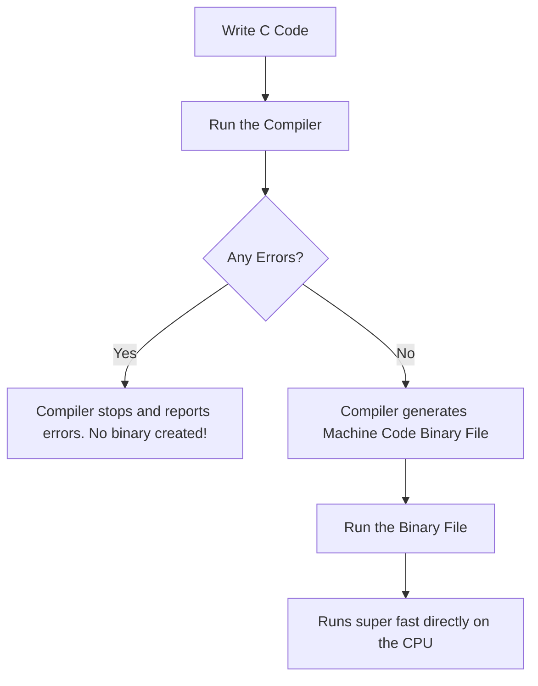
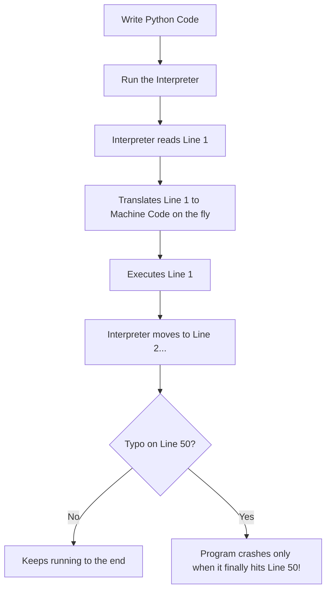

# 1. The Core Characteristics of C: Compiled, Typed, and Pass-by-Value

Before we dive into parallel programming and CUDA, we need a strong understanding of how C actually works under the hood. There are **three basic characteristics** of the C language that are absolutely essential:
1. C is a **compiled** language.
2. C is a **typed** language.
3. C arguments are **passed by value** (and it uses pointers for handling arrays efficiently).

Let's break down each of these characteristics in detail, answer some common questions about how they compare to languages like Python, and see how they impact memory and speed.

---

## 1. C is a Compiled Language

When we write C code, we write it in a human-readable format using familiar words and punctuation. However, the computer's CPU cannot directly understand this. 

To run our program, we use a software tool called a **compiler** to translate our human-readable C code into **machine code** (binary instructions of 0s and 1s) that the CPU can execute directly.

This compilation process is a classic "good news/bad news" trade-off:
* **The Good News:** Compiled code is incredibly efficient. Because it is already in the CPU's native language, the program runs blazingly fast and makes the best use of our hardware resources.
* **The Bad News:** We have to put in extra effort during development. Every time we edit our code, we must stop, run the compiler, check for syntax errors, and only then run the new version. We will get a hands-on look at this exact compile-and-run workflow very soon.

The typical alternative to a compiled language is an **interpreted** language, like Python.

### How Compiled vs. Interpreted Works

You might wonder: **What actually makes an interpreted language different, and why is it slower?**

Let's use a simple analogy to make this clear:

> 🍳 **The Recipe Analogy (Compiled vs. Interpreted)**
>
> Imagine you want to cook a delicious meal using a recipe written in French, but you only speak English.
> 
> * **Compiled Language (like C or C++):** Before you even enter the kitchen, you hire a translator. They translate the *entire recipe* into English once, giving you a clean English copy. When it is time to cook, you just read your English copy. The process is super fast because no translation happens while you are cooking.
> * **Interpreted Language (like Python):** You don't translate the recipe beforehand. Instead, you hire a translator to stand next to you in the kitchen. As you cook, they translate the recipe *one line at a time*, on the fly. *"Okay, now chop the onions..."* then you chop, *"Now heat the pan..."* then you heat. 
> 
> Cooking this way is much slower because the translation work is happening **during** the cooking process.

In Python, the interpreter program has to read, translate, and execute our code line-by-line **at runtime** (while the program is running). This adds significant overhead, which is the "price" we pay for avoiding a separate compilation step.

### Step-by-Step Workflows

#### The Compiled Workflow (e.g., C, C++, Rust)


#### The Interpreted Workflow (e.g., Python, JavaScript)


### What about syntax checking?
If Python doesn't check syntax in advance, **why does an editor like VS Code show us red squiggly lines and syntax errors while we are coding?**

This is an important distinction:
* The error checking you see while typing Python code is **not** Python itself catching errors. 
* It is done by helper tools in the background of your editor, called **linters** and **language servers** (like Pyright or Pylint). They are just friendly helpers acting as a convenience.
* **Python itself** only checks syntax when you actually run the file. If you write a Python script in a basic text editor with no helpers and run it via the terminal, Python won't warn you about a typo on line 50 until your program actually finished running lines 1 through 49 and reached line 50. 
* In contrast, the C compiler reads the *entire* file first. If there is a single error anywhere—even on a line of code that might never run—the compiler will refuse to build the program, and you won't get an executable file at all.

---

## 2. C is a Typed Language

In C, each time we define a variable, we must write a **declaration statement** that tells the system exactly what type of data the variable holds (like `int`, `float`, or `char`). 

Since the system knows exactly how much memory each data type needs, it can plan and allocate memory with absolute efficiency. This is consistent with our theme of putting in a little extra effort upfront so the computer can run our program as efficiently as possible.

In C, when we write:
```c
int x = 5;
```
We are telling the system: *"This variable `x` is an integer, and it needs exactly 4 bytes of memory."* The system reserves those 4 bytes instantly. 

In a language like Python, you simply write `x = 5`. Python doesn't require a type declaration because it has to figure out the type at runtime by looking at the value. Doing this dynamic check takes extra time and processing power, making Python slower.

### Python Data Types vs. NumPy Types

You might wonder: **Doesn't Python have only a few predefined types like float32, int32, and float64?**

Actually, those are **NumPy types**, not Python's own types!

1. **Python's built-in types** are flexible and have no size limits. They include:
   * `int` (Whole numbers—special because they have **no size limit** in Python! You can store a number with a million digits, and Python automatically manages the memory).
   * `float` (Decimal numbers—always stored as double-precision 64-bit floats underneath).
   * `str` (Text/Strings).
   * `bool` (`True` or `False`).
   * `list`, `tuple`, `dict`, `set` (Collections).

2. **NumPy types** (like `float32`, `int32`, `float64`) come from a separate library (`numpy`) built for high-performance scientific and mathematical computing. 

To make calculations fast, NumPy bypasses Python's flexible (but slow) types and uses C-style, fixed-size data types:
```python
import numpy as np

a = np.int32(5)      # Uses exactly 4 bytes (exactly like C's int)
b = np.float64(3.14) # Uses exactly 8 bytes (exactly like C's double)
c = np.float32(3.14) # Uses exactly 4 bytes (less precise, but saves 50% memory!)
```

#### Why is this important for GPU/CUDA computing?
When we send massive arrays of millions of numbers to a graphics card (GPU) for parallel calculation, the GPU needs to know **exactly** how many bytes of memory each number occupies. 

Python's standard flexible types are too slow and unpredictable for the GPU. NumPy's fixed-size types match C's memory layout perfectly, which is why they are the standard tools we use to prepare data for CUDA.

---

## 3. C Arguments are Passed by Value

In C, function arguments are **passed by value** (as opposed to **passed by reference**). 

This becomes incredibly important when we work with arrays of data. If we write a function that takes a massive array as an input, copying that entire array into the function would destroy our system memory and slow the program to a crawl. 

To prevent this, C uses a **pointer**. A pointer is a single tiny piece of data (typically just 8 bytes on modern systems) that tells the function the exact memory address where the original array is located in memory. The function can then look up and modify the array directly without copying it.

### Pass by Value vs. Pass by Reference

Let's look at what these terms actually mean:
* **Pass by Value:** The computer makes an exact **copy** of the variable's value and hands that copy to the function. The function works only on the copy. The original variable outside the function remains completely untouched.
* **Pass by Reference:** The computer hands the function the **actual memory location** of the original variable. The function works directly on the original variable. If the function makes a change, the original variable is modified.

### Simple Examples in C++

C++ gives us a very clear way to see both, using the reference symbol (`&`):

#### 1. Pass by Value (C++)
```cpp
#include <iostream>

void addTen(int x) {
    x = x + 10;  // This only changes the local COPY of the variable
}

int main() {
    int num = 5;
    addTen(num);
    std::cout << num; // Output is still 5! The original was never modified.
}
```

#### 2. Pass by Reference (C++)
```cpp
#include <iostream>

void addTen(int &x) {  // The '&' symbol means x is passed by REFERENCE
    x = x + 10;        // This changes the ORIGINAL variable directly!
}

int main() {
    int num = 5;
    addTen(num);
    std::cout << num; // Output is now 15! The original was changed.
}
```

### The History of Passing in C

You might ask: **Did C always have both options, and do we have pass-by-reference in C today?**

Here is the history:
* **Original C (1972):** Had **pass-by-value ONLY**. True pass-by-reference did not exist. If you wanted a function to modify a variable, you had to use **pointers**. You would pass the *memory address* of the variable (which is a value itself) and then write code to modify the data at that address.
* **C++ (1985):** Introduced true **pass-by-reference** using the `&` symbol. This was designed as a cleaner, safer, and easier syntax so programmers could get the exact benefits of modifying original variables without dealing with the messy syntax of raw pointers.
* **C Still Today:** Pure C **still does not have pass-by-reference using `&`**. In C, pointers are the only way to achieve this effect. Pass-by-reference with the `&` parameter syntax remains a C++ exclusive feature!

#### How we get the effect of Pass-by-Reference in Pure C (using pointers):
```c
#include <stdio.h>

void addTen(int *x) {  // '*' means x is a pointer (holds a memory address)
    *x = *x + 10;      // Go to that address and add 10 to the value stored there
}

int main() {
    int num = 5;
    addTen(&num);      // '&' means "give the ADDRESS of num" to the function
    printf("%d", num); // Output is 15!
}
```
*Note: While this changes the original variable, it is still technically **passing by value** under the hood—the value being copied and passed is the memory address itself!*

---

### Deep Copy vs. Shallow Copy

How do these concepts relate to deep and shallow copying?

* **Shallow Copy:** Only copies the "surface" container. If the container contains pointers pointing to other data in memory, the copy gets the *exact same pointers*. This means both the original container and the copied container are still sharing and pointing to the **same underlying data**.
* **Deep Copy:** Copies the container **and** duplicates all the underlying data. It allocates new memory for the contents and copies everything over, creating a completely independent duplicate.

> 🗺️ **The Treasure Chest Analogy**
>
> Imagine you have a sticky note that has a map drawn on it showing the path to a treasure chest.
> 
> * **Shallow Copy:** You photocopy the sticky note. Now you have two notes, but both notes contain the exact same map pointing to the **same single treasure chest**. If someone uses the second note to steal the treasure, the chest is empty for the first note too.
> * **Deep Copy:** You photocopy the sticky note, and then you build a **brand new, identical treasure chest** in a new location and fill it with identical treasure. Now you have two completely independent setups.

### Why Pass-by-Value is NOT always a Deep Copy!

It is easy to assume that "pass-by-value" is always a deep copy because it makes a copy of the argument. But this is a trap!

If you pass a structure that contains a pointer inside it *by value*, the structure itself is copied (which is a value copy), but the pointer inside it is copied exactly as-is. Both the original structure and the copy now have pointers pointing to the **same memory address**!

Let's look at this C++ example:
```cpp
struct Array {
    int *data; // Pointer to actual numbers in memory
    int size;
};

void doSomething(Array arr) { // Passed BY VALUE (makes a copy of the struct)
    arr.data[0] = 999;        // Modifies the underlying memory!
}

int main() {
    Array original;
    original.size = 5;
    original.data = new int[5]{1, 2, 3, 4, 5};

    doSomething(original); 
    // original.data[0] is now 999! 
    // Even though we passed by value, we had a SHALLOW COPY because of the pointer!
}
```

This explains why C's choice to use pointers for arrays is so powerful. In C, an array's name acts as a pointer to its first element. When you pass an array to a function, C copies only the pointer (shallow copy). This is incredibly efficient because copying a pointer is extremely fast and uses almost no memory, allowing the function to work directly on the original array's elements in memory.

---

## 4. Deep Dive into Pointers & Memory Abstractions

To work with pointers effectively, we need to understand how memory is laid out and how the compiler interprets different pointer expressions.

### Memory Layout: Stack vs. Heap

A common point of confusion is where variables and pointers actually live in memory. For example, if we have a variable `x` and a pointer `p` pointing to it, where do they go?

* **The Stack:** This is where **local variables** live. If you declare a normal variable inside a function (like `int x = 5;`), it is allocated on the stack automatically.
* **The Heap:** This is where **manually allocated memory** lives. In C, you get heap memory by using `malloc()`. In C++, you use `new`. 

#### Stack Memory Scenario:
```c
int x = 5;     // Local variable -> Lives on the STACK
int *p = &x;   // Local pointer variable -> Lives on the STACK (holding x's address)
```
In this case, **both `x` and `p` live on the stack!** No heap memory is involved.

#### Heap Memory Scenario:
```c
int *p = malloc(sizeof(int)); // Allocation is on the HEAP
*p = 5;                       // The value 5 lives on the HEAP
                              // The pointer variable 'p' itself still lives on the STACK!
```

---

### Checking Pointer Expressions: What is Legal vs. Illegal?

Let's assume we have this setup:
```c
int x = 5;
int *p = &x;
```

Here is a breakdown of what expressions are correct and which will cause compile-time errors:

1. **`p = &x;` (✅ LEGAL)**
   * **Why:** This stores the memory address of `x` inside the pointer `p`. Pointers are designed to hold addresses, so this is perfectly correct.
   
2. **`&x = p;` (❌ ILLEGAL)**
   * **Why:** The direction of assignment is flipped. `&x` is a read-only expression representing the hardware address of `x`. You cannot assign a value *to* an address. You can only assign values to variables (like `p`).
   
3. **`*p = 5;` (✅ LEGAL)**
   * **Why:** The `*` symbol dereferences the pointer. This means: *"Go to the memory address stored in `p` (which is `x`'s address) and set the value there to 5."*
   
4. **`*(&x) = 5;` (✅ LEGAL)**
   * **Why:** This takes the address of `x` (`&x`), and then immediately dereferences it (`*`). It basically says: *"Go to the address of `x` and write 5."* This is just a roundabout way of writing `x = 5`.
   
5. **`*x = 5;` (❌ ILLEGAL)**
   * **Why:** `x` is a plain integer, not a pointer! You can only dereference pointer variables. If you try to dereference a plain integer, the computer thinks you are trying to write to memory address `5` (which is a restricted system address), and the program will crash or fail to compile.

---

### The Complete Pointer and Memory Playground

Here is a complete, annotated C code snippet summarizing all these rules:

```c
#include <stdio.h>

int main() {
    // 1. Stack Allocation
    int x = 5;      // 'x' is an integer holding 5. Lives on the stack.
    int *p = &x;    // 'p' is a pointer holding the address of 'x'. Lives on the stack.

    // Let's print the relationships
    printf("Value of x: %d\n", x);                    // Prints: 5
    printf("Address of x (&x): %p\n", (void*)&x);     // Prints: memory address of x (e.g. 0x7ffd58)
    printf("Value stored in p: %p\n", (void*)p);      // Prints: same memory address (0x7ffd58)
    printf("Dereferenced p (*p): %d\n", *p);          // Prints: 5
    printf("Roundabout value *(&x): %d\n", *(&x));    // Prints: 5

    // 2. Modifying through the pointer
    *p = 12; 
    printf("New value of x after *p = 12: %d\n", x);  // Prints: 12

    // 3. Illegal Operations (Uncommenting these will cause compiler errors)
    // &x = p;   // ERROR: lvalue required as left operand of assignment
    // *x = 10;  // ERROR: invalid type argument of unary '*' (have 'int')

    return 0;
}
```

By mastering these core characteristics—compiled workflows, typed memory layouts, and pass-by-value pointer mechanics—we are fully prepared to tackle how CUDA manages resources and processes memory in parallel!
