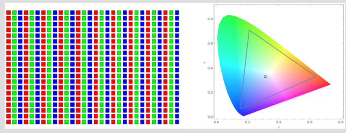
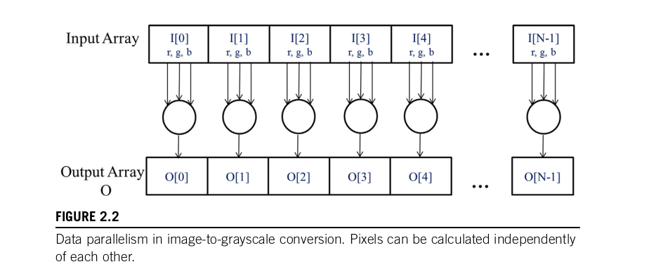

# 2.1 Data Parallelism

## Why Do Modern Applications Run Slowly?

When a modern application feels slow, what's actually causing it? Is the code logic too complicated? Is the algorithm badly written?

**Nope. The answer is almost always: too much data.**

The program's logic might be dead simple — like "apply this color filter to every pixel" or "calculate the force on every atom." The *operation itself* is easy. The problem is that you have to do that easy operation **millions or billions of times**, once for each data element.

Think of it like this:

```
 The problem is NOT:  "The recipe is too hard to cook"
 The problem IS:       "I need to cook the same dish for 10 MILLION people"
```

A single CPU core doing that one-by-one will take forever. Not because the task is hard, but because there's just **too much stuff** to process.

---

## Real-World Examples of "Too Much Data"

There are three big examples to drive this point home. Each one is from a completely different field, but they all share the same bottleneck — a mountain of data that needs the same computation applied to every piece.

### 1. Image & Video Processing — Millions to Trillions of Pixels

When you apply an Instagram filter, blur a background, or sharpen a photo, the app is doing math on **every single pixel** in the image.

* A standard 1080p image = **~2 million pixels**
* A 4K image = **~8 million pixels**
* A 4K video at 60fps for 2 hours = **trillions of pixels**

Each pixel needs the same operation (adjust brightness, apply a convolution, etc.). One CPU core doing that pixel-by-pixel is painfully slow. But if you could process all 8 million pixels **at the same time** — that's instant.

### 2. Fluid Dynamics — Billions of Grid Points

Fluid dynamics is the science of simulating how **liquids and gases move** — like air flowing over an airplane wing, ocean currents, weather patterns, or blood flow in arteries.

But a computer can't simulate every single molecule of air. That's impossible. So scientists **chop up the space into a grid** of tiny cells. Each cell is called a **grid point**, and it stores values like velocity, pressure, temperature, and density.

```
Imagine simulating airflow in a room (5m × 5m × 3m):

  ┌─────────────────────┐
  │ · · · · · · · · · · │   Each "·" is a grid point.
  │ · · · · · · · · · · │   It stores pressure, velocity, temp, etc.
  │ · · · · · · · · · · │
  │ · · · · · · · · · · │   If the grid spacing is 1cm:
  │ · · · · · · · · · · │     500 × 500 × 300 = 75 MILLION points
  └─────────────────────┘
```

Then at each time step, you use physics equations (Navier-Stokes equations) to update every grid point based on its neighbors. The finer the grid, the more accurate the simulation — but that means **billions of grid points**, each needing the same physics calculation.

Same story again: simple operation × massive data = slow on a CPU, perfect for a GPU.

### 3. Molecular Dynamics — Thousands to Billions of Atom Interactions

Molecular dynamics simulates how **atoms and molecules interact** with each other — used in drug discovery, materials science, protein folding, etc.

For every pair of atoms, you calculate the force between them (gravitational, electromagnetic, etc.). If you have N atoms, that's roughly N² pairs to compute.

* 10,000 atoms = 100 million pairs
* 1 million atoms = 1 trillion pairs

Each pair gets the same force calculation. Once again: same operation, absurd amount of data.

---

## The Pattern — Why This Leads to Data Parallelism

Notice the pattern across all three examples:

| Application | What's the data? | How much? | What's the operation? |
|---|---|---|---|
| Image processing | Pixels | Millions → Trillions | Same filter on every pixel |
| Fluid dynamics | Grid points | Millions → Billions | Same physics equation on every point |
| Molecular dynamics | Atom pairs | Millions → Trillions | Same force calculation on every pair |

**Every single one has the same structure:**

1. There's a HUGE amount of data elements
2. Each element needs the **same (or very similar) computation**
3. The computations are mostly **independent** of each other

This structure is called **Data Parallelism**.

> **Data parallelism** = when you have a massive dataset and you apply the **same operation** to each element, and each element can be processed **independently** (or mostly independently) of the others.

---

## The Big Insight — Why GPUs Exist

Here's the logical chain the author is building:

```
Modern apps are slow
    ↓
Not because the logic is hard, but because there's TOO MUCH DATA
    ↓
But wait — the data is processed the SAME WAY
    (every pixel gets the same filter)
    (every grid point gets the same physics equation)
    (every atom pair gets the same force calculation)
    ↓
So instead of processing them ONE BY ONE on a CPU...
    ↓
Why not process them ALL AT ONCE?
    ↓
That's DATA PARALLELISM → and GPUs are built exactly for this!
```

A **CPU** is like **one expert chef** — really skilled, can handle complex recipes, but cooks one dish at a time.

A **GPU** is like **10,000 basic cooks** — each one can only follow a simple recipe, but they all cook **simultaneously**. When the recipe is the same for every plate (which it is in data parallelism), 10,000 cooks beats 1 expert chef every single time.

---

## Two Types of Complexity

This is the key distinction the author is making at the start of this chapter:

| Type | What it means | Best hardware |
|---|---|---|
| **Task complexity** | The logic itself is hard — lots of branching, decision-making, irregular control flow | CPU (few powerful cores) |
| **Data complexity** | The logic is simple, but there's a mountain of data to apply it to | GPU (thousands of simple cores) |

Most real-world performance bottlenecks today fall into the **data complexity** category. That's why GPUs and data parallelism matter so much — and that's what this entire chapter is about.

---

## Three Image Operations — Different Levels of Independence

If we zoom into image processing, there are **three specific operations** to show that data parallelism comes in different flavors. Some operations are *perfectly* independent, others need a *little* cooperation between pixels, and some *seem* global but can still be broken down.

### Operation 1: Color-to-Grayscale Conversion (Pure Independence)

**What it does:** Takes a color image and converts it to a black-and-white (grayscale) image.

**The Dependency Level: Fully Independent (Pure Data Parallelism)**
To calculate the grayscale value for Pixel #5000, you **only** need the RGB values of input Pixel #5000.

* **Data Read:** Independent. A thread only reads its own pixel.
* **Data Write:** Independent. A thread only writes to its own output pixel.

**How we solve this in CUDA:**
This is the easiest problem to solve. We launch a grid where **1 Thread = 1 Pixel**.
If the image has 2 million pixels, we launch 2 million threads. Thread #5000 reads `Input_Image[5000]`, applies the math formula, and writes the result directly to `Output_Image[5000]`. There is zero need for threads to talk to each other. No shared memory is needed.

### Operation 2: Image Blurring (Partial/Local Dependency)

**What it does:** Smooths out the image by averaging each pixel's color with its immediate neighbors (e.g., a 3x3 grid around the center pixel).

**The Dependency Level: Partially Dependent (Neighborhood Dependency)**
You asked: *"If writing data is independent, why is this called partially dependent?"*
You are absolutely correct that the **Data Write** is fully independent — Thread #5000 only writes to `Output_Image[5000]`. No two threads will ever try to write to the same spot.

The dependency is entirely in the **Data Read (Input)**.
To blur Pixel #5000, Thread #5000 must read Input Pixel #5000, **PLUS** its neighbors (like #4999, #5001, etc.).
But Thread #5001 *also* needs to read Pixel #5000 and #5001!
Because adjacent threads need to read the **exact same input data**, they share a "neighborhood" of data.

**How we solve this in CUDA (The Stencil Pattern):**
If every thread just reads straight from Global VRAM, the GPU will choke because multiple threads are asking VRAM for the exact same pixels over and over again.
Instead, we solve this using **Shared Memory (The "Conscious Temporary Storage")**:

1. We assign a block of threads to a "tile" of the image (e.g., a 16x16 square of pixels).
2. The threads cooperate to load that entire 16x16 tile from slow VRAM into the SM's ultra-fast **Shared Memory**.
3. We hit a `__syncthreads()` barrier to wait until the whole tile is loaded.
4. Now, every thread does its blurring math by reading its neighbors directly from Shared Memory (which is lightning fast and allows multiple threads to read the same data instantly).
5. Finally, each thread writes its single result back to the Output VRAM.

### Operation 3: Finding the Average Brightness (Global Dependency)

**What it does:** Calculates a single number — the average brightness across ALL pixels in the image.

**The Dependency Level: Highly Dependent (Global Dependency)**
To find an average, you must first find the **Total Sum** of every pixel.
Imagine if we launched 2 million threads and told them all: `total_sum = total_sum + my_pixel_value;`
This creates a massive **Data Write Dependency (A Race Condition)**. You might ask: *"If they are just accumulating, why would they overwrite each other?"*

Because at the hardware level, accumulation is not one single action. It is three separate steps (Read-Modify-Write):

1. **Read:** Fetch the current `total_sum` from memory into the thread's private register.
2. **Modify:** Add the pixel value to it.
3. **Write:** Save the new value back to `total_sum` in memory.

**Example of the Race Condition (The Overwrite):**
Imagine `total_sum` is currently 0.

* Thread A (pixel value 5) wants to add. It **Reads** 0 from memory.
* A split-second later, Thread B (pixel value 10) wants to add. It also **Reads** 0 from memory (because Thread A hasn't written anything back yet!).
* Thread A adds 5 + 0 = 5.
* Thread B adds 10 + 0 = 10.
* Thread A **Writes** 5 to memory.
* Thread B **Writes** 10 to memory (crushing Thread A's 5).
The final sum in memory is 10. It *should* be 15. Thread A's data was completely lost. When 2 million threads do this simultaneously, the final answer will be completely garbage.

**Why not just use an Atomic Operation on all 2 million pixels?**
If a race condition is the problem, and an `atomicAdd` (the "hardware bouncer") solves race conditions, why not just launch 2 million threads and have every single one use `atomicAdd` to update the total?
Because it **destroys parallelism**.
If 2 million threads hit the bouncer at once, the bouncer forces them into a single-file line. Only one thread can add at a time. You have just taken a massive, highly parallel GPU and forced it to run **sequentially**, one pixel at a time. It will be incredibly slow.

**How we ACTUALLY solve this: Parallel Reduction (The Two-Phase Strategy)**

Because we cannot let 2 million threads write to one variable, and we cannot use a massive sequential atomic traffic jam, we break the problem down. We solve this using a strategy called **Parallel Reduction**, which happens in two phases: Local Summation and Global Summation.

**Phase 1: Local Block Sums (The Tournament)**
Instead of everyone shouting at the same time, we organize the threads into manageable groups (Blocks).

1. Imagine a Block of 256 threads. They load their 256 pixels into ultra-fast Shared Memory.
2. They do a **tournament-style pairwise addition**. In round one, 128 threads add two numbers together. We now have 128 numbers. In round two, 64 threads add those together. Then 32, 16, 8, 4, 2, and finally 1.
3. This happens entirely inside the SM, lightning fast, without ever touching global VRAM.
4. The result? Instead of 256 threads trying to write 256 numbers to VRAM, the Block produces exactly **ONE partial sum**.

**The Math (How 2 million shrinks to 7,800):**
If our image has 2,000,000 pixels, and we group threads into Blocks of 256:
`2,000,000 total pixels ÷ 256 pixels per Block = 7,812.5 Blocks`
So we launch 7,813 Blocks. Because each Block produces exactly 1 partial sum, we have successfully shrunk the problem from 2,000,000 numbers down to exactly **7,813 partial sums**.

**Phase 2: Combining the Partial Sums (Two Approaches)**
We still have 7,813 partial sums sitting in the GPU that need to be added into one final `total_sum`. We can solve this final step in two ways:

* **Approach A: The Software Method (A Second Kernel)**
  We save all 7,813 partial sums into a new, smaller array in VRAM. Then, we launch a *second* CUDA kernel. This new kernel treats those 7,813 partial sums as a brand new mini-image, and runs the exact same tournament-style reduction on it. If needed, you launch a third kernel until you are left with exactly one final number. This is pure software logic and requires the CPU to manage the different kernel launches.

* **Approach B: The Hardware Method (`atomicAdd`)**
  Instead of launching a second kernel, we use a special hardware feature called **Atomic Operations** (specifically `atomicAdd`).
  An atomic operation is like a strict security bouncer. It guarantees that the Read-Modify-Write cycle happens as **one unbreakable, uninterrupted step**.
  If Block 1 and Block 2 both try to `atomicAdd` their partial sum to the global `total_sum` at the exact same millisecond, the hardware bouncer says: *"Stop. Block 1, you go first. Block 2, you wait your turn until Block 1 is completely finished."*
  Because we already reduced 2 million pixels down to just 7,813 partial sums in Phase 1, the bouncer doesn't have to work that hard. The hardware safely handles this small traffic jam.
  
  **The Clock Cycle Math (Why this is fast):**
  A single `atomicAdd` to global VRAM takes about 300 clock cycles. If 7,813 blocks are forced into a single-file line (serialized), it takes:
  `7,813 blocks × 300 cycles = ~2,343,900 clock cycles.`
  Is 2.3 million clock cycles bad? No. A modern GPU like the RTX 3060 runs at 1.77 GHz (1.77 *Billion* cycles per second). Therefore, 2.3 million cycles takes about **0.001 seconds (1 millisecond)**.
  *(If we had used atomicAdd on all 2,000,000 pixels at the very beginning, it would have taken 600,000,000 cycles, causing a massive performance bottleneck!)*

### Summary of the Three Operations

```
Operation 1: Color → Grayscale     
  Dependency: ZERO (pure data parallelism)
  Solution:   1 Thread = 1 Pixel, direct read/write.

Operation 2: Blurring              
  Dependency: LOCAL READS (threads share input data)
  Solution:   Load neighborhood tiles into Shared Memory, then compute.

Operation 3: Average brightness    
  Dependency: GLOBAL WRITES (all threads writing to one sum)
  Solution:   Parallel Reduction (tournament-style pairwise addition).
```

The main point: even when it *looks* like you need the whole dataset, you can often restructure the problem into independent pieces. Data parallelism is more broadly applicable than you might think at first glance.

---

## How Are Images Actually Stored in a Computer?

Before we can understand the color-to-grayscale conversion, we need to understand how a computer actually **stores** an image. An image is just a grid of tiny colored dots called **pixels** (short for "picture elements"). But how do you store a "color" as a number?

### Grayscale Images — The Simple Case

A **grayscale image** is what most people call a "black and white" image (though it's technically black, white, AND every shade of gray in between).

In a grayscale image, each pixel is stored as **a single number** representing its **brightness** (also called **luminance** or **intensity**).

* **0** = completely black (no light)
* **1** = completely white (full light)
* Anything in between = some shade of gray

(Some systems use 0–255 as integers instead of 0.0–1.0 as fractions, but we will use the 0-to-1 fractional system.)

```
Example grayscale pixel values:  

  0.0    0.25    0.5    0.75    1.0
  □□□    ░░▓     ░░░    ■■░     ■■■
  BLACK  DARK    MID    LIGHT   WHITE
         GRAY    GRAY   GRAY
```

So a grayscale image is just a **2D array of single numbers**:

```
Grayscale image (4×4 pixels):

  [ 0.1,  0.3,  0.5,  0.9 ]
  [ 0.2,  0.4,  0.6,  0.8 ]
  [ 0.0,  0.1,  0.7,  1.0 ]
  [ 0.5,  0.5,  0.5,  0.5 ]

Each number = one pixel's brightness
Total storage = 4 × 4 = 16 numbers
```

### Color Images — RGB Representation

A color image is more complex. Each pixel isn't just one number — it's **three numbers** bundled together, called an **RGB tuple** (tuple = a group of values packed together):

* **R** = Red intensity (0 to 1)
* **G** = Green intensity (0 to 1)
* **B** = Blue intensity (0 to 1)

Why red, green, and blue? Because that's how our **eyes** work. Human eyes have three types of cone cells — one sensitive to red light, one to green, one to blue. Every color you've ever seen is your brain mixing these three signals. Computer screens work the same way — each pixel has a tiny red LED, green LED, and blue LED, and by mixing their brightness, you get any color.

```
How RGB mixing works:

  R=1, G=0, B=0  →  Pure Red
  R=0, G=1, B=0  →  Pure Green
  R=0, G=0, B=1  →  Pure Blue
  R=1, G=1, B=0  →  Yellow (red + green)
  R=1, G=0, B=1  →  Magenta (red + blue)
  R=0, G=1, B=1  →  Cyan (green + blue)
  R=1, G=1, B=1  →  White (all colors full)
  R=0, G=0, B=0  →  Black (no color at all)
  R=0.5, G=0.5, B=0.5  →  Medium Gray
```

### How RGB Data Is Laid Out in Memory

When a color image is stored in memory, each row of the image is stored as a sequence of (r, g, b) tuples, one after another:

```
Memory layout for one row of pixels:

  | r g b | r g b | r g b | r g b | r g b | ...
  pixel 0   pixel 1  pixel 2  pixel 3  pixel 4

So if pixel 0 is orange-ish:  r=1.0, g=0.5, b=0.0
And pixel 1 is sky blue:      r=0.3, g=0.6, b=1.0

Memory looks like:
  [1.0, 0.5, 0.0, 0.3, 0.6, 1.0, ...]
```

A color image is essentially a **2D array where each element is 3 numbers instead of 1**:

```
Color image (3×3 pixels):

  [(0.9, 0.1, 0.1), (0.1, 0.8, 0.1), (0.1, 0.1, 0.9)]    ← row of red, green, blue pixels
  [(1.0, 1.0, 0.0), (1.0, 0.0, 1.0), (0.0, 1.0, 1.0)]    ← yellow, magenta, cyan
  [(0.0, 0.0, 0.0), (0.5, 0.5, 0.5), (1.0, 1.0, 1.0)]    ← black, gray, white

Each tuple = one pixel's color
Total storage = 3 × 3 × 3 = 27 numbers (3x more than grayscale!)
```

### The RGB Color Space — What That Triangle Graph Means



There is a diagram with a colored triangle on a chart. Here's what it means:

**Color space** = the full range of colors that a system can represent. Think of it as the "menu" of all possible colors available.

The **AdobeRGB** color space is shown as a **triangle** on a chart called the **CIE chromaticity diagram** (that horseshoe-shaped graph of all visible colors). The three corners of the triangle are the purest red, green, and blue that the system can produce. Every color inside the triangle can be created by mixing those three primaries in various amounts.

```
The chromaticity diagram:

          Green
           /\
          /  \
         /    \         ← Everything INSIDE the triangle
        / Any  \           can be displayed
       / color  \
      /  here!   \
     /____________\
   Blue          Red

   x-axis = how much Red vs Green
   y-axis = how much Green vs Blue
   The remaining (1 - x - y) = Blue contribution
```

The **x coordinate** on the chart tells you the fraction of the pixel's light that should be **Red**. The **y coordinate** tells you the fraction that should be **Green**. The remaining fraction **(1 - y - x)** is assigned to **Blue**. Together, (x, y, 1-x-y) define the *color mixture* (what color it is), separate from the total intensity (how bright it is).

The key takeaway: different color spaces (sRGB, AdobeRGB, DCI-P3, etc.) define different triangles — meaning they can display different ranges of colors. But the underlying storage is always the same: three numbers (r, g, b) per pixel.

---

## Color-to-Grayscale Conversion — The Formula


Now that we understand both formats, let's look at the actual conversion. To go from a color pixel (r, g, b) to a single grayscale brightness value L (called **luminance**), we use this formula:

```
L = r × 0.21 + g × 0.72 + b × 0.07
```

### Why Not Just Average Them Equally?

You might think: "Why not just do `L = (r + g + b) / 3`?" That would give each color equal weight of 0.33.

The reason is: **your eyes are not equally sensitive to all colors.** Human vision is:

* **Most sensitive to green** — that's why green gets the biggest weight: **0.72** (72%)
* **Moderately sensitive to red** — weight: **0.21** (21%)
* **Least sensitive to blue** — weight: **0.07** (7%)

If you averaged them equally, a bright blue and a bright green would produce the same gray — but to our eyes, bright green looks way brighter than bright blue. The weighted formula matches what our eyes actually perceive .

```
Example conversions:

  Pure Red   (1.0, 0.0, 0.0):  L = 1.0×0.21 + 0.0×0.72 + 0.0×0.07 = 0.21  (dark gray)
  Pure Green (0.0, 1.0, 0.0):  L = 0.0×0.21 + 1.0×0.72 + 0.0×0.07 = 0.72  (light gray)
  Pure Blue  (0.0, 0.0, 1.0):  L = 0.0×0.21 + 0.0×0.72 + 1.0×0.07 = 0.07  (very dark)
  White      (1.0, 1.0, 1.0):  L = 0.21 + 0.72 + 0.07 = 1.00              (white)
  Black      (0.0, 0.0, 0.0):  L = 0.00                                    (black)
```

Notice: pure green converts to a much brighter gray (0.72) than pure blue (0.07), which matches how we perceive them! The weights 0.21 + 0.72 + 0.07 = 1.00, so white (1,1,1) stays white and black (0,0,0) stays black. The formula is a proper weighted average.

---

## Data Parallelism in Image-to-Grayscale Conversion



Figure 2.2 visualizes exactly how color-to-grayscale conversion works as data parallelism. Here's what this diagram is telling you, piece by piece:

**Input Array `I`:** The entire color image is stored as one big array. `I[0]` is the first pixel (containing r, g, b values), `I[1]` is the second pixel, and so on up to `I[N-1]` where N is the total number of pixels.

**Output Array `O`:** The grayscale image is stored as another array. `O[0]` is the grayscale value for the first pixel, `O[1]` for the second, etc.

**The arrows:** Each arrow represents one independent computation:

* `O[0]` = `I[0].r × 0.21 + I[0].g × 0.72 + I[0].b × 0.07`
* `O[1]` = `I[1].r × 0.21 + I[1].g × 0.72 + I[1].b × 0.07`
* `O[2]` = `I[2].r × 0.21 + I[2].g × 0.72 + I[2].b × 0.07`
* ...and so on

**The critical observation:** Look at the arrows. Every single one goes **straight down** — from `I[k]` to `O[k]`. No arrow ever crosses to a different pixel. `O[0]` ONLY depends on `I[0]`. `O[1]` ONLY depends on `I[1]`. There is **zero communication** between pixels.

This means:

* You could compute `O[0]` on Thread #0
* You could compute `O[1]` on Thread #1
* You could compute `O[2]` on Thread #2
* ...all running **simultaneously**, with no waiting, no conflicts, no dependencies

**This is an absolute example of data parallelism.** Same operation, applied independently to every data element.

---

## Task Parallelism vs. Data Parallelism

Data parallelism is NOT the only kind of parallelism. There's another kind called **Task Parallelism**. Let's understand both:

### Data Parallelism (what we've been learning)

**Same operation, different data.**

You have one function/formula, and you apply it to millions of data elements at the same time. Every thread does the **same job**, just on a **different piece** of data.

```
Data Parallelism:

  Thread 0:  apply_formula(pixel_0)
  Thread 1:  apply_formula(pixel_1)
  Thread 2:  apply_formula(pixel_2)
  Thread 3:  apply_formula(pixel_3)
  ...
  Thread N:  apply_formula(pixel_N)

  Same function, different inputs → DATA parallelism
```

### Task Parallelism

**Different operations, running at the same time.**

You have multiple **completely different jobs** (tasks), and you run them simultaneously because they don't depend on each other.

```
Task Parallelism:

  Thread A:  do_vector_addition()       ← Task 1
  Thread B:  do_matrix_multiplication() ← Task 2
  Thread C:  do_data_transfer()         ← Task 3

  Different functions, running at the same time → TASK parallelism
```

For a great example, imagine a program that needs to do a **vector addition** AND a **matrix-vector multiplication**. These are two completely different computations. If one doesn't depend on the other's result, you can run them **at the same time** on different cores. Each one is a separate "task" — hence, task parallelism.

### Other examples of Task Parallelism

 **I/O and data transfers** are common sources of task parallelism. For example:

* While the GPU is crunching numbers on batch #1, the CPU can be **transferring batch #2** from disk to memory
* While one computation runs, another thread can be **writing results** to a file

These are different tasks happening simultaneously.

### Real Example: Molecular Dynamics Simulator

In a molecular dynamics simulator, there are many **different types** of calculations:

* Vibrational forces
* Rotational forces
* Neighbor identification for non-bonding forces
* Non-bonding force calculations
* Velocity updates
* Position updates

Each of these is a different "task." If some of them don't depend on each other, you can run them in parallel — that's task parallelism.

### Which One Scales Better? Data Parallelism Wins

Here's the key insight:

| | Data Parallelism | Task Parallelism |
|---|---|---|
| **What scales?** | The DATA (more pixels = more threads) | The number of TASKS |
| **Scalability** | Massive — millions of threads | Limited — maybe dozens of tasks |
| **Depends on** | Dataset size (usually huge) | Application structure (usually limited) |
| **Best for** | GPUs (thousands of cores) | CPUs (handful of powerful cores) |

**Data parallelism scales with the data.** If you have 10 million pixels, you can launch 10 million threads. Buy a bigger GPU? Now you can handle 20 million pixels just as fast. The parallelism grows with the data — and the data in modern apps is always growing.

**Task parallelism is limited by the application's structure.** You can only have as many parallel tasks as there are independent operations in your program. A typical application might have 5-10 independent tasks — that's it. You can't magically invent more tasks by buying a bigger processor.

That's why it is said: *"Data parallelism is the main source of scalability for parallel programs."* With massive datasets, you can always find abundant data parallelism to keep thousands of GPU cores busy. Task parallelism is a nice bonus (and we'll learn about it later with CUDA streams), but data parallelism is the star of the show.

---
