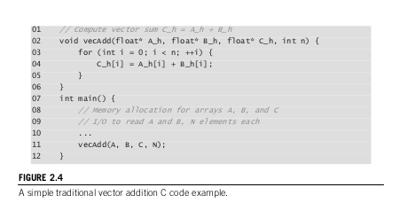
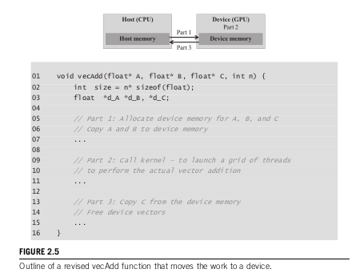

# 2.3 A Vector Addition Kernel

Vector addition is essentially the "Hello World" of parallel programming. It is the absolute simplest data-parallel computation we can do, making it the perfect starting point to understand how to structure a CUDA C program... .

## Part 1: The Traditional CPU Approach

Below is the diagram showing how a standard, single-threaded C program handles vector addition.



Here is the fully completed code for what is happening above, filling in the missing details:

```c
#include <stdlib.h>
#include <stdio.h>

// Compute vector sum C_h = A_h + B_h
void vecAdd(float* A_h, float* B_h, float* C_h, int n) {
    for (int i = 0; i < n; ++i) {
        C_h[i] = A_h[i] + B_h[i];
    }
}

int main() {
    int N = 1000; // Example size
    
    // Memory allocation for arrays A, B, and C on the CPU (Heap Memory)
    float *A = (float*)malloc(N * sizeof(float));
    float *B = (float*)malloc(N * sizeof(float));
    float *C = (float*)malloc(N * sizeof(float));

    // I/O to read A and B, N elements each (Assuming we fill them with data here)
    for(int i = 0; i < N; i++) {
        A[i] = 1.0f;
        B[i] = 2.0f;
    }

    // Call the vector addition function
    vecAdd(A, B, C, N);

    // Free the memory
    free(A); free(B); free(C);
    
    return 0;
}
```

### Core Common Doubts Clarified: Pointers, Arrays, and Memory

Several questions about how exactly `A`, `B`, and `C` were being passed around explained :

1. **What exactly is a "Vector" here?**
   In this context, a "vector" is not a fancy C++ object; it is simply a standard 1D mathematical array of numbers. In C, we typically define dynamic arrays using `malloc`, which allocates a block of memory on the heap and returns a pointer to the very first element (the 0th element).

2. **Why  passing Pointers (`float* A_h`) instead of the actual arrays?**
   Because passing entire arrays "by value" is physically impossible without crashing the system's performance. If `A` contained 1 million floats, passing the "actual variables" would force the CPU to make a complete copy of all 1 million floats just to run the `vecAdd` function. Instead, C is designed so that the array name `A` essentially acts as a pointer. I just pass the memory address of the first element. It is incredibly fast and lightweight.

3. **Is this what calle das Pass-by-Reference?**
   Effectively, yes! Because passing the *memory address* of `C` into the `C_h` parameter, the `vecAdd` function knows exactly where `C` physically lives in my computer's RAM. When `C_h[i] = A_h[i] + B_h[i];` runs, it goes directly to the physical memory location of `C` (which belongs to `main()`) and permanently writes the answer there.

---

## Part 2: The GPU "Outsourcing" Approach

Now, let's look at how it should be  modified from a   CPU function to run the math on the GPU ,



In the diagram above, the actual CUDA code is omitted on a purpose in book , but here is the fully completed, exact code of what that "revised" function actually looks like, merging both host and device code:

```cuda
#include <cuda_runtime.h>
#include <math.h>

// ---------------------------------------------------------
// DEVICE CODE (The kernel that runs on the GPU)
// ---------------------------------------------------------
__global__ void vecAddKernel(float* A, float* B, float* C, int n) {
    // Calculate global thread ID
    int i = blockIdx.x * blockDim.x + threadIdx.x;
    
    // Ensure we don't go out of bounds
    if (i < n) {
        C[i] = A[i] + B[i]; // Each thread does ONE addition
    }
}

// ---------------------------------------------------------
// HOST CODE (The Outsourcing Agent running on the CPU)
// ---------------------------------------------------------
void vecAdd(float* A, float* B, float* C, int n) {
    int size = n * sizeof(float);
    float *d_A, *d_B, *d_C; // 'd_' stands for device (GPU) memory

    // Part 1: Allocate device memory in GPU VRAM
    cudaMalloc((void**)&d_A, size);
    cudaMalloc((void**)&d_B, size);
    cudaMalloc((void**)&d_C, size);

    // Copy A and B from CPU RAM to GPU VRAM
    cudaMemcpy(d_A, A, size, cudaMemcpyHostToDevice);
    cudaMemcpy(d_B, B, size, cudaMemcpyHostToDevice);

    // Part 2: Call kernel - launch a grid of GPU threads
    // We define how many threads per block, and how many blocks we need in the grid
    int threadsPerBlock = 256;
    int blocksPerGrid = ceil(n / 256.0); 
    
    // Launch the kernel! (Activates calculation on device)
    vecAddKernel<<<blocksPerGrid, threadsPerBlock>>>(d_A, d_B, d_C, n);

    // Part 3: Copy result C from GPU VRAM back to CPU RAM
    cudaMemcpy(C, d_C, size, cudaMemcpyDeviceToHost);

    // Free the GPU VRAM
    cudaFree(d_A);
    cudaFree(d_B);
    cudaFree(d_C);
}
```

### Deconstructing the "Transparent Outsourcing Model"

When looking at this revised code, there are a few critical architectural concepts to understand about exactly what the hardware and software are doing.

**1. The "Outsourcing Agent"**
Notice that my new `vecAdd` function on the CPU doesn't actually do any math anymore. It is just an "agent" or manager running on the CPU. Its entire job is to outsource the math task to the GPU. It executes exactly three precise hardware steps:

* **Ships Data:** It commands the system to copy arrays `A` and `B` from the motherboard's CPU RAM into the GPU's VRAM (`cudaMemcpyHostToDevice`).
* **Activates Calculation:** It tells the GPU to launch the parallel threads (`vecAddKernel<<<...>>>`) to crunch the numbers.
* **Collects Results:** It commands the system to copy the finished array `C` from the GPU VRAM back across the motherboard into the CPU's RAM (`cudaMemcpyDeviceToHost`).

**2. The "Transparent" Model**
If I look at the `main()` function in my program, it still just calls `vecAdd(A, B, C, N);`. The `main` function has absolutely no idea that a GPU is involved. It doesn't see the VRAM allocations, the memory copies, or the kernel launches. Because all of that complex GPU code is securely hidden inside the `vecAdd` function, the GPU execution is considered "transparent" (invisible) to the rest of the main program.

**3. Why this specific code is incredibly inefficient**
While this "transparent model" is great for introducing the basic CUDA program structure, it is actually a terrible way to write real-world GPU code. The bottleneck is the PCIe bus—the physical slots and wires connecting the CPU to the GPU. Copying data across the motherboard is incredibly slow compared to the blazing speed of the GPU cores. If i copy huge arrays over, do a simple addition that takes 1 millisecond, and immediately copy them right back, I am spending 99% of my execution time just physically moving data back and forth.

**4. The Efficient Way (Real-world practice)**
To write highly optimized, professional code, I must avoid copying data back and forth for every single function call. The efficient way is to copy large, important data structures (like a massive image or neural network weights) into the GPU VRAM **exactly once** at the very beginning of the program. The data stays physically locked in the VRAM.

Then, the CPU simply fires off multiple different kernel commands in a sequence (e.g., "GPU, run Kernel 1 on the data in VRAM," then "GPU, run Kernel 2"). The data never leaves the GPU between these steps. I only copy the final, finished result back to the CPU RAM at the very end of the entire pipeline, eliminating the PCIe bottleneck.
