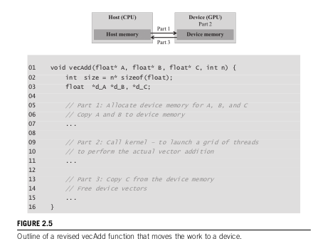
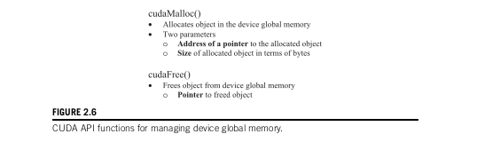
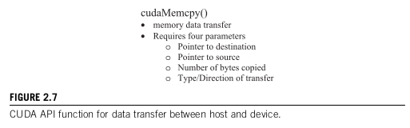

# 2.4 Device Global Memory and Data Transfer

### 1. Hardware Context: What is "Global" Memory?

In modern CUDA systems, the GPU devices are often physically separate hardware cards plugged into the motherboard (like an NVIDIA Volta V100, which comes with 16GB or 32GB of its own memory). Because these are discrete, separate cards, they come equipped with their own dedicated, onboard dynamic random-access memory (DRAM).

**Deep Dive: Why are devices "often" hardware cards?**
In High Performance Computing (HPC), GPUs are almost always discrete PCIe cards (like the V100, RTX 3090, etc.) with their own dedicated VRAM chips. However, the book specifically uses the word "often" because there is an alternative in the CUDA ecosystem: **Integrated Systems-on-a-Chip (SoCs)** (like the NVIDIA Jetson Nano or Tegra line). In these integrated setups, the CPU (ARM) and the GPU share the exact same physical RAM (Unified Memory). Even though there is no physical PCIe bus to cross in those integrated systems, the CUDA programming model still conceptually treats the memory spaces as separate to maintain compatibility across all hardware.

**Deep Dive: Why is Host-to-Device transfer considered a bottleneck?**
For discrete cards, moving data from the CPU RAM to the GPU VRAM is physically exhausting. The data must travel from the CPU RAM -> Memory Controller -> Motherboard Traces -> PCIe Slot -> across the PCIe Bus -> into the GPU PCIe Controller -> and finally into the GPU VRAM. The PCIe bus is extremely slow compared to the GPU's internal memory bandwidth. This physical distance is why I must minimize `cudaMemcpy` calls as much as possible.

In CUDA terminology, this massive pool of VRAM is called **Device Global Memory**, or simply **Global Memory**.

**Why call it "global"?**
Calling it "global" memory distinguishes it from other types of device memory that are also accessible. It is "global" because it acts as the main public square of the GPU—every single thread running across the entire GPU grid has full read and write access to this memory. Later chapters cover more restricted, specialized memory types (like Shared Memory or Constant Memory).

---

### 2. The Data Transfer Workflow

Before a GPU can actually perform any computation, data must be physically moved across the motherboard (via the PCIe bus) to the GPU, and answers brought back.

This can be broken down into three distinct parts, which perfectly match the structure of my real-world `vecAdd` functions:



The workflow is exactly:

1. **Part 1 (Allocate & Copy):** Before calling the kernel, I need to **allocate space** in the device global memory and **transfer data** from the host memory (CPU RAM) to the allocated space in the device global memory.
2. **Part 2 (Compute):** Call the kernel to launch a grid of threads to perform the actual vector addition.
3. **Part 3 (Copy & Free):** After device execution, I need to **transfer result data** from the device global memory back to the host memory and **free up the allocated space** in the device global memory that is no longer needed.

**A note on terminology:** From this point on, whenever I write *"data is transferred from host to device"*, it is a strict shorthand for saying *"the data is copied from the host memory to the device global memory."*

---

### 3. API Functions: `cudaMalloc` and `cudaFree`

To perform these activities, the CUDA runtime system provides API functions. In Part 1 and 3, API functions allocate memory for vectors A, B, and C, transfer them back and forth, and finally free them.



There is a "striking similarity" between `cudaMalloc` and the standard C runtime library `malloc` function. This is highly intentional. CUDA C is just C with minimal extensions. By keeping the interface as close to the original C runtime libraries as possible, NVIDIA minimizes the time spent relearning how to manage memory.

#### The Sample Code

Here is the simple code example illustrating the use of these two functions:

```c
float *A_d;
int size = n * sizeof(float);
cudaMalloc((void**)&A_d, size);
...
cudaFree(A_d);
```

#### The Danger of Dereferencing Device Pointers

The addresses stored in `A_d`, `B_d`, and `C_d` point to physical locations in the **device global memory** (the GPU VRAM).

**CRITICAL RULE:** These addresses must **never** be dereferenced in the host code (the CPU code).
They should only be passed as arguments to CUDA API functions (like `cudaMemcpy`) or handed over to kernel functions running on the GPU. If I try to dereference a device pointer in host code (e.g., trying to print `A_d[0]` or do `A_d[0] = 5.0f` in my `main()` function), it will cause a fatal exception or a segmentation fault because the CPU physically cannot reach across the PCIe bus to read that memory address directly.

**Experiment: The Hidden CUDA Context Overhead**

While testing this sample code, I ran a practical experiment ([cuda_malloc_memcpy.cu](./cuda_malloc_memcpy.cu)) on an **RTX 3060 GPU** to monitor how much VRAM `cudaMalloc` actually consumes compared to what I requested.
First, I tested an allocation of 1 million floats (exactly 4 MB of data):

```cpp
// Test 1: 1 Million Floats
int main() {
  float *A_d;
  int size = 1000000 * sizeof(float); // 4 MB
  cudaMalloc((void **)&A_d, size);
  std::cin.get(); // Pause to check nvidia-smi
  cudaFree(A_d);
}
```

When checking the GPU, this 4 MB allocation surprisingly consumed **108 MB** of VRAM.

Next, I tested an allocation of 4 million floats (exactly 16 MB of data):

```cpp
// Test 2: 4 Million Floats
int main() {
  float *A_d;
  int size = 4000000 * sizeof(float); // 16 MB
  cudaMalloc((void **)&A_d, size);
  std::cin.get();
  cudaFree(A_d);
}
```

When checking the GPU, this 16 MB allocation consumed **120 MB** of VRAM.

**The Math & The Explanation:**

* Test 1: 108 MB (Total) - 4 MB (My Array) = **104 MB Overhead**
* Test 2: 120 MB (Total) - 16 MB (My Array) = **104 MB Overhead**

so, the remaining 104 MB is a constant overhead known as the **CUDA Context**. The very first time a program calls a CUDA API function (like `cudaMalloc`), the CUDA runtime must initialize itself on the device. This involves allocating memory for page tables, device-side runtime structures, and module loading. This context creation is a mandatory, one-time "flat fee" of roughly ~100 MB per process.

---

## 4. The Complete `cudaMalloc` and Pointers Deep Dive

While studying memory allocation, I tore apart how memory allocation actually works at the compiler and hardware levels to understand *why* `cudaMalloc` is designed this way. Here is the documentation of every question I researched.

### Question: How does `new` in C++ handle allocation?

**Answer:** When writing `float *A = new float[10];`, C++ does two things automatically:

1. It looks at the type (`float`) and knows it is 4 bytes.
2. It multiplies that by 10 elements to get 40 bytes.
It allocates exactly 40 bytes and returns a typed `float*` pointer. **With C++ `new`, 1 unit = 1 element.**

### Question: How does `malloc` in C handle allocation?

**Answer:** When writing `float *A = (float*)malloc(40);`:

* `malloc` has no idea what data type is being stored. It strictly deals in **raw bytes**. **1 unit = 1 raw byte.** (For example, 10 int32s is exactly 40 bytes).
* It returns a `void*` (a generic pointer meaning "here is an address, but I don't know what data lives there").
* **The C vs C++ difference:** In pure C, `malloc` does NOT need a cast; a `void*` automatically flows into a `float*`. However, in C++, the compiler's strict type-checking forbids this, forcing the `(float*)` cast explicitly.

### Question: How does `cudaMalloc` handle allocation compared to `malloc`?

**Answer:** Both `malloc` and `cudaMalloc` deal in **raw bytes** (`size = n * sizeof(float)`). However, their delivery mechanism is fundamentally different:

* **`malloc` RETURNS the pointer directly:** It computes the address and returns it as a value (`A = malloc(...)`).
* **`cudaMalloc` WRITES the pointer into a variable:** It uses its return value strictly for error codes (like `cudaSuccess`). Because it cannot return the address, a "delivery address" (`&A_d`) must be provided, and it writes the GPU VRAM address directly into that variable.

### Question: What exactly is a pointer at the hardware level?

**Answer:** A pointer is nothing but an 8-byte box (on a 64-bit system) containing a number (a memory address).

* **Casting does NOT change bits:** A C script proves that a `void*` and a `float*` are exactly the same size (8 bytes).
* Casting a pointer from `void*` to `float*` does not physically alter the memory address. The type is purely an instruction to the compiler to define the **hop size** for pointer arithmetic. A `float*` tells the compiler to hop 4 bytes at a time; a `void*` throws an error because the hop size is unknown.

### Question: Why does `cudaMalloc` require a `(void**)` cast?

**Answer:** The `cudaMalloc` function signature expects a generic pointer `void**` because it is a generic function not restricted to any particular type of object.

* **Is `&A_d` a secret pointer created by the OS?**
  **No.** I do not create a separate pointer variable in memory to hold the address of `A_d`, and neither does the OS. The `&` operator is just a mathematical instruction asking the C++ compiler: *"What is the memory address of the box named A_d?"* The compiler simply evaluates that location on the spot.
* **Is it void by default?**
  **No.** Using `typeid()` proves that the C++ compiler strictly evaluates `&A_d` as a `float**`. It is never a `void` by default. It perfectly inherits the type of the variable it points to.
* **Why must it be cast?**
  Because C does not have Function Overloading or Templates. NVIDIA had to write exactly one generic function: `cudaMalloc(void **devPtr, size_t size)`.
* If a `float**` is passed directly, the strict C++ compiler throws a fatal type mismatch error.
* The `(void**)` cast is a **temporary permission slip**. It tells the compiler to temporarily treat the coordinates of the float pointer as generic coordinates, just to bypass the strict function signature.

### Question: How can a `void` pointer address be written into a `float` pointer variable?

**Answer:** At the hardware level, all pointers are just 8-byte numbers. When `cudaMalloc` executes, it generates an 8-byte GPU VRAM address. It goes to the delivery address provided (`&A_d`) and shoves those 8 bytes into the 8-byte box belonging to `A_d`.
Because both a generic pointer and a float pointer are physically identical 8-byte boxes, it fits perfectly. There is no internal conversion needed because, to the hardware, a pointer is just a raw number regardless of its C++ type label.

### Question: What does `malloc` literally return?

**Answer:** It literally just returns a raw 64-bit memory address (a number like `0x7FFF1000`).
When writing `A_d = (float*)malloc(...)`, there is no "temporary pointer variable" created. The CPU just calculates the raw hex address, and directly assigns that numeric value into the `A_d` variable.

### Question: Does the `(void**)` cast in `cudaMalloc` permanently change the pointer's type globally?

**Answer:** When writing `(void**)&A_d` inside the `cudaMalloc` call, the cast is strictly **local** to that single line of code. It simply acts as a temporary disguise so the function accepts it. Once `cudaMalloc` finishes executing, the compiler rips off the disguise. Everywhere else in the code (globally), `A_d` remains a strictly-enforced `float*` pointer.

### Question: When we create a pointer, does the OS automatically create a hidden pointer inside it to store its address?

**Answer:** **A pointer does NOT contain another pointer.** A pointer is just a single variable on the stack (a box).
When using the `&` operator (e.g., `&A_d`), the computer does **not** create a new "pointer inside a pointer" to hold the address. The `&` operator is just a mathematical question to the compiler: *"What is the stack coordinate of this box?"* The compiler simply calculates the coordinate and hands it to `cudaMalloc`. No extra variables are created by the programmer or the OS.

### Question: Why is dynamically allocating multidimensional arrays with `cudaMalloc` so complex?

**Answer:** The fact that `cudaMalloc` returns a generic object makes the use of dynamically allocated multidimensional arrays more complex.

* **Explanation:** In C, a 2D array is created as an array of row-pointers (a pointer to pointers). Trying to build this structure across the PCIe bus with `cudaMalloc` is a nightmare. It requires allocating an array of row-pointers on the GPU, allocating individual rows on the GPU, temporarily storing the GPU row-pointers in a CPU array, and using a complex `cudaMemcpy` to send that array over to the GPU.
* **The Practical Fix:** Because `cudaMalloc` uses raw generic memory, CUDA programmers almost always avoid 2D pointers. Instead, a 2D matrix is flattened into a 1D array (`float *d_matrix; cudaMalloc(&d_matrix, ROWS * COLS * sizeof(float));`) and the indices are calculated manually using `row * NUM_COLS + col`.

---

### 5. API Function For Memory Transfer : `cudaMemcpy`

Once the host code has allocated space in the device global memory using `cudaMalloc`, it can request that data be transferred across the PCIe bus. This is accomplished using the `cudaMemcpy` function.



The `cudaMemcpy` function strictly requires four parameters:

1. **Pointer to Destination:** The memory address where the data will be written.
2. **Pointer to Source:** The memory address where the data is currently located.
3. **Number of Bytes:** The total size of the payload being copied.
4. **Direction of Transfer:** A constant indicating the type of memory involved (e.g., `cudaMemcpyHostToDevice`, `cudaMemcpyDeviceToHost`, `cudaMemcpyDeviceToDevice`, or `cudaMemcpyHostToHost`).

#### The Code Implementation

Here is the exact code sequence I ran to execute data transfers using `cudaMemcpy`, tracked in my [cuda_malloc_memcpy.cu](./cuda_malloc_memcpy.cu) experiment file:

```cpp
  // Test 3 : cudaMemcpy
  // int size = 1000000 * sizeof(float); //~4 MiB (or) 1 million floats ,,, ,
  //using new instead of malloc ,,, , 
    // float* A_h=new float[1000000];
   // setting all to 1 ,,, , 
//     float *A_h = (float *)malloc(size);
//   for (int i = 0; i < 1000000; ++i) {
//     A_h[i] = 1.0f;
//   }
  //  using 4 million floats
  int size = 4000000 * sizeof(float); //~16Mib (or) 4 million floats ,,, ,

  float *A_h = (float *)malloc(size);
  for (int i = 0; i < 4000000; ++i) {
    A_h[i] = 1.0f;
  }
  std::cout << "[";
  // I filled A_hwith 1 , not 1.0f or 1.0 ,
  //  so lets see whether it will take as 1.0f natively or not ,
  // by printing the values ,
  // should print 1.0 's    ,,, ,
  for (int i = 0; i < 100; ++i) {
    std::cout << A_h[i] << " ";
  }
  std::cout << "]\n";

  // allocate same space in gpu vram before doing cudaMemcpy ,,, ,
  float *A_d;
  cudaMalloc((void **)&A_d, size);

  // right after creating this would be garbage. To print and see the
  // values/memory in gpu:
  // 1) From the CPU (main function): first , need to cudaMemcpy it back to a
  // CPU array and use std::cout as the CPU cannot read VRAM directly , 2) From
  // the GPU : CUDA actually has a built-in printf() , but can be used inside a
  // __global__ kernel , it can print the VRAM data directly to the terminal ,
  float *B_h = (float *)malloc(size);
  cudaMemcpy(B_h, A_d, size, cudaMemcpyDeviceToHost);
  // should print some garbage or luckily zeroes     ,,, ,
  std::cout << "[";
  for (int i = 0; i < 100; ++i) {
    std::cout << B_h[i] << " ";
  }
  std::cout << "]\n";

  // now lets transfer A_h data (already filled with 1) using cudaMemcpy
  cudaMemcpy(A_d, A_h, size, cudaMemcpyHostToDevice);
  // now lets print the values in A_h by printing thosevalues transferrign to
  // cpu should print 1.0 's    ,,, ,
  float *C_h = (float *)malloc(size);
  cudaMemcpy(C_h, A_d, size, cudaMemcpyDeviceToHost);
  std::cout << "[";
  for (int i = 0; i < 100; ++i) {
    std::cout << C_h[i] << " ";
  }
  std::cout << "]\n";

  std::cin.get();
  cudaFree(A_d);
  free(A_h);
  free(B_h);
  free(C_h);
  std::cin.get();
```

**Observation: The CPU-Side CUDA Context "Tax"**

While running the exact code above, I used the Linux `htop` tool to track the CPU RAM. The purpose of using the `std::cin.get()` commands at the bottom of the code is to artificially pause the program so the memory footprint can be observed live in `htop`.

* **First Pause (`std::cin.get();` before `free`):** The program stops executing. At this point, the memory is fully allocated but not yet cleared. The purpose of this pause is to check the peak memory allocated by my arrays.
* **Second Pause (`std::cin.get();` after `free`):** After pressing Enter, the program proceeds to execute the `free()` and `cudaFree()` commands, destroying the arrays. The program then hits the second pause. The purpose of this pause is to see what memory remains after all custom arrays are destroyed.

I ran this exact code block twice (once with 1 million floats, and then with 4 million floats) to verify the results:

1. **Test 1 (1 Million Floats):** I ran the code with 1 million floats (4 MB per array, totaling 12 MB of CPU arrays).
    * **At First Pause:** `htop` reported my program was eating a peak of **~108.6 MB** of RAM.
    * **At Second Pause:** I pressed Enter to free the memory. The `htop` memory instantly dropped down to exactly **~96.6 MB**.
    * **The Math:** `108.6 MB (Total)` - `12 MB (Destroyed Arrays)` = `~96.6 MB (Remaining)`.

2. **Test 2 (4 Million Floats):** Next, I uncommented the 4 million floats size (16 MB per array, totaling 48 MB) and ran it again.
    * **At First Pause:** `htop` reported a peak of **~144.7 MB** of RAM!
    * **At Second Pause:** I pressed Enter. The memory instantly dropped down to exactly **~96.7 MB**.
    * **The Math:** `144.7 MB (Total)` - `48 MB (Destroyed Arrays)` = `~96.7 MB (Remaining)`.

Earlier (in section 3), I proved that the GPU suffers a ~100 MB CUDA Context overhead in its VRAM when initializing. **This htop test proved that the CPU RAM suffers the exact same tax.**

The official [NVIDIA CUDA Driver API documentation for cuCtxCreate](https://docs.nvidia.com/cuda/cuda-driver-api/group__CUDA__CTX.html) defines that a CUDA context encapsulates all resources (modules, streams, memory allocations) for a process on the GPU. The [NVIDIA MPS documentation](https://docs.nvidia.com/deploy/mps/index.html) further states: *"each CUDA process using a GPU allocates separate storage and scheduling resources on the GPU."*

**Important Note:** NVIDIA does **not** publish the exact MB size of this context overhead. The ~96-100 MB on the GPU (VRAM) and ~96-100 MB on the CPU (RAM) are **our own empirical measurements** on an RTX 3060 (GA106, 28 SMs). This number varies by GPU architecture, SM count, and driver version.

### Question: Why does `cudaMemcpy` have a `HostToHost` option when standard C `memcpy` already exists?

**Answer:** The book states the fourth parameter of `cudaMemcpy` can be `cudaMemcpyHostToHost`. It seems redundant to have this when the standard C library already provides `memcpy()`. However, it exists for two critical reasons:

1. **API Uniformity (Avoiding messy If-Statements):** "Uniformity" means the API behaves exactly the same way no matter what the situation is.
   Imagine building a large framework (like PyTorch) where a user can dynamically move data around. If `cudaMemcpyHostToHost` did **not** exist, the framework code would be forced to use messy `if/else` logic to handle the CPU-to-CPU edge case:

   ```cpp
   if (dest == CPU && source == CPU) {
       memcpy(dest, src, size); // Forced to switch to standard C library
   } else {
       cudaMemcpy(dest, src, size, kind); // Use CUDA for the rest
   }
   ```

   Because NVIDIA *did* include `HostToHost`, programmers don't have to write special exceptions. They can use one single, clean API call `cudaMemcpy(dest, src, size, kind)` that successfully handles **every possible combination** of data movement.
2. **Advanced Async Workflows:** Is it slower than normal C? No. NVIDIA's driver recognizes it is a host-to-host transfer and simply routes it to a highly optimized CPU memory copy routine (often identical to or faster than the standard C library using AVX/SIMD instructions). More importantly, later on, when using asynchronous streams (`cudaMemcpyAsync`) with "pinned" (page-locked) host memory, having a Host-to-Host option allows the CPU to queue up memory copies into CUDA Streams. This potentially offloads the copy work to DMA engines, allowing the CPU to do other things while the copy happens in the background.
