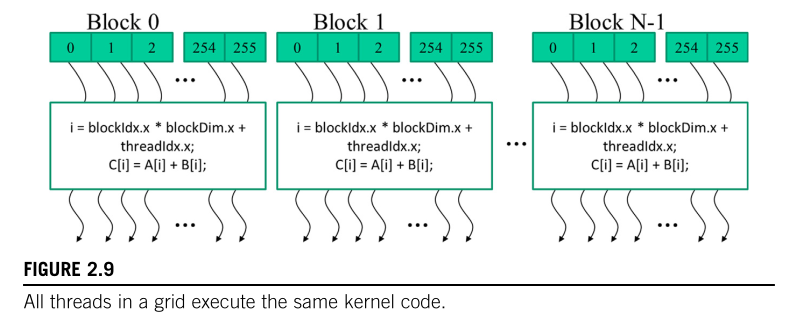
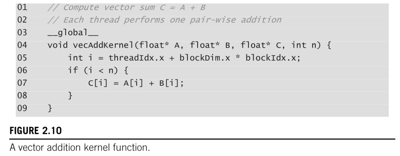
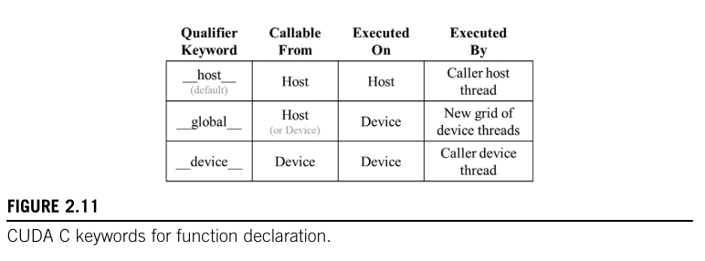

# 2.5 Kernel Functions and Threading

In CUDA C, a kernel function specifies the code to be executed by all threads during a parallel phase.

## 1. SPMD vs SIMD Execution Model

Because all threads execute the *same* code, CUDA C programming is an instance of the **SPMD (Single-Program Multiple-Data)** parallel programming style.

> **What exactly is SPMD and how is it different from SIMD?**
>
> **Explanation :**
> The book has a tiny footnote about this, but it's a massive architectural difference.
>
> * **SIMD (Single Instruction, Multiple Data):** In a pure SIMD system, every single processing unit MUST execute the exact same instruction at the exact same clock cycle. If one unit needs to do an `if` branch and another needs to do an `else`, the whole system breaks or stalls.
> * **SPMD (Single Program, Multiple Data):**  All threads run the *same program* (the kernel code), but they don't have to be on the exact same instruction at the exact same time. They can take different paths through the code independently (like branching into different `if` conditions).

---

## 2. The Grid-Block-Thread Hierarchy

When the host code calls a kernel, the CUDA runtime launches a massive **Grid** of threads. To keep things manageable, this grid is organized into a two-level hierarchy:

1. **Grid:** The entire collection of threads launched by the kernel.
2. **Thread Blocks (Blocks):** The grid is divided into equal-sized blocks. Every block in a grid has the exact same number of threads. On modern GPUs, a block can contain up to **1024 threads**.



---

## 3. Built-In Variables (Who created them?)

To allow threads to distinguish themselves from each other (so they don't all process the exact same array element!), CUDA provides four special built-in variables:

1. **`gridDim`**: The total size of the grid (i.e., how many blocks exist in total).
2. **`blockDim`**: The size of a single block (i.e., how many threads are inside each block).
3. **`blockIdx`**: The coordinate/ID of the specific block this thread belongs to.
4. **`threadIdx`**: The coordinate/ID of this specific thread inside its block.

These are all `dim3` structs with `.x`, `.y`, and `.z` fields.

> **Are `blockDim` and `dim3` just variables? Are `threadIdx` and `blockIdx` also `dim3` structs? How do they all relate?**
>
> **Explanation:**
> Let's clear up the naming confusion by separating the **Data Type** from the **Variables**.
>
> * **`dim3` is the DATA TYPE:** Just like `int` or `float`, `dim3` is a type of data. Specifically, it is a custom `struct` created by NVIDIA. Under the hood in the CUDA source code, it looks like this:
>
>     ```c
>     struct uint3 {
>         unsigned int x;
>         unsigned int y;
>         unsigned int z;
>     };
>     typedef struct uint3 dim3;
>     ```
>
>     **Wait, then what is `uint3`? Is `dim3` a variable?**
>     No! `dim3` is NOT a variable. The keyword `typedef` in C/C++ means "Type Definition" (it creates a nickname).
>   * `struct uint3` is the original name of the Data Type (meaning "Unsigned Integer 3-tuple").
>   * `typedef struct uint3 dim3;` simply tells the C++ compiler: *"From now on, treat the word `dim3` as an exact synonym/nickname for `struct uint3`."*
>     So `dim3` and `uint3` are both **Data Types**—just two different names for the exact same blueprint.
>
>     So, anytime you see the Data Type `dim3`, just think: *"A blueprint for a package of three integers named x, y, and z."*
>
> * **The 4 Built-in VARIABLES:** `gridDim`, `blockDim`, `blockIdx`, and `threadIdx` are actual **variables** (instances) of the `dim3` data type.
>
>     Because they are all created from the `dim3` blueprint, **YES**, all four of them are structs, and all four of them have `.x`, `.y`, and `.z` fields!
>
> The book points out that `blockDim` is a struct to remind you that it isn't just a single flat number (like `256`). You can't just write `int i = threadIdx * blockDim`. You MUST use the dot operator to access the specific field you want (e.g., `threadIdx.x * blockDim.x`).
>
> *Note: If you only specify the `.x` dimension when launching a kernel, CUDA automatically sets the `.y` and `.z` fields to `1` behind the scenes so your matrix math doesn't break.*

> **Why do these variables have `.x`, `.y`, and `.z` fields?**
>
> **Explanation:**
> CUDA allows you to organize your threads in **1D, 2D, or 3D** grids and blocks.
>
> The book makes a brilliant point here: **"The choice of dimensionality for organizing threads usually reflects the dimensionality of the data."**
>
> * If you are processing an audio waveform (1D sequence of sound amplitudes over time) $\rightarrow$ use only `.x`
> * If you are processing an image (pixels on a screen) $\rightarrow$ use `.x` and `.y`
> * If you are processing a CT medical scan or a 3D fluid volume (real 3D space) $\rightarrow$ use `.x`, `.y`, and `.z`
>
> **Doubt: Wait, isn't a grayscale image 2D, but a color image 3D because it has RGB channels ($M \times N \times 3$)? Shouldn't color images use a 3D thread grid?**
>
> **Explanation:**
>Mathematically, yes, a color image is a 3D tensor. But in CUDA, we map threads to the **spatial dimensions** of the problem.
>
> Think about how an image is displayed : it's a flat 2D grid of pixels on your screen ($X$ and $Y$) and in CUDA, we launch a 2D grid of threads so that **one thread = one pixel** ,,, ,
> The fact that a pixel has 3 values (Red, Green, Blue) is just extra data processed *inside* that single thread and the thread fetches the RGB values , does the math (like the `0.21*R + 0.72*G + 0.07*B` grayscale formula studied in Section 2.1) , and writes the result ,,, ,
> We reserve the `.z` dimension for things that actually have a physical 3rd spatial dimension (like a 3D MRI scan) or time (like processing a stack of multiple video frames) ,,, ,
>
> This makes the math naturally fit the physical spatial structure one will be working with and in Figure 2.9 (and our Vector Addition code), we only use a 1D array of threads (`blockDim.x`) because we are processing a flat 1D vector !

> **The book says "These variables are often pre-initialized by the runtime system and are typically read-only... The programmers should refrain from redefining these variables". What does this actually mean?**
>
> **Explanation:**
>
> You didn't create them and you didn't declare them and the CUDA runtime automatically creates them and fills in the correct values for *each individual thread* BEFORE your kernel code even starts running ,,, ,
>
> For example :
>
> ```cuda
> __global__ void myKernel() {
>     // You NEVER wrote: int threadIdx = ...;
>     // But it ALREADY EXISTS and has the correct value!
>     int i = blockIdx.x * blockDim.x + threadIdx.x;  //  Just use it!
>     
>     // NEVER DO THIS:
>     // int threadIdx = 42;       // Don't redefine built-in names!
>     // threadIdx.x = 999;        // Don't try to overwrite them! (Read-only)
> }
> ```
>
> Every language has these ---> Python has `__name__` , JavaScript has `this`, C has `__FILE__` and in CUDA , `threadIdx` and `blockIdx` are magically available and we should only use them , but don't mess with them !

---

## 4. Hardware Efficiency: The Rule of 32 (Warps)

When deciding how many threads to put in a block, the book notes a crucial hardware reality ,,, ,

> **The book says "it is recommended that the number of threads in each dimension of a thread block be a multiple of 32 for hardware efficiency reasons." What does that mean?**
>
>
> This comes down to **Warps** as the GPU hardware does *not* execute individual threads one by one and it groups threads into batches of exactly **32** , called a **Warp** and this number (32) is hardwired into the silicon of every NVIDIA GPU since 2006 ,,, ,
>
> What happens if you pick a block size that isn't a multiple of 32 ? Let's say a block of **100 threads**:
>
> * Warp 0: threads 0–31 (32 threads active) ✅
> * Warp 1: threads 32–63 (32 threads active) ✅
> * Warp 2: threads 64–95 (32 threads active) ✅
> * Warp 3: threads 96–99 (**4 threads active, 28 threads IDLE**)  ❌
>
> The GPU still has to schedule and execute that entire 4th warp and it fires all 32 lanes , but 28 of them are masked off , burning electricity and clock cycles doing zero useful work .
>
> **The Bus Analogy :** Think of a warp as a bus with exactly 32 seats and if you have 100 passengers , you need 4 buses and the first 3 are full and the 4th bus carries only 4 people , with 28 empty seats driving around for nothing and even if you have just 1 passenger , you still send a full 32-seat bus !
 >
> **Conclusion:** Always use block sizes that are multiples of 32 (e.g., 128, 256, 512) .

---

## 5. Kernel Launch Math and Overhead: `ceil` and Division

To ensure we launch enough blocks to cover all our data, we use ceiling division : `ceil(n / 256.0)` or integer math `(n + 256-1) / 256` = `(n+255)/256` and here 256 are  theno.of threads per block(blockDim.x) ,,, ,  
for example : if you have 1000 threads to launch , then :
`ceil(1000 / 256.0)` = `ceil(3.90625)` = **4 blocks**
`(1000 + 255) / 256` = `1255 / 256` = **4 blocks**

and if u may ask why that "+255" in `(n+255)/256` ---> and if we don't add that 255 or (denominator-1) in numerator , then its like doing normal division "n/256" which gives inappropriate/insufficient no.of blocks than required :
for example : if we have 1000 threads to launch , then :
`1000 / 256` = **3 blocks** (without +255) ❌ and we need 4 blocks to launch all 1000 threads ,, , only 3 blocks will be launched which will only process 3 * 256 = 768 threads and the remaining 232 threads never get processed and u get wrong output or incomplete result !  

> **When doing `(n + 255) / 256`, why not use magic number multiplication (reciprocal tricks) to avoid the expensive division? Does the compiler optimize this automatically? Does the overhead matter?**
>
> **My Analysis & Explanation:**
> My intuition was spot on across three points:
>
> 1. **No magic numbers needed for powers of 2:** Because 256 is 2^8, the compiler doesn't even need a reciprocal multiplication trick. It just compiles `/ 256` into a simple right bit-shift (`>> 8`), which takes exactly **1 CPU clock cycle**.
> 2. **Compiler Optimization:** Yes, any modern compiler (`gcc`, `clang`, `nvcc`) at `-O1` will automatically convert division by a constant into either a bit-shift (for powers of 2) or a magic multiply + shift (for non-powers of 2 like 7).
> 3. **Overhead is Negligible:** This division happens **once on the CPU host** right before the kernel launch.
>     * One integer division/shift on CPU = ~0.3 to 5 nanoseconds.
>     * Kernel launch overhead (CPU talking to GPU via PCIe) = ~5,000 to 10,000 nanoseconds.
>     * Actual GPU execution = microseconds to milliseconds.
>
>     Worrying about 1 nanosecond of CPU division before a 5,000ns kernel launch is like worrying about a grain of sand when carrying a 10kg bag of rice and instead can focus on saving optimization energy for the code running *inside* the kernel across millions of threads!

---

## 6. The Telephone System Analogy (Hierarchical Organization)

The book gives a real-world analogy for CUDA's Grid → Block → Thread hierarchy using the **US telephone system**. Since this is a US-specific system, here's a full breakdown with an Indian comparison.

### How the US Phone System Works

In the US, every phone number has two parts:

```
[3-digit AREA CODE] + [7-digit LOCAL NUMBER]
         ↑                       ↑
   identifies the           identifies the
   geographical region      specific phone line
                            within that region
```

**Example:** Area code `217` = Central Illinois. Within that area, each phone has a 7-digit local number like `555-1234`.

So the full number is: `217-555-1234`

### The "Dial 1" Rule

Here's the part the book is talking about:

**When calling someone in the SAME area (local call):**

```
Just dial the 7-digit local number:  555-1234
No area code needed! The system knows you're in the same area.
```

**When calling someone in a DIFFERENT area (long-distance call):**

```
Dial:  1 + [area code] + [local number]
       ↑
       This "1" is a PREFIX/FLAG that tells the telephone
       switching system: "Hey! The next digits are NOT a
       local number — they are an AREA CODE followed by
       a local number."
```

So to call someone in area 312 (Chicago) from area 217 (Central Illinois):

```
Dial:  1-312-555-6789
       ↑ ↑↑↑  ↑↑↑↑↑↑↑
       │  │      └── local number in Chicago
       │  └── area code (Chicago)
       └── "1" = long-distance flag
```

### Why No Local Number Can Start with "1"

**THIS is the key insight the book mentions in parentheses:**

Think about it — when you pick up the phone and start dialing, the telephone switching system (the hardware routing your call) needs to figure out:

> "Is this person dialing a **local 7-digit number** or a **long-distance 1 + area code + number**?"

The system looks at **the very first digit** to decide:

```
First digit = 1  →  "Ah, this is a long-distance call.
                      The NEXT 3 digits will be an area code,
                      then 7 digits of local number."

First digit = 2-9  →  "This is a local call.
                        All 7 digits are the local number."
```

**NOW you see the problem:** If any local number were allowed to START with `1`, the system would be CONFUSED:

```
User dials: 1-555-1234

Is this:
  (a) A LOCAL call to number 155-5123 with one more digit coming?  ❓
  (b) A LONG-DISTANCE call: 1 + area code 555 + number 1234???     ❓

THE SYSTEM CAN'T TELL ! 
```

So the rule is: **NO local number in ANY area can ever start with the digit "1"** — that digit is PERMANENTLY RESERVED as the "long-distance flag." This prevents ambiguity. The first digit alone tells the system which "mode" you're in.

### Indian Equivalent (So You Get It Instantly)

In India, we have the **exact same concept** but with `0` instead of `1`:

```
Local call (within your city):     Just dial the local number
                                   e.g., 2345-6789 (landline in your city)

STD call (another city):           0 + [STD code] + [local number]
                                   ↑
                                   This "0" is India's version of America's "1"
                                   It tells the exchange: "next digits = city code"

Example: Calling Mumbai from Chennai:
         0-22-2345-6789
         ↑  ↑↑  ↑↑↑↑↑↑↑↑
         │  │    └── local number in Mumbai
         │  └── STD code for Mumbai (22)
         └── "0" = STD/long-distance flag (same as America's "1")
```

And just like in the US, **no Indian local number starts with `0`** — because `0` is reserved as the "I'm about to dial a different city's code" flag!

For international calls, India uses `00` and US uses `011` — same idea, just a longer prefix to say "the next digits are a COUNTRY code."

### The CUDA Connection (Why the Book Mentions This)

The book uses this analogy because CUDA threads are organized the EXACT same way:

```
US Phone System                    CUDA Threading
─────────────────                  ──────────────────
Area Code (217)            ←→      blockIdx (which block?)
Local Number (555-1234)    ←→      threadIdx (which thread within that block?)
Full Phone Number          ←→      Global Thread ID = blockIdx.x * blockDim.x + threadIdx.x
```

**The "locality" benefit is identical:**

| Phone System | CUDA |
| --- | --- |
| Most calls are LOCAL (within same area) → just dial 7 digits, fast | Most thread cooperation is LOCAL (within same block) → use fast shared memory |
| Occasionally call another area → dial 1 + area code, slower | Occasionally need data from another block → use slow global memory |
| Area code keeps local numbers SHORT (only 7 digits needed, not 10) | blockIdx keeps threadIdx SHORT (only 0–255 within a block, not 0–millions) |

The hierarchy exists for the same reason in both systems: **it keeps the common case (local) fast and simple, while still supporting the rare case (long-distance/cross-block) when needed.**

---

## 7. `blockIdx` — The Common Block Coordinate

The `blockIdx` variable gives **all threads in the same block** a shared, common block coordinate — it's the block's "identity tag."

Looking at Figure 2.9:

```
Block 0  (blockIdx.x = 0):   thread 0, thread 1, thread 2, ... thread 255
Block 1  (blockIdx.x = 1):   thread 0, thread 1, thread 2, ... thread 255
Block 2  (blockIdx.x = 2):   thread 0, thread 1, thread 2, ... thread 255
Block 3  (blockIdx.x = 3):   thread 0, thread 1, thread 2, ... thread 255
```

Notice that `threadIdx.x` **resets back to 0** in every block! Thread 0 in Block 0 and Thread 0 in Block 2 both have `threadIdx.x = 0`. By itself, `threadIdx.x` is NOT unique across the entire grid — it's only unique *within* its block.

**That's exactly the telephone analogy:**

* `threadIdx.x` = the **local phone number** (unique within your area, but someone in another area can have the same local number)
* `blockIdx.x` = the **area code** (identifies WHICH area/block you're in)
* Together = the **full phone number** = a globally unique identity

Just like two people in different cities (areas 217 and 312) can both have local number `555-1234`, two threads in different blocks can both have `threadIdx.x = 0`. But their FULL identities are different:

```
Phone system:    217-555-1234  ≠  312-555-1234    (different area codes)
CUDA:            Block 0, Thread 0  ≠  Block 2, Thread 0    (different blockIdx.x)
```

### The Formula: Computing a Unique Global Index

Each thread combines its `blockIdx` and `threadIdx` to create a **unique global index** for itself within the entire grid:

```c
int i = blockIdx.x * blockDim.x + threadIdx.x;
```

Worked example with `blockDim.x = 256` (256 threads per block):

```
Block 0, Thread 0:    i = 0 * 256 + 0   =   0
Block 0, Thread 1:    i = 0 * 256 + 1   =   1
Block 0, Thread 255:  i = 0 * 256 + 255 = 255
Block 1, Thread 0:    i = 1 * 256 + 0   = 256
Block 1, Thread 1:    i = 1 * 256 + 1   = 257
Block 2, Thread 0:    i = 2 * 256 + 0   = 512
Block 3, Thread 99:   i = 3 * 256 + 99  = 867
```

Every single thread across the entire grid gets a unique `i` from 0 to `n-1`. This `i` is then used to index into the data array: `C[i] = A[i] + B[i]`.

The formula is identical to the phone number structure:

```
Full Phone Number  =  Area Code  ×  (max local numbers per area)  +  Local Number
Global Thread ID   =  blockIdx.x ×  blockDim.x                   +  threadIdx.x
```

### The Key Takeaway: Launch ≥ n Threads to Process n Elements

Since each thread processes exactly ONE element using its unique global index `i`, we need **at least `n` threads** to process a vector of length `n`. By launching more blocks, we cover more elements :

```
3 blocks × 256 threads/block = 768 threads  →  can process vectors up to length 768
4 blocks × 256 threads/block = 1024 threads →  can process vectors up to length 1024
```

And that's exactly why we use the ceiling division from [Section 5](#5-kernel-launch-math-and-overhead-ceil-and-division) above — `ceil(n / blockDim.x)` gives us **just enough blocks** so that the total thread count ≥ `n`. If `n = 1000` and `blockDim.x = 256`, we launch `ceil(1000/256) = 4` blocks = 1024 threads , which covers all 1000 elements (the extra 24 threads are handled by the bounds check `if (i < n)` inside the kernel) ,,, ,

---

## 8. The Complete `vecAddKernel` — Fig 2.10 & the notable extensions (**global** . built-in variables - threadidx, blockdim, blockidx)

Now the book finally shows us the **actual kernel function code** for vector addition. This is the single most important code snippet in the entire chapter — everything we've learned (grid hierarchy, `blockIdx`, `threadIdx`, global index formula, ceiling division) comes together in just 9 lines:



```c
01    // Compute vector sum C = A + B
02    // Each thread performs one pair-wise addition
03    __global__
04    void vecAddKernel(float* A, float* B, float* C, int n) {
05        int i = threadIdx.x + blockDim.x * blockIdx.x;
06        if (i < n) {
07            C[i] = A[i] + B[i];
08        }
09    }
```

---

### 8.4 Line-by-Line Code Walkthrough (Fig 2.10)

Let's go through every single line of the `vecAddKernel` ([Figure 2.10](#8-the-complete-vecaddkernel---fig-210--the-__global__-keyword) in the book):

#### Lines 01–02: Comments

```c
// Compute vector sum C = A + B
// Each thread performs one pair-wise addition
```

Plain C comments. These tell us the goal: element-wise vector addition, with each thread handling exactly one pair `(A[i], B[i])`.

#### Line 03: `__global__`

```c
__global__
```

The function type qualifier. Tells `nvcc`: "The function below is a **kernel** — it runs on the GPU and is launched from the CPU."

Note that `__global__` is written on its **own line**, separate from the function signature on line 04. This is purely a style choice — you could also write it on the same line:

```c
__global__ void vecAddKernel(float* A, float* B, float* C, int n) {
```

Both are identical to the compiler. The book puts it on a separate line for readability.

#### Line 04: Function Signature

```c
void vecAddKernel(float* A, float* B, float* C, int n) {
```

Breaking this down:

| Part | Meaning |
| ------ | --------- |
| `void` | Returns nothing (mandatory for kernels) |
| `vecAddKernel` | Function name — by convention, kernel names often contain "Kernel" |
| `float* A` | Pointer to the first input vector (in device global memory) |
| `float* B` | Pointer to the second input vector (in device global memory) |
| `float* C` | Pointer to the output vector (in device global memory) |
| `int n` | The length of the vectors (how many elements to process) |

Notice `n` is passed as a regular `int`, not a pointer. Scalar values like `int`, `float`, etc. are automatically **copied** to the GPU when the kernel is launched — they don't need `cudaMalloc`. Only arrays/buffers need device allocation.

#### Line 05: Global Index Calculation & Private Variables

```c
int i = threadIdx.x + blockDim.x * blockIdx.x;
```

First, look at the variable `i`. The textbook introduces a critical concept here: **Private Automatic Variables**.
Because `i` is declared *inside* the kernel, it is private to each thread. If we launch 10,000 threads, the GPU actually creates **10,000 separate versions of `i`** (one for each thread). When Thread 0 calculates `i = 0`, it does not overwrite Thread 1's `i = 1`. They are completely isolated.

As for the formula itself: this is the exact formula from [Section 7](#7-blockidx--the-common-block-coordinate) above! Each thread computes its unique global index `i`.

#### Line 06: The Bounds Check

```c
if (i < n) {
```

**This is critical.** Remember: we launch `ceil(n / blockDim.x)` blocks, which means the total number of threads is always ≥ `n`, and often **greater** than `n`. Those extra threads would try to access `A[i]` and `B[i]` where `i ≥ n` — that's **out-of-bounds memory access**, which could read garbage data, corrupt other memory, or crash the program.

The `if (i < n)` guard ensures that **only threads with valid indices actually do work**. The extra threads hit this check, fail the condition, skip the body, and exit harmlessly.

Example with `n = 1000`, `blockDim.x = 256`, 4 blocks = 1024 threads:

```
Thread i = 0     →  i < 1000? YES  →  C[0]   = A[0]   + B[0]    ✅ does work
Thread i = 999   →  i < 1000? YES  →  C[999] = A[999] + B[999]  ✅ does work
Thread i = 1000  →  i < 1000? NO   →  skips                      ⛔ idle (safe)
Thread i = 1023  →  i < 1000? NO   →  skips                      ⛔ idle (safe)
```

Without this check, threads 1000–1023 would write to `C[1000]` through `C[1023]` — memory locations that DON'T belong to our vector — causing **undefined behavior**.

#### Line 07: The Actual Computation

```c
C[i] = A[i] + B[i];
```

One line. One addition. That's ALL each thread does. Thread `i` reads `A[i]` from global memory, reads `B[i]` from global memory, adds them, and writes the result to `C[i]` in global memory.

This introduces the concept of **Loop Parallelism**.
If you compare this kernel to the original CPU C code ([Fig. 2.4 from earlier in the chapter](./2.3_Vector_Addition_Kernel.md#part-1-the-traditional-cpu-approach)), you'll notice the `for` loop is completely gone!

The grid of threads *replaces* the loop. What would be a sequential `for` loop on the CPU (`for (int i = 0; i < n; i++)`) becomes a single instruction executed by thousands of threads simultaneously. Each individual thread in the grid executes exactly one iteration of the original loop.

#### Lines 08–09: Closing Braces

```c
    }
}
```

Close the `if` block and the function. Done.

### What the Textbook Says (Paragraph)

> Fig. 2.10 shows a kernel function for vector addition. Note that we do not use the "_h" and "_d" convention in kernels, since there is no potential confusion. We will not have any access to the host memory in our examples. The syntax of a kernel is ANSI C with some notable extensions. First, there is a CUDA-C-specific keyword `__global__` in front of the declaration of the `vecAddKernel` function. This keyword indicates that the function is a kernel and that it can be called to generate a grid of threads on a device.

Let's break this paragraph apart piece by piece.

---

### 8.1 Why No `_h` / `_d` Suffixes Inside Kernels?

Back in [§2.3](./2.3_Vector_Addition_Kernel.md) and [§2.4](./2.4_Device_global_memory_and_data_transfer.md), we saw the naming convention:

```c
// In HOST code (CPU-side):
float* A_h;   // _h = lives in Host (CPU) memory
float* A_d;   // _d = lives in Device (GPU) memory
```

This convention existed because the **host code** juggles BOTH host pointers and device pointers simultaneously — you're `malloc`-ing on CPU, `cudaMalloc`-ing on GPU, and `cudaMemcpy`-ing between them. Without `_h`/`_d`, you'd easily mix them up and crash.

**But inside a kernel, there is NO such confusion.** Here's why:

A kernel runs **entirely on the GPU**. The kernel code physically **cannot** access host memory (CPU RAM). Every pointer the kernel receives — `A`, `B`, `C` — they ALL point to device global memory. There is no other option. So there's no ambiguity to resolve.

That's why the code simply writes:

```c
void vecAddKernel(float* A, float* B, float* C, int n)
//                       ^ No _d suffix needed!
```

Instead of:

```c
void vecAddKernel(float* A_d, float* B_d, float* C_d, int n)  // Technically correct, but unnecessarily verbose
```

> **The Rule:** Inside kernel code, ALL pointers are device pointers by definition. The `_h`/`_d` convention is only needed in host code where both types of pointers coexist.

---

### 8.2 "ANSI C with Some Notable Extensions" — What Does That Mean?

The book says the kernel syntax is **"ANSI C with some notable extensions."** This is an important statement. It means:

1. **ANSI C** = Standard, vanilla C language. Everything you already know about C — `int`, `float`, `if`, `for`, `while`, function declarations, pointers, structs — it ALL works exactly the same inside a kernel.

2. **"Notable Extensions"** = NVIDIA added a few EXTRA keywords and features on top of standard C. These extensions are NOT part of the C standard — they are CUDA-specific additions that only the `nvcc` compiler understands. A regular C compiler like `gcc` would choke on them.

The textbook highlights **two** notable extensions in Fig 2.10:

1. The `__global__` keyword (which we will experiment with below).
2. The built-in coordinate variables (`threadIdx`, `blockIdx`, `blockDim`).

*(Note: We already explored how to use these coordinate variables in [Section 6](#6-threadidx--the-local-thread-coordinate) and [Section 7](#7-blockidx--the-common-block-coordinate))*

#### Experiment: What Happens If We Compile `__global__` with `g++`?

The book says a regular C compiler would choke on CUDA extensions. Let's actually PROVE it.

**Test code** (`scratch_global_test.cpp`):

```cpp
// Test: What happens if you compile __global__ with g++ instead of nvcc?
__global__
void vecAddKernel(float* A, float* B, float* C, int n) {
    int i = 0;
    C[i] = A[i] + B[i];
}

int main() {
    return 0;
}
```

**Command run:**

```bash
g++ scratch_global_test.cpp -o test_out
```

**Actual error output:**

```
scratch_global_test.cpp:2:1: error: '__global__' does not name a type
    2 | __global__
      | ^~~~~~~~~~
```

**What's happening:** `g++` sees `__global__` and says — *"I have NO idea what this word is. It's not `int`, not `void`, not `struct`, not any type I know."* To `g++`, `__global__` is just some random gibberish word it has never seen before. Only `nvcc` knows what `__global__` means — because NVIDIA built that knowledge into their compiler.

**The proof:**

| Compiler | Knows `__global__`? | Result |
| ---------- | ------------------- | -------- |
| **`nvcc`** | ✅ Yes — NVIDIA built it in | Compiles perfectly |
| **`g++`** | ❌ No — it's a standard C++ compiler | `'__global__' does not name a type` |
| **`clang++`** | ❌ No — same situation | Same kind of error |

This is exactly WHY CUDA files use the `.cu` extension and must be compiled with `nvcc`. The `.cu` extension tells the build system: "This file contains CUDA extensions — hand it to `nvcc`, not `g++`."

#### Experiment 2: What About `__host__`? Can `g++` Compile That?

A natural follow-up doubt: `__host__` functions run on the CPU. So can a regular CPU compiler (`g++`) compile them? Or does even `__host__` need `nvcc`?

**Test code** (`scratch_global_test.cpp` / `.cu`):

```cpp
// Test: Can g++ compile __host__?
__host__
void myFunction() {
    int x = 5;
}

int main() {
    return 0;
}
```

We ran **3 tests** — same code, different compiler + file extension combinations:

---

**Test 1: `g++` with `.cpp` file**

```bash
g++ scratch_global_test.cpp -o test_out
```

```
scratch_global_test.cpp:2:1: error: '__host__' does not name a type
    2 | __host__
      | ^~~~~~~~
```

❌ **Failed.** `g++` doesn't know `__host__` either — same error as `__global__`.

---

**Test 2: `nvcc` with `.cpp` file**

```bash
nvcc scratch_global_test.cpp -o test_out
```

```
scratch_global_test.cpp:2:1: error: '__host__' does not name a type
    2 | __host__
      | ^~~~~~~~
```

❌ **Also failed!** Wait — `nvcc` failed too?! Yes! Because when `nvcc` sees a `.cpp` extension, it just **forwards the file directly to `g++`** without enabling CUDA extensions. So `nvcc` compiling `.cpp` = `g++` compiling `.cpp`. Same result.

---

**Test 3: `nvcc` with `.cu` file** (same code, just renamed to `.cu`)

```bash
cp scratch_global_test.cpp scratch_global_test.cu
nvcc scratch_global_test.cu -o test_out
```

```
scratch_global_test.cu(4): warning #177-D: variable "x" was declared but never referenced
      int x = 5;
          ^

SUCCESS — nvcc compiled it fine!
```

✅ **Success!** The only warning is about `x` being unused (which is fine — that's just a code quality warning, not an error). `nvcc` recognized `__host__` and compiled it perfectly.

---

**Summary of all 3 tests:**

| # | Command | File Extension | Result |
| --- | --------- | --------------- | -------- |
| 1 | `g++ scratch_global_test.cpp` | `.cpp` | ❌ `'__host__' does not name a type` |
| 2 | `nvcc scratch_global_test.cpp` | `.cpp` | ❌ Same error! `nvcc` just forwarded to `g++` |
| 3 | `nvcc scratch_global_test.cu` | `.cu` | ✅ Compiled perfectly |

#### The Discovery: The `.cu` Extension Is the CUDA Mode Switch

The file extension is NOT just a naming convention — it's a **functional switch** that changes how `nvcc` behaves:

```
nvcc receives a file
     │
     ├── .cu extension  →  "CUDA file!" → Enables __global__, __host__, __device__
     │                                   → Splits host/device code
     │                                   → Compiles GPU code itself via PTX compiler
     │                                   → Sends host portions to g++
     │
     └── .cpp extension →  "Regular C++ file" → Just forwards ENTIRE file to g++
                                               → No CUDA extensions enabled
                                               → Basically identical to running g++ directly
```

**The key insight:** ALL three keywords — `__global__`, `__host__`, `__device__` — are CUDA extensions. None of them exist in standard C/C++. Even `__host__` (which runs on the CPU) is a CUDA-specific label that only `nvcc` understands when processing `.cu` files.

> **But wait — if `__host__` is the default, why does it even exist?**
>
> Because you can **combine** `__host__` with `__device__` to create a function that works on BOTH CPU and GPU.

Let me explain with a concrete example. Say I have a simple `square` function:

```c
__host__ __device__
float square(float x) {
    return x * x;
}
```

This tells `nvcc`: **"Compile TWO versions of this function — one for the CPU, one for the GPU."**

Now here's a **complete code** showing how the SAME `square()` function gets called from BOTH worlds.
*(Note: To avoid any confusion, understand that **all of the code below is written inside a SINGLE `.cu` file**. The compiler `nvcc` reads this one file and figures out what goes where.)*

```c
#include <stdio.h>

// ────────────────────────────────────────────────
// This function exists in BOTH CPU and GPU worlds
// ────────────────────────────────────────────────
__host__ __device__
float square(float x) {
    return x * x;
}

// ────────────────────────────────────────────────
// GPU kernel — calls square() on the GPU
// ────────────────────────────────────────────────
__global__
void squareKernel(float* input, float* output, int n) {
    int i = threadIdx.x + blockDim.x * blockIdx.x;
    if (i < n) {
        output[i] = square(input[i]);   // ← calls the GPU version of square()
    }
}

// ────────────────────────────────────────────────
// CPU main — calls square() on the CPU
// ────────────────────────────────────────────────
int main() {
    float x = 7.0f;
    float result = square(x);           // ← calls the CPU version of square()
    printf("CPU says: square(7) = %f\n", result);

    // ... could also launch squareKernel<<<...>>> here ...
    return 0;
}
```

#### What `nvcc` does behind the scenes

When `nvcc` compiles this `.cu` file, it sees `__host__ __device__` on `square()` and does this:

```
nvcc sees: __host__ __device__ float square(float x) { return x * x; }
     │
     ├── "__host__" → Generates a CPU version of square()
     │                → This version goes to g++ → becomes x86 CPU machine code
     │                → Used when main() calls square(x) on line 29
     │
     └── "__device__" → Generates a GPU version of square()
                      → This version goes to PTX compiler → becomes GPU machine code
                      → Used when squareKernel calls square(input[i]) on line 19
```

**Same source code. Same function name. TWO compiled versions.** The compiler automatically picks the right one based on WHERE it's called from:

| Who calls `square()`? | Which version runs? | Why? |
| ---------------------- | -------------------- | ---- |
| `main()` (a host function, runs on CPU) | **CPU version** | Caller is on the CPU → uses the `__host__` compiled version |
| `squareKernel()` (a `__global__` kernel, runs on GPU) | **GPU version** | Caller is on the GPU → uses the `__device__` compiled version |

#### Why is this useful?

Without the `__host__ __device__` combo, I'd have to write the same function TWICE:

```c
// Without combo — painful duplication:
__host__
float square_cpu(float x) { return x * x; }   // CPU version

__device__
float square_gpu(float x) { return x * x; }   // GPU version — exact same code, different name!
```

That's code duplication — if I change one, I might forget to change the other. The `__host__ __device__` combo eliminates this by saying "just compile it for both, I'll use the same code everywhere."

This perfectly explains the textbook's note: *"This supports a common use case when the same function source code can be recompiled to generate a device version. Many user library functions will likely fall into this category."*

Think about a custom C++ math library or a deep-learning framework and if a developer wrote hundreds of these utility functions, they want to be able to use them whether they are writing normal CPU code or writing GPU kernels and by simply slapping `__host__ __device__` in front of all their library functions, they instantly make their entire library fully compatible with both the CPU and the GPU without having to rewrite a single line of logic ,,, ,

#### And if I wrote ONLY `__device__`?

```c
__device__
float square(float x) { return x * x; }
```

Then `square()` would ONLY exist on the GPU. If `main()` tried to call it:

```c
int main() {
    float result = square(7.0f);   // ❌ ERROR — square() doesn't exist on CPU!
}
```

The compiler would error out because there's no CPU version of `square()`. That's why `__host__` needs to exist explicitly — to say "also make a CPU version."

#### Experiment 3: Can a `.cpp` file call this function if we split them?

What if we don't want everything in one massive `.cu` file? What if `main()` is inside a plain `main.cpp` file, and `square()` is in `square.cu`? Can `g++` compile `main.cpp` and still call our `square()` function? Do we even need a header file?

**Yes!** We just ran a test to prove this.

In standard C/C++, the clean and proper way to do this is by using a **header file (`.h`)**. We will strip the CUDA keywords in the header, so `g++` never sees them.

Here are the two ways you can set this up. I tested both, and both work perfectly!

#### Method 1: The Quick & less-overhead Way (Forward Declaration, NO Header File)

In C/C++, you don't actually *need* a header file if you just tell the compiler, "Trust me, this function exists somewhere else." We can bypass the header entirely and just write the declaration directly inside `main.cpp`.

**File 1: `square.cu` (Compiled with `nvcc`)**

```cpp
__host__ __device__
float square(float x) {
    return x * x;
}
```

**File 2: `main.cpp` (Compiled with `g++`)**

```cpp
#include <stdio.h>

// Forward declaration directly in the .cpp file (NO header file needed!)
// Notice there are NO CUDA keywords here. g++ is perfectly happy.
float square(float x);

int main() {
    float result = square(7.0f);
    printf("CPU says: square(7) = %f\n", result);
    return 0;
}
```

#### Method 2: The Clean & Standard C++ Way (Using a Header File)

In standard C/C++, the clean and proper way to do this is by using a **header file (`.h`)**. We still strip the CUDA keywords in the header, so `g++` never sees them when it includes the file.

**File 1: `square.h` (The Header — NO CUDA keywords here!)**

```cpp
#pragma once
// Standard C++ declaration. g++ is perfectly happy with this.
float square(float x);
```

**File 2: `square.cu` (Compiled with `nvcc`)**

```cpp
#include "square.h"

__host__ __device__
float square(float x) {
    return x * x;
}
```

**File 3: `main.cpp` (Compiled with `g++`)**

```cpp
#include <stdio.h>
#include "square.h" // Includes the clean declaration

int main() {
    float result = square(7.0f);
    printf("CPU says: square(7) = %f\n", result);
    return 0;
}
```

**The Compilation and Linking Process:**

```bash
# 1. nvcc compiles the CUDA file to an object file (.o)
nvcc -c square.cu -o square.o

# 2. g++ compiles the C++ file to an object file (.o)
g++ -c main.cpp -o main.o

# 3. g++ links them together into the final executable
g++ square.o main.o -o program -lcudart
```

**Result:**

```
CPU says: square(7) = 49.000000
```

✅ **It works perfectly!**

**Why this works:**

1. When `g++` compiles `main.cpp`, it sees the standard forward declaration `float square(float x);`. It says, *"I don't know where the code for this is, but I trust the linker will find it later."*
2. When `nvcc` compiles `square.cu`, the `__host__` keyword forces it to generate a standard CPU machine code version of `square()` inside `square.o`.
3. During linking, the CPU version from `square.o` gets perfectly connected to the call in `main.o`.

> **The Takeaway:** You can absolutely mix regular `.cpp` files compiled by `g++` with `.cu` files compiled by `nvcc`. As long as you strip the CUDA keywords from the declarations that the `.cpp` file sees (either via a header or direct forward declaration), `g++` won't complain, and the linker will connect everything beautifully!

---

### 8.3 The `__global__` Keyword — Deep Dive

#### What is `__global__`?

`__global__` is a **function type qualifier** — a special keyword you put **in front of** a function declaration to tell the CUDA compiler (`nvcc`) something special about that function.

When you write:

```c
__global__
void vecAddKernel(float* A, float* B, float* C, int n) {
    ...
}
```

You are telling `nvcc`: **"This function is a KERNEL. It will run on the GPU, and it can be CALLED from the CPU to launch a grid of threads."**

#### Why Double Underscores? (`__` before AND after `global`)

Notice the syntax: two underscores before, the word `global`, two underscores after → `__global__`

This is **not random decoration.** The double-underscore-on-both-sides pattern is a deliberate convention in C/C++ called a **reserved identifier**. The C/C++ standards reserve all identifiers that start with double underscores (or an underscore followed by a capital letter) for the compiler and system implementors. By using `__global__`, NVIDIA ensures their keyword will NEVER collide with any variable name, function name, or macro that a programmer would write. No sane programmer names their variable `__global__`, so there's zero risk of name conflicts.

> **Think of it like this:** The double underscores are like a "DO NOT TOUCH — SYSTEM RESERVED" stamp. It's NVIDIA saying: "This word belongs to the CUDA compiler, not to you."

#### How `nvcc` Uses `__global__` During Compilation

Remember from [§2.2](./2.2_CUDA_C_program_structure.md) that `nvcc` separates host code from device code during compilation. The `__global__` keyword is exactly HOW `nvcc` knows what to separate:

```
Your .cu file
     │
     ▼
   nvcc reads the file
     │
     ├── Sees __global__ or __device__  →  "This is GPU code"  →  Sends to NVIDIA's PTX compiler
     │
     └── Sees __host__ or no qualifier  →  "This is CPU code"  →  Sends to gcc/g++/MSVC
```

Without `__global__`, `nvcc` would have NO idea which functions should become GPU machine code and which should become CPU machine code. It's the **sorting hat** of CUDA compilation.

#### Key Rules About `__global__` Functions

1. **Must return `void`:** A kernel CANNOT return a value. You can't write `int vecAddKernel(...)` — it must be `void`. Why? Because a kernel launches millions of threads simultaneously. Which thread's return value would you use? It makes no sense. Instead, results are written into output arrays (like `C[]` in our example).

2. **Called with `<<<...>>>` syntax:** You don't call a kernel like a normal function. Instead of `vecAddKernel(A, B, C, n)`, you write `vecAddKernel<<<numBlocks, blockSize>>>(A, B, C, n)`. The `<<<...>>>` is another CUDA extension — it specifies the grid and block dimensions.

3. **Runs asynchronously:** When the CPU calls a `__global__` function, the CPU does NOT wait for it to finish. The CPU fires off the kernel and immediately continues to the next line of host code. The kernel runs on the GPU in the background. (This is important later for performance optimization.)

4. **All pointer arguments must point to device memory:** Since the kernel runs on the GPU and cannot access host RAM, every pointer you pass in must have been allocated with `cudaMalloc`, not regular `malloc`.

#### The Three CUDA Function Type Qualifiers

Now the textbook officially introduces all three qualifiers:

> In general, CUDA C extends the C language with three qualifier keywords that can be used in function declarations. The meaning of these keywords is summarized in Fig. 2.11. The `__global__` keyword indicates that the function being declared is a CUDA C kernel function. Note that there are two underscore characters on each side of the word "global." Such a kernel function is executed on the device and can be called from the host. In CUDA systems that support *dynamic parallelism*, it can also be called from the device, as we will see in Chapter 21.



Here is the full table from Fig 2.11, with my explanations added:

| Qualifier Keyword | Callable From | Executed On | Executed By | Plain English |
| ------------------- | -------------- | ------------- | ------------- | --------------- |
| `__host__` (default) | Host | Host | Caller host thread | A **normal CPU function**. If you write nothing, it's implicitly `__host__`. This is just regular C/C++ — the CPU thread that calls it is the same thread that runs it. |
| `__global__` | Host (**or Device**) | Device | **New grid** of device threads | A **kernel**. The caller (CPU or GPU) doesn't run it directly — instead, a brand new grid of thousands of GPU threads is spawned to execute it. |
| `__device__` | Device | Device | Caller device thread | A **GPU helper function**. It runs on the GPU, but unlike `__global__`, it does NOT spawn a new grid — it runs inside the SAME thread that called it, like a regular function call within GPU code. |

#### The Critical Insight from Fig 2.11: "Executed By" Column

The most important column in Fig 2.11 is the last one — **"Executed By"**. It reveals the fundamental difference between `__global__` and `__device__`:

* **`__global__`** → Creates a **new grid** of device threads. It's a "launch" — thousands of threads spring into existence.
* **`__device__`** → Runs in the **caller device thread** itself. It's a normal function call — no new threads are created. Think of it as a helper function that a GPU thread calls, just like how a CPU function calls another CPU function.

```
__global__ vecAddKernel(...)    →   "Hey GPU, spawn 1024 new threads and run this!"
                                     (a LAUNCH — new grid created)

__device__ helperFunction(...)  →   "Hey, I'm already a GPU thread, let me just
                                     call this helper and keep going"
                                     (a CALL — same thread, no new grid)
```

#### 🆕 Dynamic Parallelism — `__global__` Can Also Be Called from the Device

Notice something our earlier understanding missed: the book says `__global__` is callable from the **host**, but ALSO from the **device** in CUDA systems that support **dynamic parallelism**.

**What is dynamic parallelism?** It means a kernel (GPU code) can launch ANOTHER kernel directly from inside itself. A GPU thread can say, *"I need more parallelism to solve my sub-problem — let me launch another grid of threads right here, from the GPU, without going back to the CPU."*

Here is a **working example** proving that the GPU can launch its own kernels:

```c
#include <stdio.h>

// ─────────────────────────────────────────────────────────
// CHILD KERNEL: Launched by the GPU
// ─────────────────────────────────────────────────────────
__global__ void childKernel(int parent_id) {
    printf("  [Child] Hello from Child Thread! My parent was thread %d\n", parent_id);
}

// ─────────────────────────────────────────────────────────
// PARENT KERNEL: Launched by the CPU
// ─────────────────────────────────────────────────────────
__global__ void parentKernel() {
    int tid = threadIdx.x;
    printf("[Parent] Hello from Parent Thread %d! Launching child...\n", tid);
    
    // THE MAGIC: A __global__ function launching another __global__ function!
    // We launch 1 block with 1 thread for each child.
    childKernel<<<1, 1>>>(tid);
}

int main() {
    printf("CPU: Launching parent kernel with 2 threads...\n");
    
    // CPU launches the parent kernel
    parentKernel<<<1, 2>>>();
    
    // CPU waits for everything to finish
    cudaDeviceSynchronize();
    
    printf("CPU: Done!\n");
    return 0;
}
```

If we compile this with Dynamic Parallelism enabled, we get this exact output. Let's break down exactly **how** we compiled it and **why** the output looks like that.

#### The Compilation Command Explained

To compile this, we cannot use a simple `nvcc file.cu`. We must use a specific command:

```bash
nvcc -arch=sm_86 -rdc=true file.cu -lcudadevrt -o dp_test
```

Here is exactly what every flag means:

* **`-arch=sm_86`**: Dynamic parallelism requires a GPU architecture of Kepler (sm_35) or newer. By specifying `sm_86` (Ampere, your RTX 3060), we tell `nvcc` to enable these modern features.
* **`-rdc=true`**: This stands for **Relocatable Device Code**. Normally, `nvcc` compiles device code into a single, finished block of machine code. But dynamic parallelism requires the GPU to act like a linker — the GPU needs to be able to "find" and launch the child kernel at runtime. `-rdc=true` tells `nvcc` to leave the device code "relocatable" so the device runtime can link it dynamically on the GPU itself.
* **`-lcudadevrt`**: This links the **CUDA Device Runtime** library. Just like C programs link `libc` to use `printf`, the GPU needs its own internal runtime library to manage launching new grids, scheduling threads, and managing memory from *within* the device. This flag attaches that library.

#### Decoding the Output (Is it a fluke?)

Here is the exact output we got:

```
CPU: Launching parent kernel with 2 threads...
[Parent] Hello from Parent Thread 0! Launching child...
[Parent] Hello from Parent Thread 1! Launching child...
  [Child] Hello from Child Thread! My parent was thread 0
  [Child] Hello from Child Thread! My parent was thread 1
CPU: Done!
```

**Why did we launch 1 block with 2 threads for the parent, and 1 block with 1 thread for the child?**

* The parent kernel was launched as `parentKernel<<<1, 2>>>()`. Our intention was to simulate 2 independent GPU threads running side-by-side.
* Inside the parent kernel, EACH of those 2 threads executes `childKernel<<<1, 1>>>(tid);`. So Thread 0 launches a 1-thread child grid, and Thread 1 launches a separate 1-thread child grid. We kept it to 1 thread just to keep the output readable!

**Is the output order guaranteed, or is it a fluke?**
It is absolutely a **fluke (race condition/scheduling artifact)!**

When you launch threads in CUDA, they execute **asynchronously and concurrently**. There are NO guarantees about the order in which `printf` statements will hit the screen unless you explicitly synchronize them.

In our specific run, Thread 0 and Thread 1 executed their `printf`, then both launched their children, and then both children executed. But the GPU scheduler could easily have run it like this:

**Alternative Possible Output (Equally Valid):**

```
[Parent] Hello from Parent Thread 1! Launching child...
  [Child] Hello from Child Thread! My parent was thread 1
[Parent] Hello from Parent Thread 0! Launching child...
  [Child] Hello from Child Thread! My parent was thread 0
```

Or even completely scrambled! The only absolute guarantees here are:

1. The CPU's "Launching..." prints first.
2. The CPU's "Done!" prints last (because of `cudaDeviceSynchronize()` in `main`).
3. A specific parent's `printf` will always print before its *own* child's `printf` (because the parent executes its `printf` *before* the `<<<1, 1>>>` launch code).

Everything else is up to the GPU's internal scheduler. When writing parallel code, you must never rely on print order!

This is an advanced feature covered in Chapter 21. For now, just know that `__global__` is not strictly "host-only" — it's the one qualifier that **bridges both worlds**.

> **Updated mental model:**
>
> * `__host__` = CPU → CPU (stays in host world)
> * `__device__` = GPU → GPU (stays in device world)
> * `__global__` = **CPU → GPU** (the bridge!) ... and with dynamic parallelism: **GPU → GPU** (launches a new grid from the device too)

So when you see:

```c
__global__ void vecAddKernel(...) { ... }
```

It means: **"vecAddKernel runs on the GPU and can be called/launched from the CPU (or even from other GPU code in advanced scenarios)."**

This is the bridge between the two worlds — usually the CPU says "Go!" and the GPU does the work, but sometimes the GPU can tell itself to "Go!" too.

#### 8.3.1 The `__device__` Keyword — Deep Dive

The next paragraph in the textbook officially introduces the `__device__` keyword:

> The `__device__` keyword indicates that the function being declared is a CUDA device function. A device function executes on a CUDA device and can be called only from a kernel function or another device function. The device function is executed by the device thread that calls it and does not result in any new device threads being launched.

We previously used `__device__` in combination with `__host__`, but what happens when you use it **strictly by itself**? It becomes a pure "GPU helper function."

The textbook gives us two critical rules for a pure `__device__` function:

1. **It executes on the GPU.**
2. **It can ONLY be called from GPU code** (either from a `__global__` kernel, or from another `__device__` function). You cannot call it from the CPU (`main()`).

Let's look at a concrete example demonstrating BOTH of these valid calling scenarios:

```c
#include <stdio.h>

// ─────────────────────────────────────────────────────────
// GPU Helper Function 1 (Pure __device__)
// ─────────────────────────────────────────────────────────
__device__ float add(float a, float b) {
    return a + b;
}

// ─────────────────────────────────────────────────────────
// GPU Helper Function 2 (Pure __device__)
// SCENARIO 1: A __device__ function calling another __device__ function
// ─────────────────────────────────────────────────────────
__device__ float multiplyAndAdd(float a, float b, float c) {
    // Calling add() from inside multiplyAndAdd()
    return add(a * b, c); 
}

// ─────────────────────────────────────────────────────────
// KERNEL
// SCENARIO 2: A __global__ kernel calling a __device__ function
// ─────────────────────────────────────────────────────────
__global__ void myKernel(float* output) {
    // Calculate global thread index
    int i = blockIdx.x * blockDim.x + threadIdx.x;
    
    // Calling multiplyAndAdd() from inside a kernel
    output[i] = multiplyAndAdd(2.0f, 3.0f, 4.0f); // (2 * 3) + 4 = 10
}

int main() {
    // float result = add(1.0f, 2.0f); // ❌ ERROR! CPU cannot call __device__ functions!
    
    float* d_output;
    cudaMalloc(&d_output, 256 * sizeof(float));
    
    // CPU MUST call the __global__ kernel instead
    myKernel<<<1, 256>>>(d_output);
    
    cudaDeviceSynchronize();
    cudaFree(d_output);
    
    return 0;
}
```

**Why is this important?**
We launched `myKernel` with 256 threads (`<<<1, 256>>>`). When `myKernel` reaches the call to `multiplyAndAdd`, **no new grids or threads are created.** Instead, each of the 256 threads individually and completely in isolation executes the `multiplyAndAdd` function, which internally executes the `add` function. It's exactly the same as a normal function call stack in standard C, just happening 256 times in parallel by 256 independent threads. The `__device__` keyword is simply a way to organize your GPU code into smaller, reusable helper functions without paying the massive overhead of launching a brand new grid (like `__global__` does).

If you tried to call `add(1.0, 2.0)` from `main()`, `nvcc` would throw an error, because the compiled machine code for `add()` only exists in the GPU's PTX output, not the CPU's x86 output.

#### 8.3.2 Footnote 7: Recursion, Indirect Calls, and Portability

At the bottom of the page, there is a small footnote (7) attached to the `__device__` explanation:

> *We will explain the rules for using indirect function calls and recursions in different generations of CUDA later. In general, one should avoid the use of recursion and indirect function calls in their device functions and kernel functions to allow maximal portability.*

Let's decode every single piece of this footnote, because it contains a lot of dense computer science terminology.

**1. Clarifying Terminology: Kernel Functions vs. Device Functions**
First, let's clear up the naming:

* **Kernel functions** = Functions marked with `__global__`. (Launched by CPU, spawns a new grid).
* **Device functions** = Functions marked with `__device__`. (Called by GPU threads, acts as a helper).
Both of these run on the GPU. The footnote is saying that the limitations apply to ALL code running on the GPU.

**2. What is "Recursion"?**
Recursion is when a function calls itself. For example, calculating a factorial:

```c
__device__ int factorial(int n) {
    if (n <= 1) return 1;
    return n * factorial(n - 1); // Calling itself!
}
```

**Why avoid it?** On a CPU, each thread has a massive stack (megabytes of memory) to keep track of recursive calls. But on a GPU, there are *millions* of threads. To fit them all on the chip, each GPU thread is given a ridiculously tiny amount of local memory. If a GPU thread tries to do deep recursion, it will rapidly run out of memory (stack overflow) and crash the kernel.

**3. What are "Indirect Function Calls"?**
An indirect function call is when you call a function using a **function pointer** (a variable that stores the memory address of a function), rather than calling the function directly by its name.

```c
// Direct call (Good!)
add(a, b); 

// Indirect call (Avoid on GPU!)
float (*mathOperation)(float, float) = &add; // function pointer
mathOperation(a, b); 
```

**Why avoid it?** The CUDA compiler (`nvcc`) is obsessed with speed. To make GPU code blindingly fast, the compiler heavily relies on **inlining** (copy-pasting the function code directly into the caller to avoid the overhead of jumping to a different memory address). If you use a function pointer, the compiler doesn't know *which* function will be called until the program is actually running. It cannot inline it, and it severely limits the compiler's ability to optimize register usage.

**4. What does "Different Generations of CUDA" mean?**
This refers to **GPU Hardware Architectures** (Compute Capability), NOT the software toolkit versions (like CUDA 11 vs CUDA 12).

* **Very old GPUs** (Compute Capability 1.x, Tesla architecture) *literally did not have the physical hardware to support a true function call stack.* On those old cards, recursion and function pointers were physically impossible. The compiler would throw a fatal error.
* **Modern GPUs** (Compute Capability 2.0+ Fermi, Kepler, Ampere, etc.) DO have hardware call stacks. So recursion and indirect calls *will* compile and run on your RTX 3060.

**5. What is "Maximal Portability"?**
"Portability" means writing code that can be compiled and run on *any* GPU, old or new, without crashing.
Because very old GPU architectures physically cannot handle recursion or function pointers, using them destroys your portability. If you use recursion, the code might work fine on your modern RTX 3060, but if you send that code to someone running an ancient GPU, it will fail.

**The Golden Rule:**
Even though your modern RTX 3060 allows recursion and indirect calls, **don't use them.** They bloat the tiny thread stack, ruin compiler optimizations, and break compatibility with older hardware. Always prefer `for`/`while` loops over recursion in GPU programming!

#### 8.3.3 The `__host__` Keyword — Deep Dive

The book now introduces the final qualifier, `__host__`:

> *The `__host__` keyword indicates that the function being declared is a CUDA host function. A host function is simply a traditional C function that executes on the host and can be called only from another host function. By default, all functions in a CUDA program are host functions if they do not have any of the CUDA keywords in their declaration.*

Let's break down exactly what this means and answer a common doubt: **"Is `main()` a host function?"**

**Yes, `main()` is absolutely a host function!**
Because `main()` does not have a `__global__` or `__device__` keyword in front of it, the CUDA compiler automatically treats it as if you had explicitly typed `__host__ int main()`.

The book says: *"A host function can be called only from another host function."*
This is just a fancy way of saying **"CPU code calls CPU code."** It is normal C/C++ behavior. Here is a clear example of this limitation and behavior in action:

```c
#include <stdio.h>

// This is a CPU function. We did NOT type __host__.
// But nvcc treats it as if we typed: __host__ void printGreeting()
void printGreeting() {
    printf("  -> [Implicit Host] Hello from the CPU!\n");
}

// This is an EXPLICIT host function. We manually typed __host__.
__host__ void anotherExplicitHost() {
    printf("  -> [Explicit Host 1] I am another explicitly labeled host function.\n");
}

// This is ALSO an explicit host function.
// SCENARIO 1: A host function calling TWO other host functions (Implicit(without __host__ keyword) and Explicit(with __host__  keyword))
__host__ void explicitHostFunc() {
    printf("[Explicit Host 2] I am calling two other host functions now:\n");
    printGreeting();       // <-- VALID: Host calling implicit Host
    anotherExplicitHost(); // <-- VALID: Host calling explicit Host
}

// ─────────────────────────────────────────────────────────
// SCENARIO 2: main() (Host) calling Host
// ─────────────────────────────────────────────────────────
int main() {
    printf("[Main] CPU is starting...\n");
    
    // main() is a host function (by default).
    // It can call explicitHostFunc (which is also a host function)
    explicitHostFunc(); 
    
    printf("[Main] CPU is done!\n");
    return 0;
}

// ─────────────────────────────────────────────────────────
// SCENARIO 3: Device calling Host (INVALID - ALWAYS FAILS)
// ─────────────────────────────────────────────────────────
__global__ void myKernel() {
    //  ERROR! GPU code cannot call CPU code!
    // printGreeting(); 
    
    //  ERROR! GPU code STILL cannot call CPU code!
    // It does not matter if you explicitly typed __host__ or left it blank. 
    // Host code NEVER runs on the GPU.
    // explicitHostFunc(); 
}
```

If we actually compile this file using `nvcc` and run it on the CPU, we get this exact output:

```
[Main] CPU is starting...
[Explicit Host 2] I am calling two other host functions now:
  -> [Implicit Host] Hello from the CPU!
  -> [Explicit Host 1] I am another explicitly labeled host function.
[Main] CPU is done!
```

**Understanding the "Porting" Benefit**

The textbook mentions that this default behavior (treating all unlabelled functions as `__host__`) exists primarily to make "porting" easier.

"Porting" simply means taking an existing program that only runs on a CPU and upgrading parts of it to run on a GPU. In the real world, developers rarely write massive CUDA applications completely from scratch. Instead, they take a massive, already-working C program (with hundreds of standard C functions) and move the heavy mathematics to the GPU.

When you upgrade an old C program to CUDA, you just rename your `.c` files to `.cu` so the `nvcc` compiler can read them. During this process, you will write a few brand new GPU functions and label them with `__global__` or `__device__`.

But what about the hundreds of original CPU functions still sitting in that file?

* If CUDA *required* you to explicitly label every CPU function, you would have to manually type `__host__` in front of all 500 of your old functions just so the compiler wouldn't crash. That is the "tedious work" the book mentions.
* Because CUDA **defaults** to `__host__`, you don't have to touch your original CPU code at all. The compiler sees a function without a keyword, assumes it's a CPU function, and hands it straight to the standard CPU compiler (like `g++`). You only need to type keywords on the brand new GPU functions you add.

---

### 8.5 Putting It All Together — The Full Picture So Far

Here's how everything from §2.1 through §2.5 connects. *(Note: Don't worry if the exact `<<<...>>>` syntax for launching the kernel feels slightly unexplained — that is the **very next topic** in Section 2.6!)*

```
                         CPU (Host) Side                          GPU (Device) Side
                    ┌─────────────────────────┐             ┌──────────────────────────┐
                    │                         │             │                          │
  §2.4 Part 1:     │  cudaMalloc(&A_d, size)  │────────────►│  Allocate A_d in VRAM    │
                    │  cudaMemcpy(A_d, A_h,    │────────────►│  Copy data Host → Device │
                    │            ..., H2D)     │             │                          │
                    │                         │             │                          │
  §2.5 (this       │  vecAddKernel<<<...>>>   │────────────►│  __global__ kernel runs  │
  section):        │    (A_d, B_d, C_d, n);   │             │  1024 threads in parallel│
                    │                         │             │  each does C[i]=A[i]+B[i]│
                    │                         │             │                          │
  §2.4 Part 3:     │  cudaMemcpy(C_h, C_d,    │◄────────────│  Copy result Device→Host │
                    │            ..., D2H)     │             │                          │
                    │  cudaFree(A_d)           │────────────►│  Free device memory      │
                    └─────────────────────────┘             └──────────────────────────┘
```

The kernel (Fig 2.10) is the **Part 2** — the actual computation step that sits between the memory transfers.
