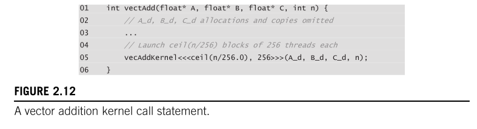
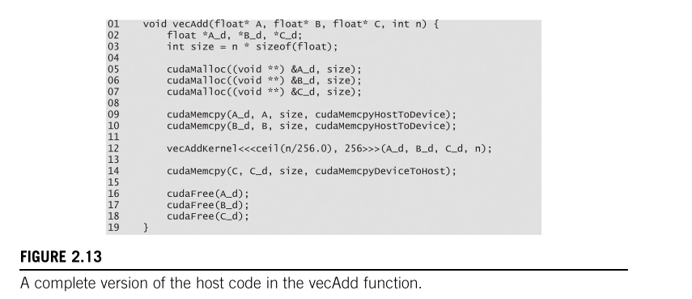

# 2.6 Calling Kernel Functions

Having implemented the kernel function (`vecAddKernel`) in the previous section ([§2.5](./2.5_Kernel_Functions_and_threading.md)), the remaining step is to **call that function from the host code** to actually launch the grid of threads on the GPU.

This section covers:

- The **kernel call syntax** (`<<<...>>>`)
- How to choose the **number of blocks**
- Why we need **ceiling division**
- The **complete host code** for `vecAdd`
- Why blocks can execute in **any order**
- Why the **same code runs faster on bigger GPUs** (transparent scalability)
- What **factors determine the block size** (the book's footnote #8 — fully answered here)

---

## 1. The Kernel Call Statement (Figure 2.12)



Here's the code from Figure 2.12:

```c
01  int vectAdd(float* A, float* B, float* C, int n) {
02      // A_d, B_d, C_d allocations and copies omitted
03      ...
04      // Launch ceil(n/256) blocks of 256 threads each
05      vecAddKernel<<<ceil(n/256.0), 256>>>(A_d, B_d, C_d, n);
06  }
```

Let's break this down piece by piece.

---

### 1.1 The `<<<...>>>` Syntax — Execution Configuration Parameters

The most important new thing in this line is the **triple angle brackets** `<<<...>>>`. This is NOT normal C/C++. This is a **CUDA-only extension** that the NVIDIA compiler (`nvcc`) understands.

The general form is:

```
kernelFunction<<<numberOfBlocks, threadsPerBlock>>>(arg1, arg2, ...);
```

- **First parameter** (before the comma): **Number of blocks** in the grid.
- **Second parameter** (after the comma): **Number of threads** in each block.
- After the `>>>`: The normal function arguments, passed exactly like in regular C.

So in our case:

```c
vecAddKernel<<<ceil(n/256.0), 256>>>(A_d, B_d, C_d, n);
```

| Part | Meaning |
| ------ | --------- |
| `vecAddKernel` | The kernel function we defined in [§2.5](./2.5_Kernel_Functions_and_threading.md) |
| `ceil(n/256.0)` | Number of blocks — calculated dynamically based on `n` |
| `256` | Number of threads per block — hardcoded to 256 |
| `(A_d, B_d, C_d, n)` | The regular function arguments — device pointers and the vector length |

> **In simple words:** "Hey GPU, launch this many blocks, put 256 threads in each block, and run the `vecAddKernel` function on all those threads. Here are the pointers to the data and the vector length."

---

### 1.2 Why `ceil(n/256.0)` — The Ceiling Division Deep-Dive

We need **at least `n` threads** to process all `n` elements of the vector. Since each block has 256 threads, the number of blocks we need is:

$$\text{number of blocks} = \lceil \frac{n}{256} \rceil$$

That `⌈...⌉` symbol means **ceiling** — always round UP to the nearest integer.

#### Why round UP and not DOWN?

Because if we round DOWN, we **lose elements**. Example:

| `n` | `n / 256` (exact) | Floor (round down) | Ceil (round up) | Threads with Floor | Threads with Ceil |
| ----- | -------------------- | -------------------- | ----------------- | -------------------- | -------------------- |
| 1000 | 3.906... | 3 | **4** | 768 ❌ (not enough for 1000) | **1024** ✅ |
| 512 | 2.0 | 2 | **2** | 512 ✅ | **512** ✅ |
| 257 | 1.003... | 1 | **2** | 256 ❌ (not enough for 257) | **512** ✅ |

With **floor** (rounding down), we'd only create 3 × 256 = 768 threads for 1000 elements. That means 232 elements go unprocessed! With **ceil** (rounding up), we create 4 × 256 = 1024 threads. The first 1000 threads do useful work, and the remaining 24 threads hit the `if (i < n)` boundary check (from [§2.5](./2.5_Kernel_Functions_and_threading.md)) and just do nothing. **Safe!**

---

### 1.3 The Integer Division Trap — Why `256.0` and NOT `256`

This is a **critical C programming pitfall** that the book warns about. Let me explain it very clearly.

#### The Rule in C/C++

In C (and C++, and CUDA C), **when you divide two integers, you get an integer result**. The C language does NOT round the result up or down in the way we'd normally think — it **truncates toward zero** (chops off the decimal part completely).

```c
int result = 1000 / 256;  // result = 3   (not 3.906, not 4 — just 3)
int result = 7 / 2;       // result = 3   (not 3.5, not 4 — just 3)
int result = 1 / 3;       // result = 0   (not 0.333... — just 0)
```

**It doesn't matter if the decimal part is 0.001 or 0.999 — it ALWAYS chops it off. It does NOT round.**

> **Misconception busted:** Some people think "if the decimal is 0.5 or above, it rounds up, and if below 0.5, it rounds down." **NO!** C integer division does NOT round at all. It just **truncates** — chops off the decimal part, always. `7/2` = `3`, not `4`. `999/1000` = `0`, not `1`.

#### So what happens if we use integer `256` instead of `256.0`?

```c
// BAD: Integer division
int blocks = ceil(n / 256);    // ← BROKEN!
```

**Step by step for `n = 1000`:**

1. `n / 256` → Both are integers → C does **integer division** → `1000 / 256 = 3` (the `.906` is chopped off BEFORE `ceil` ever sees it)
2. `ceil(3)` → `ceil` receives the integer `3` → `ceil(3) = 3`
3. Result: **3 blocks** → 768 threads → **NOT ENOUGH for 1000 elements!** ❌

The `ceil` function becomes **useless** here because the truncation already happened BEFORE `ceil` got to do its job. By the time `ceil` sees the value, it's already a flat integer. There's nothing to round up anymore.

```c
// GOOD: Floating-point division
int blocks = ceil(n / 256.0);  // ← CORRECT!
```

**Step by step for `n = 1000`:**

1. `n / 256.0` → One operand is `float`/`double` → C does **floating-point division** → `1000 / 256.0 = 3.90625`
2. `ceil(3.90625)` → `ceil` sees the fractional value → `ceil(3.90625) = 4`
3. Result: **4 blocks** → 1024 threads → **Enough for 1000 elements!** ✅

> **Key insight:** The `256.0` (with the `.0`) forces C to treat the division as a **floating-point operation**, which preserves the fractional part. Then `ceil()` can actually do its job and round it UP to the next integer.

#### The Alternative: Integer-Only Ceiling Division Formula

There IS a way to do ceiling division without using `ceil()` or floating-point at all. It's a classic C trick:

```c
int blocks = (n + 256 - 1) / 256;   // or equivalently: (n + 255) / 256
```

**How this works for `n = 1000`:**

1. `(1000 + 255) / 256 = 1255 / 256 = 4` (integer division truncates 4.902 → 4) ✅

**How this works for `n = 512` (an exact multiple):**

1. `(512 + 255) / 256 = 767 / 256 = 2` (integer division truncates 2.996 → 2) ✅ (correct, no rounding needed)

Both methods (`ceil(n/256.0)` and `(n + 255) / 256`) give the same answer. The book uses the `ceil()` approach because it's more readable. But in production CUDA code, you'll often see the integer trick because it avoids floating-point entirely.

---

## 2. Worked Example: `n = 1000`

The book walks through a concrete example. Let's trace it step by step:

1. We want to add two vectors of length **n = 1000**
2. We choose **256 threads per block** (the book's choice — we'll discuss WHY 256 later)
3. Number of blocks = `ceil(1000 / 256.0)` = `ceil(3.906...)` = **4 blocks**
4. Total threads launched = 4 × 256 = **1024 threads**
5. Thread `i = 0` processes element `A[0] + B[0] → C[0]`
6. Thread `i = 999` processes element `A[999] + B[999] → C[999]`
7. Threads `i = 1000` through `i = 1023` hit the `if (i < n)` check → `i < 1000` is **false** → they do **nothing**
8. Result: All 1000 elements processed correctly, 24 threads wasted (but that's fine — they cost almost nothing)

---

## 3. The Complete Host Code (Figure 2.13)



Here's the complete code from Figure 2.13:

```c
01  void vecAdd(float* A, float* B, float* C, int n) {
02      float *A_d, *B_d, *C_d;
03      int size = n * sizeof(float);
04
05      cudaMalloc((void **) &A_d, size);
06      cudaMalloc((void **) &B_d, size);
07      cudaMalloc((void **) &C_d, size);
08
09      cudaMemcpy(A_d, A, size, cudaMemcpyHostToDevice);
10      cudaMemcpy(B_d, B, size, cudaMemcpyHostToDevice);
11
12      vecAddKernel<<<ceil(n/256.0), 256>>>(A_d, B_d, C_d, n);
13
14      cudaMemcpy(C, C_d, size, cudaMemcpyDeviceToHost);
15
16      cudaFree(A_d);
17      cudaFree(B_d);
18      cudaFree(C_d);
19  }
```

This is the **final, complete** version of the `vecAdd` host function. It fills in the skeleton from Figure 2.5 ([§2.2](./2.2_CUDA_C_program_structure.md)). Let's walk through the entire flow:

### 3.1 The Complete Flow (Line by Line)

| Line | Code | What's happening |
| ------ | ------ | ------------------ |
| 01 | `void vecAdd(float* A, float* B, float* C, int n)` | Host function declaration. Takes 3 host pointers (A, B, C) and vector length `n`. Returns nothing (`void`). |
| 02 | `float *A_d, *B_d, *C_d;` | Declare 3 device pointers. The `_d` suffix = "this pointer will point to GPU memory." |
| 03 | `int size = n * sizeof(float);` | Calculate total bytes needed. Each `float` is 4 bytes. If `n = 1000`, then `size = 4000 bytes`. |
| 05–07 | `cudaMalloc(...)` ×3 | Allocate GPU memory for all three arrays. After this, `A_d`, `B_d`, `C_d` point to valid GPU memory. |
| 09–10 | `cudaMemcpy(..., HostToDevice)` ×2 | Copy input data `A` and `B` from CPU RAM → GPU global memory. Note: We do NOT copy `C` to the device — it will be computed there. |
| 12 | `vecAddKernel<<<ceil(n/256.0), 256>>>(...)` | **THE KERNEL LAUNCH!** This single line fires up thousands of GPU threads. The host code does NOT wait here — it continues immediately (the kernel runs asynchronously). |
| 14 | `cudaMemcpy(..., DeviceToHost)` | Copy the result `C_d` back from GPU → CPU RAM. This call DOES wait for the kernel to finish first (implicit synchronization). |
| 16–18 | `cudaFree(...)` ×3 | Free the GPU memory. Clean up, just like `free()` in regular C. |

### 3.2 The Complete Picture (Visual Summary)

```
CPU Side (Host)                              GPU Side (Device)
──────────────                               ──────────────────
A[] = {1.0, 2.0, 3.0, ...}                  
B[] = {4.0, 5.0, 6.0, ...}                  
C[] = {?, ?, ?, ...}                         
         │                                   
         ▼ cudaMalloc ×3                     
         │                           A_d[] = {empty}
         │                           B_d[] = {empty}
         │                           C_d[] = {empty}
         │                                   
         ▼ cudaMemcpy (HostToDevice) ×2      
         │─────────────────────────▶ A_d[] = {1.0, 2.0, 3.0, ...}
         │─────────────────────────▶ B_d[] = {4.0, 5.0, 6.0, ...}
         │                                   
         ▼ Kernel Launch <<<...>>>           
         │                           Thread 0: C_d[0] = A_d[0] + B_d[0] = 5.0
         │                           Thread 1: C_d[1] = A_d[1] + B_d[1] = 7.0
         │                           Thread 2: C_d[2] = A_d[2] + B_d[2] = 9.0
         │                           ...all threads run in parallel...
         │                                   
         ▼ cudaMemcpy (DeviceToHost)         
         │◀───────────────────────── C_d[] = {5.0, 7.0, 9.0, ...}
C[] = {5.0, 7.0, 9.0, ...}                  
         │                                   
         ▼ cudaFree ×3                       
                                     Memory freed!
```

---

## 4. "Note that all thread blocks operate on different parts of the vectors. They can be executed in any arbitrary order."

This line from the book is really important. Let me explain both parts.

### 4.1 "Thread blocks operate on different parts of the vectors"

Each block handles a **separate chunk** of the vector. No two blocks ever touch the same element. Here's why:

For `n = 1000` and 256 threads per block:

| Block # (`blockIdx.x`) | Thread range (`threadIdx.x`) | Global index `i = blockIdx.x * 256 + threadIdx.x` | Elements processed |
| ------------------------- | ------------------------------ | --------------------------------------------------- | -------------------- |
| Block 0 | 0 – 255 | 0 – 255 | `C[0]` through `C[255]` |
| Block 1 | 0 – 255 | 256 – 511 | `C[256]` through `C[511]` |
| Block 2 | 0 – 255 | 512 – 767 | `C[512]` through `C[767]` |
| Block 3 | 0 – 255 | 768 – 1023 | `C[768]` through `C[999]` (threads 1000–1023 do nothing) |

**Each block owns its own slice of the array.** Block 0 never touches `C[256]`, and Block 1 never touches `C[0]`. They are completely independent of each other.

### 4.2 "They can be executed in any arbitrary order"

This means the GPU is allowed to run:

- Block 0 first, then Block 1, then Block 2, then Block 3
- Block 3 first, then Block 0, then Block 2, then Block 1
- All 4 blocks at the same time (in parallel)
- Any other combination!

**Why is this allowed?** Because:

1. **No block depends on another block's result.** Block 2 doesn't need to read `C[255]` (which Block 0 computes). It only reads from `A` and `B` (which are inputs — nobody writes to them). Each block writes to its OWN slice of `C` only.

2. **There is NO synchronization between blocks.** Recall from [§2.5](./2.5_Kernel_Functions_and_threading.md) that there's no way for Block 0 to say "hey Block 1, wait until I'm done" (there's no `__syncthreads()` across blocks — that only works WITHIN a single block). Since they CAN'T communicate or wait for each other, the GPU is free to run them in whatever order it wants.

3. **This is by design.** NVIDIA designed CUDA this way on purpose. If blocks HAD to run in a specific order (like Block 0 → Block 1 → Block 2 → Block 3), then the GPU couldn't parallelize them. By making blocks independent, the GPU can run as many blocks simultaneously as it has resources for.

> **The programmer's responsibility:** When you write a CUDA kernel, you must NEVER assume that Block 0 finishes before Block 1 starts. You must NEVER have one block read data that another block writes. If your algorithm needs blocks to talk to each other, you need to split it into multiple kernel launches (each launch is a synchronization point).

---

## 5. "A small GPU may execute only one or two blocks in parallel. A larger GPU may execute 64 or 128 blocks in parallel."

This is the concept of **transparent scalability** — one of the most important design principles in CUDA. The book says they'll revisit it in Chapter 4, but let me explain it fully right now.

### 5.1 How Does the GPU Decide How Many Blocks to Run at Once?

The GPU is made up of multiple **Streaming Multiprocessors (SMs)**. Think of each SM as a mini-processor inside the GPU. The CUDA runtime system assigns blocks to SMs. Each SM can run **multiple blocks at the same time** (as long as it has enough resources).

Here's the key insight from Chapter 4 of this same book (§4.2, §4.3 — we'll create those docs when we get there):

> The CUDA runtime maintains a list of blocks that need to execute. It assigns blocks to SMs. When a block finishes on an SM, the runtime assigns a new block to that SM. This continues until all blocks in the grid have been executed.

**It's like a restaurant with tables:**

- The GPU = the restaurant
- SMs = the tables
- Blocks = groups of customers waiting to be seated
- The host/hostess (CUDA runtime) seats groups at whatever table is free
- When a group finishes eating and leaves, the next group in line gets that table
- A restaurant with MORE tables can serve MORE groups at the same time → finishes the queue faster

### 5.2 Real GPU Comparison — What Does "Smaller" and "Larger" Mean?

The key hardware spec that determines how many blocks a GPU can handle simultaneously is the **number of SMs** and the **resources per SM** (thread slots, registers, shared memory). Let me use real GPUs as examples:

| GPU | Architecture | SMs | Max Threads/SM | Max Blocks/SM | Max Simultaneous Threads | Max Simultaneous Blocks |
| ----- | ------------- | ----- | --------------- | -------------- | -------------------------- | ------------------------ |
| **GTX 1650** | Turing | **14** | 1024 | 16 | 14,336 | 224 |
| **RTX 3060** (our GPU!) | Ampere | **28** | 1536 | 16 | 43,008 | 448 |
| **RTX 4090** | Ada Lovelace | **128** | 1536 | 32 | 196,608 | 4,096 |
| **A100** (data center) | Ampere | **108** | 2048 | 32 | 221,184 | 3,456 |

> **Note:** "Max Simultaneous Blocks" = SMs × Max Blocks/SM. This is the theoretical maximum — the actual number depends on how many resources (registers, shared memory) each block uses.

### 5.3 Concrete Example: Same Code, Different Speed

Let's say we launch our `vecAddKernel` with `n = 100,000` (100K elements):

- Number of blocks = `ceil(100000 / 256)` = **391 blocks**
- Each block has 256 threads

**On a GTX 1650 (14 SMs):**

Each SM can hold multiple blocks. Let's say each SM can hold 4 blocks of 256 threads (that's 1024 threads per SM, which fits within the 1024 max). So the GPU can run **14 × 4 = 56 blocks simultaneously**.

- 391 blocks total, 56 blocks at a time
- It takes roughly `ceil(391/56)` = **7 "waves"** of execution to finish all blocks
- Each wave: 56 blocks run in parallel, then the next 56, then the next 56, ...

**On an RTX 4090 (128 SMs):**

Each SM can hold many more blocks. Let's say 6 blocks per SM. So the GPU can run **128 × 6 = 768 blocks simultaneously**.

- 391 blocks total, 768 blocks possible at a time
- **ALL 391 blocks can run at the same time in a single wave!** The GPU has MORE than enough capacity.
- Result: finishes in **1 wave** — massively faster!

```
GTX 1650 (14 SMs) — "smaller GPU":
Wave 1: [Block 0–55]    ████████████████████████████
Wave 2: [Block 56–111]  ████████████████████████████
Wave 3: [Block 112–167] ████████████████████████████
Wave 4: [Block 168–223] ████████████████████████████
Wave 5: [Block 224–279] ████████████████████████████
Wave 6: [Block 280–335] ████████████████████████████
Wave 7: [Block 336–390] ██████████████████░░░░░░░░░░
                         ↑ 7 waves total — SLOW

RTX 4090 (128 SMs) — "larger GPU":
Wave 1: [Block 0–390]   ████████████████████████████████████████████████
                         ↑ 1 wave — ALL blocks fit at once — FAST!
```

### 5.4 So the Answer to "How Come Same Code Runs Faster on Bigger GPUs?"

**The same code creates the same number of blocks and threads**. That doesn't change. What changes is:

1. **A bigger GPU has more SMs** → It can run more blocks simultaneously
2. **More blocks running at the same time** → The work finishes in fewer "waves"
3. **Fewer waves** → Less total time → **Faster**

The code doesn't know or care how many SMs the GPU has. It just says "here are 391 blocks, go." The GPU's hardware scheduler figures out how to run them on whatever SMs are available. **The programmer writes the code ONCE, and it automatically scales — fast on big GPUs, slower (but still correct) on small GPUs.**

This is what the book calls **transparent scalability**. "Transparent" because the programmer doesn't need to do anything special — it just happens. The same binary executable, no recompilation, no code changes.

> **From Chapter 4 (§4.3) of this book:**
> "The ability to execute the same application code on different hardware with different amounts of execution resources is referred to as transparent scalability, which reduces the burden on application developers and improves the usability of applications."

### 5.5 How to Calculate How Many Blocks Can Execute at Once on YOUR GPU

For our **RTX 3060** (28 SMs, Ampere CC 8.6):

| Resource | Limit per SM |
| ---------- | ------------- |
| Max threads per SM | 1,536 |
| Max blocks per SM | 16 |
| Max warps per SM | 48 |
| Registers per SM | 65,536 |
| Shared memory per SM | 100 KB |

For our `vecAddKernel` with 256 threads per block:

- Each block uses 256 threads = 8 warps
- Thread limit: `floor(1536 / 256)` = **6 blocks** (using 1536 of 1536 threads — 100% occupancy!)
- Block slot limit: 16 blocks per SM (not the bottleneck here)
- The bottleneck is threads: **6 blocks per SM**
- Across all 28 SMs: **6 × 28 = 168 blocks can run simultaneously**

So if we launch 391 blocks, it takes about `ceil(391/168)` ≈ **3 waves** on our RTX 3060. Not bad!

---

## 6. Footnote 8 — "The Block Size Should Be Determined by a Number of Factors"

The book uses 256 threads per block in this example and adds a footnote:

> ⁸ While we use an arbitrary block size 256 in this example, the block size should be determined by a number of factors that will be introduced later.

Let me pull ALL of those factors right now from later chapters of this same book (Chapter 4: Compute Architecture and Scheduling, and Chapter 5: Memory Architecture and Data Locality), so we don't have to wait.

### Factor 1: Maximum Threads Per Block (Hardware Limit)

The absolute maximum is **1024 threads per block** on all current NVIDIA GPUs. You simply cannot launch a block with more than 1024 threads. This is a hard hardware limitation.

So the block size must be: **1 ≤ blockSize ≤ 1024**

### Factor 2: Warp Size — Must Be a Multiple of 32

Every block is divided into **warps** of 32 threads. If your block size is NOT a multiple of 32, the last warp gets padded with inactive threads that waste hardware resources.

Example:

- Block of 256 threads → 8 warps of 32 → perfect, no waste ✅
- Block of 48 threads → 1 full warp (32) + 1 partial warp (16 active + 16 inactive) → 33% waste ❌
- Block of 100 threads → 3 full warps (96) + 1 partial warp (4 active + 28 inactive) → 22% waste ❌

**Rule of thumb: ALWAYS use block sizes that are multiples of 32.** Common choices: 32, 64, 128, 256, 512, 1024.

### Factor 3: Occupancy — Fitting Blocks into SM Thread Slots

This is the BIG one, explained in detail in Chapter 4 (§4.7) of the book (we'll document that chapter later). Here's the idea:

Each SM has a **fixed number of thread slots**. For the Ampere A100, it's **2048 thread slots per SM**. The SM dynamically partitions these slots among whatever blocks are assigned to it.

| Block Size | Blocks that Fit per SM (2048 slots) | Threads Used | Occupancy |
| ----------- | -------------------------------------- | ------------- | ----------- |
| 1024 | 2 blocks | 2048 | **100%** ✅ |
| 512 | 4 blocks | 2048 | **100%** ✅ |
| 256 | 8 blocks | 2048 | **100%** ✅ |
| 128 | 16 blocks | 2048 | **100%** ✅ |
| 64 | 32 blocks | 2048 | **100%** ✅ |
| 32 | 32 blocks (hit max block limit!) | 1024 | **50%** ❌ |
| 768 | 2 blocks (768×3=2304 > 2048) | 1536 | **75%** ❌ |

**Wait, why does block size 32 give only 50%?**

Because the A100 has a **maximum of 32 block slots per SM**. With 32-thread blocks, you'd need 64 blocks to fill 2048 thread slots, but the SM only has 32 block slots. So only 32 × 32 = 1024 threads can run, leaving 1024 thread slots empty.

**And why does 768 give only 75%?**

Because 768 × 3 = 2304, which exceeds 2048. So only 2 blocks of 768 can fit = 1536 threads. The remaining 512 thread slots are wasted. Neither the thread limit NOR the block limit is fully used — the block size just doesn't divide evenly into the thread slots.

> **From the book (Chapter 4):** "Dynamic partitioning of resources can lead to subtle interactions between resource limitations, which can cause underutilization of resources."

### Factor 4: Register Usage Per Thread

Every thread in a kernel uses some **registers** (fast on-chip memory for local variables). The SM has a **fixed pool of registers** shared among all threads.

For the Ampere A100:

- 65,536 registers per SM
- 2048 max threads per SM
- If each thread uses ≤ 32 registers → all 2048 threads can fit → 100% occupancy ✅
- If each thread uses 64 registers → only 65,536 / 64 = 1024 threads can fit → 50% occupancy ❌

**The more registers your kernel uses per thread, the fewer threads can run simultaneously on an SM.**

The book gives a concrete example (Chapter 4):

> "Assume that a programmer implements a kernel that uses 31 registers per thread and configures it with 512 threads per block. The SM will have 4 blocks running simultaneously (2048 threads × 31 registers = 63,488 registers — under the 65,536 limit). Now assume the programmer declares two more automatic variables, bumping to 33 registers per thread. Now 2048 threads × 33 = 67,584 registers — EXCEEDS the limit! The runtime reduces to 3 blocks (1536 threads × 33 = 50,688 registers). Occupancy drops from 100% to 75%."

This is what the book calls a **"performance cliff"** — a tiny increase in register usage causes a big drop in occupancy and performance.

### Factor 5: Shared Memory Usage Per Block

Each SM also has a limited amount of **shared memory** (fast on-chip memory shared among all threads in a block). If each block uses a lot of shared memory, fewer blocks can fit on the SM.

For example, if an SM has 100 KB of shared memory:

- If each block uses 25 KB → 4 blocks can fit
- If each block uses 50 KB → 2 blocks can fit
- If each block uses 70 KB → only 1 block can fit

(This factor is covered in Chapter 5: Memory Architecture and Data Locality.)

### Factor 6: The Nature of Your Algorithm

Sometimes the algorithm itself determines the ideal block size:

- For **matrix operations**: Block sizes of 16×16 = 256 or 32×32 = 1024 are common because they align with tile sizes for shared memory optimization
- For **reduction operations** (summing all elements): Larger block sizes (256, 512, 1024) are better because they reduce the number of blocks and inter-block communication
- For **simple element-wise operations** (like our vector addition): Almost any multiple of 32 works fine

### Summary: All Factors That Determine Block Size

| Factor | Rule | Where in the Book |
| -------- | ------ | ------------------- |
| Hardware max | ≤ 1024 threads per block | Chapter 4 |
| Warp alignment | Must be a multiple of 32 | Chapter 4 (§4.4) |
| SM thread slots | Block size should divide evenly into max threads/SM | Chapter 4 (§4.7) |
| SM block slots | Too-small blocks hit the max block slot limit | Chapter 4 (§4.7) |
| Register pressure | More registers per thread → fewer threads → lower occupancy | Chapter 4 (§4.7) |
| Shared memory | More shared mem per block → fewer blocks per SM | Chapter 5 |
| Algorithm needs | Tile sizes, reduction trees, etc. | Throughout |

> **Practical advice:** For simple kernels like `vecAddKernel`, **256** is a solid default choice. It's a multiple of 32, it divides evenly into most SM thread slot counts, and it provides good occupancy without being so large that register pressure becomes an issue. That's why the book picks 256 — it's not "arbitrary" so much as "a safe, sensible default."
> NVIDIA also provides the **CUDA Occupancy Calculator** — a tool that takes your kernel's register usage, shared memory usage, and block size, and tells you the exact occupancy you'll achieve on a specific GPU. The book recommends using this tool for real-world optimization.
>
> *(For an even deeper dive into these tradeoffs, check out our [hardware_clarity.md](../../hardware_clarity.md) document which contains a section on **"Occupancy and The Tightest Limit: 10 Comprehensive Examples"** that breaks down how blocks, grids, threads, SMs, registers, and shared memory all interplay.)*

---

## 7. The Overhead Warning — Vector Addition is "Too Simple"

The book ends this section with a really important warning:

> "In practice, the overhead of allocating device memory, input data transfer from host to device, output data transfer from device to host, and deallocating device memory will likely make the resulting code **slower** than the original sequential code."

**Wait — the GPU code is SLOWER than the CPU code?!**

Yes, for vector addition specifically. Here's why:

### 7.1 The Compute-to-Transfer Ratio

For vector addition, each element requires:

- **2 reads** (one from `A`, one from `B`)
- **1 write** (to `C`)
- **1 addition** (that's it — just a single `+` operation)

So we transfer **3 floats (12 bytes)** of data for just **1 floating-point operation**. That's a terrible ratio! The time to transfer the data across the PCIe bus (between CPU and GPU) FAR exceeds the time to just do the addition on the CPU.

```
CPU version:
  for(i = 0; i < n; i++)
      C[i] = A[i] + B[i];     ← All in CPU memory, no transfers needed
                                  Just loop and add. Done.

GPU version:
  cudaMalloc × 3               ← Overhead: allocate GPU memory
  cudaMemcpy × 2               ← Overhead: copy A and B across PCIe bus (SLOW!)
  kernel<<<...>>>               ← The actual addition (FAST on GPU!)
  cudaMemcpy × 1               ← Overhead: copy C back across PCIe bus (SLOW!)
  cudaFree × 3                 ← Overhead: free GPU memory
```

The kernel itself (the actual addition) finishes almost instantly on the GPU. But the data transfers (PCIe bus: ~16 GB/s on PCIe 3.0, ~32 GB/s on PCIe 4.0) dominate the total time. The GPU can't show its advantage because there isn't enough computation to justify the transfer overhead.

### 7.2 When Does the GPU Actually Win?

The GPU wins when:

1. **There's LOTS of computation per data element** — Like matrix multiplication, where each element of the output requires `n` multiplications and additions, but only `n` input values. The compute-to-transfer ratio is much higher.

2. **Data stays on the GPU across multiple kernel launches** — In real applications, you load data to the GPU ONCE and then run many kernels on it. The transfer overhead is **amortized** (spread out) over many operations. For example, in deep learning, the weights stay on the GPU for thousands of iterations.

3. **The problem is massively parallel** — Millions or billions of independent operations that can run simultaneously.

> **Bottom line:** Vector addition is used in this chapter for its SIMPLICITY, not because it's a good use case for GPUs. The real power of CUDA will become clear when we tackle more compute-intensive problems like matrix multiplication, convolution, and stencil computations in later chapters.

---

## 8. Quick Reference Summary

| Concept | Key Point |
| --------- | ----------- |
| Kernel call syntax | `kernel<<<numBlocks, threadsPerBlock>>>(args)` |
| First config param | Number of blocks in the grid |
| Second config param | Number of threads per block |
| Ceiling division | `ceil(n/256.0)` — the `.0` is critical! |
| Integer division trap | `n/256` truncates in C — `ceil` becomes useless on an already-integer value |
| Integer ceiling trick | `(n + 255) / 256` — works without floating-point |
| Block independence | Blocks operate on different data, no inter-block communication |
| Execution order | Arbitrary — programmer must NOT assume any ordering |
| Transparent scalability | Same code auto-scales: more SMs → more parallel blocks → faster |
| Block size of 256 | A sensible default; real choice depends on warp size, occupancy, registers, shared memory, algorithm |
| Overhead warning | Vector addition is too simple — transfers dominate; real apps do more computation per element |
