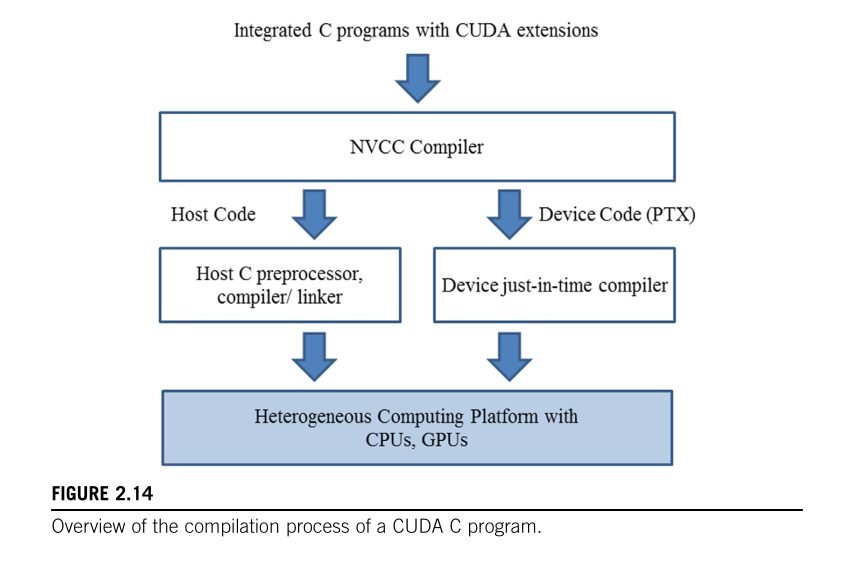

# 2.7 Compilation

> **Reference:** PMPP Chapter 2, Section 2.7  
> **Key Concepts:** NVCC (Compiler Driver), Host Code vs Device Code separation, PTX (intermediate code), SASS (machine binary), Fatbinary, Just-In-Time (JIT) Compilation, Forward Compatibility.

---

## 1. Why Can't We Use `gcc` or `g++` for CUDA Code?

We have been using CUDA-specific extensions that are **not** part of standard C or C++:
- `__global__` keyword
- `<<<numBlocks, threadsPerBlock>>>` kernel launch syntax
- `threadIdx.x`, `blockIdx.x` built-in variables
- CUDA API calls like `cudaMalloc`, `cudaMemcpy`, `cudaFree`

If you try to compile a `.cu` file with a normal C compiler like `gcc`, it will spit out a bunch of syntax errors because it has absolutely no idea what `<<<...>>>` or `__global__` means. These are NVIDIA inventions, not part of the C language standard.

So we need a special compiler: **`nvcc`** (NVIDIA CUDA Compiler).

---

## 2. What is `nvcc`? (It's a "Compiler Driver", Not Just a Compiler)

You might think `nvcc` is just a single compiler like `gcc`. But it's actually a **Compiler Driver** — meaning it's more like a **manager** that coordinates multiple compilers under the hood.

Here's what `nvcc` does when you run `nvcc program.cu -o program`:

Because a `.cu` file contains a **mix** of Host Code (CPU code) and Device Code (GPU code), `nvcc` **separates** them into two independent paths:

1. **Host Code Path:** `nvcc` strips out all the GPU stuff (`__global__`, `<<<...>>>`, etc.) and sends the remaining pure C/C++ code to your system's **normal host compiler** (like `gcc` on Linux or `MSVC` on Windows). This host compiler does the usual preprocessing → compiling → linking stages and produces normal CPU object files.

2. **Device Code Path:** The GPU-specific code (kernels, device functions) is sent through NVIDIA's **own proprietary compilation pipeline**. This is where PTX and SASS come in (explained below).

Both paths produce their outputs, and `nvcc` **bundles everything together** into one single final executable.

### Figure 2.14 — Overview of the Compilation Process



**Reading the diagram:**
- At the top: Your integrated `.cu` source code goes into `nvcc`.
- `nvcc` splits it into two streams:
  - **Left:** Host Code → goes to the normal Host C preprocessor, compiler, and linker.
  - **Right:** Device Code → gets compiled into PTX → then goes to the "Device just-in-time compiler."
- Both streams merge at the bottom into the heterogeneous computing platform (CPU + GPU).

---

## 3. PTX vs. SASS — The Two Levels of Device Code

This is the **critical** distinction that explains everything about JIT compilation and forward compatibility.

### 3.1 What is PTX? (Parallel Thread Execution)

PTX is **intermediate code** — a pseudo-assembly language designed by NVIDIA. It is human-readable (you can open it in a text editor). But most importantly: **the actual GPU hardware CANNOT understand or execute PTX directly.**

Think of it like this:
- *Analogy:* PTX is exactly like **Java Bytecode** (`.class` files). Java source code gets compiled into bytecode, but bytecode doesn't run directly on any CPU. It needs the JVM (Java Virtual Machine) to translate it into real machine code first.
- Same idea: CUDA source code gets compiled into PTX, but PTX doesn't run directly on any GPU. It needs one more compilation step to turn it into real machine code.

### 3.2 What is SASS? (Streaming ASSembler)

SASS is the **actual binary machine code** that the GPU hardware executes directly. SASS is the final product — the real 1s and 0s that the GPU's silicon understands.

**Critical fact:** SASS is tied to a **very specific** GPU architecture.
- SASS compiled for Ampere (`sm_86`, like our RTX 3060) contains instructions that are physically different from SASS for Turing (`sm_75`, like an RTX 2060) or Ada Lovelace (`sm_89`, like an RTX 4090).
- Different GPU generations have different physical instruction sets (ISA). The actual binary patterns for "add two numbers" or "load from memory" are literally different bit sequences on different architectures.

---

## 4. The "Fatbinary" — One Executable, Multiple Code Formats Inside

When you compile with `nvcc`, the final executable is **not** a simple binary like what `gcc` produces. It is a **"Fatbinary"** — a single executable file that contains **both** SASS (real machine code) **and** PTX (intermediate code) bundled together inside it.

You do NOT need separate `.ptx` files or `.sass` files sitting around on disk. Everything is packed into that one executable.

### Proof: Inspecting a Fatbinary with `cuobjdump`

NVIDIA provides a tool called `cuobjdump` that lets you peek inside a compiled CUDA executable to see exactly what's bundled in there.

```bash
# Compile a simple CUDA program
$ nvcc test.cu -o test

# Look inside the executable — find the PTX (intermediate code)
$ cuobjdump -ptx test

Fatbin ptx code:
================
arch = sm_86   <-- Architecture target
code version = [7,4]
...
.visible .entry _Z9my_kernelv(
)
{
        .reg .b32       %r<2>;
        mov.u32         %r1, %tid.x;  <-- PTX instruction (human-readable!)
        ret;
}
```

```bash
# Look inside the same executable — find the SASS (real machine binary)
$ cuobjdump -sass test

Fatbin elf code:
================
arch = sm_86
...
        /*0000*/                   MOV R1, c[0x0][0x28] ;    <-- SASS machine code
        /*0010*/                   S2R R0, SR_TID.X ;        <-- SASS machine code
        /*0020*/                   EXIT ;
```

**Both PTX and SASS are right there inside the same executable file!**

---

## 5. Doubt: "What Does 'Just-In-Time (JIT) Compiler' Mean?"

### 5.1 The Original Doubt

The book's Figure 2.14 shows a box labeled **"Device just-in-time compiler"** on the right side. And the book says:

> *"These PTX files are further compiled by a runtime component of NVCC into the real object files and executed on a CUDA-capable GPU device"*

This raised a very natural question: *"What does 'just-in-time' mean here? Is it like Python where code runs without compiling first? Because with `nvcc` we compile first and THEN run, just like `gcc`, right?"*

### 5.2 The Answer: JIT Is NOT Like Python

**You are absolutely correct** — it is NOT like Python. Python is *interpreted* line-by-line. CUDA JIT is a **true, full compilation step** that produces real machine binary (SASS). The only difference between JIT and normal compilation is **WHEN** the compilation happens:

- **Ahead-Of-Time (AOT) compilation** = You run `nvcc` on your terminal. It compiles everything into SASS right then and there. Done at compile time.
- **Just-In-Time (JIT) compilation** = The CUDA **Driver** (not `nvcc`!) compiles PTX into SASS at **runtime**, right before the kernel is about to execute on the GPU.

### 5.3 Correcting the Book's Wording

The book says *"a runtime component of NVCC"* — this is slightly misleading. It is NOT `nvcc` doing the JIT compilation. `nvcc` is only involved at compile time. Once `nvcc` produces the fatbinary, its job is **done forever**. It is never called again.

The JIT compilation at runtime is done by the **CUDA Driver** (`libcuda.so` on Linux) — a completely separate piece of software that is part of your GPU driver installation, not part of the CUDA Toolkit's compiler.

---

## 6. Doubt: "The Book Says Compilation Happens at Runtime — But We Compile First Like `gcc`, Right?"

### 6.1 The Original Doubt

*"Like it's telling like in runtime itself compilation will happen, object files will be created and then ran in runtime itself. But bro, `nvcc` is like C and C++ compilers right? Like first we compile and generate object files like SASS code and then it will be run or executed using `./program`, right?"*

### 6.2 The Answer: Both Are True — Here's How

Yes, you are correct — normally `nvcc` compiles everything at compile time, just like `gcc`. But **both** things can happen:

**Normal case (Ahead-Of-Time):**
You run `nvcc program.cu -o program`. It generates SASS for your specific GPU (say, `sm_86` for your RTX 3060). When you run `./program`, the CUDA Driver finds the SASS, sees it matches your GPU, loads it directly, and runs it. **Zero JIT happens.** This is exactly like `gcc`.

**JIT case (Forward Compatibility fallback):**
You take that exact same `program` executable and try to run it on a brand-new GPU that didn't exist when you compiled the code. The CUDA Driver looks inside the executable, finds the SASS, and says *"This SASS is for sm_86 (RTX 3060), but this machine has sm_120 (some future GPU). I can't use this SASS."* Instead of crashing, it finds the PTX code (also bundled in the same executable), **JIT-compiles the PTX into new SASS for the new GPU right at that moment**, caches it (at `~/.nv/ComputeCache`), and runs it.

### 6.3 The Clear Picture — Compile Time vs. Runtime

```
Compile time (you do this once):
   nvcc program.cu -o program
   └── nvcc generates fatbinary containing SASS + PTX
   └── nvcc's job is DONE. It is never called again.

Runtime (every time you run it):
   ./program
   └── CUDA Driver checks: "Does the SASS match this GPU?"
       ├── YES → Load SASS directly, run it. Done.
       └── NO  → Take PTX, JIT-compile to new SASS, run it.
```

**Key takeaway:** In the normal everyday case (you compile on your machine and run on the same machine), JIT never happens. JIT is a **fallback mechanism** for when the pre-compiled SASS doesn't match the GPU you're running on.

---

## 7. Doubt: "Can Old Code Run on New GPUs? Can New Code Run on Old GPUs?"

### 7.1 First, Let's Get the Terminology Right — Forward vs. Backward Compatibility

These terms can be confusing because they can be viewed from two different angles: **the hardware's perspective** and **the software's perspective**. Let's define them clearly so we don't mix them up.

**From the Hardware's perspective:**

| Term | Meaning | Example |
|------|---------|---------|
| **Hardware Backward Compatibility** | **NEW hardware** can run **OLD software** | A 2026 Intel CPU running a `.exe` compiled in 2005. The new CPU is built to still understand the old instructions. |
| **Hardware Forward Compatibility** | **OLD hardware** can run **NEW software** | Almost never works. Old hardware doesn't have the physical circuits for new instructions. |

**From the Software's perspective:**

| Term | Meaning | Example |
|------|---------|---------|
| **Software Forward Compatibility** | **OLD software** can run on **NEW hardware/environment** | A program compiled in 2020 still works when you upgrade to a 2026 GPU. The old code adapts to the new environment. |
| **Software Backward Compatibility** | **NEW software** can run on **OLD hardware/environment** | A program compiled with the latest toolkit still works on an older GPU. The new code is designed to work on older environments. |

**The key GPU vs CPU difference:**

CPUs (like Intel x86) have **hardware backward compatibility** — a 2026 CPU can still understand instructions from a 2005 CPU because Intel deliberately keeps the old instruction set working in every new generation.

GPUs **DO NOT** have hardware backward compatibility for SASS. NVIDIA changes the physical Instruction Set Architecture (ISA) between GPU generations. The actual binary patterns (the 1s and 0s) that represent instructions on an Ampere GPU are literally different bit sequences than on a Turing GPU or Ada Lovelace GPU. A new GPU does NOT understand old SASS, and an old GPU does NOT understand new SASS.

### 7.2 The Compatibility Rules for SASS (Machine Binary)

Since NVIDIA changes the ISA between GPU generations, SASS fails in **both** directions:

| Scenario | What Happens | Works? | Why? |
|----------|-------------|--------|------|
| Old SASS (RTX 3060, Ampere) on New GPU (RTX 5090, Blackwell) | New GPU doesn't understand old SASS instructions | ❌ **Fails** | No hardware backward compatibility — new GPU has a different ISA |
| New SASS (RTX 5090, Blackwell) on Old GPU (RTX 3060, Ampere) | Old GPU doesn't understand new SASS instructions | ❌ **Fails** | No hardware forward compatibility — old GPU lacks the new physical circuits |

**SASS fails in BOTH directions.** This is completely unlike CPUs where old binaries run on new hardware.

### 7.3 The Compatibility Rules for PTX (Intermediate Code)

PTX is where the magic of **software forward compatibility** happens:

| Scenario | What Happens | Works? | Type of Compatibility |
|----------|-------------|--------|-----------------------|
| Old PTX on New GPU | CUDA Driver JIT-compiles old PTX into new SASS for the new GPU | ✅ **Works!** | **Software Forward Compatibility** — old code runs on new hardware |
| New PTX on Old GPU | PTX references hardware features that don't physically exist on the old GPU | ❌ **Fails** | No software backward compatibility — new code needs features the old GPU doesn't have |

**This is the entire reason PTX exists!** Since SASS breaks across generations, NVIDIA needed a "universal bridge" format. Old PTX can always be JIT-compiled into whatever the new GPU needs. But new PTX cannot run on old GPUs because the new PTX might reference hardware features (like newer Tensor Core instructions) that simply do not physically exist on the older GPU.

### 7.4 The Complete Compatibility Picture

Here is every combination in one table:

| Code Type | Direction | Works? | Mechanism |
|-----------|-----------|--------|-----------|
| Old SASS → New GPU | Forward | ❌ | Different ISA, new GPU can't read old binary |
| New SASS → Old GPU | Backward | ❌ | Different ISA, old GPU can't read new binary |
| Old PTX → New GPU | Forward | ✅ | CUDA Driver JIT-compiles PTX into new SASS |
| New PTX → Old GPU | Backward | ❌ | Old GPU lacks physical hardware features the new PTX expects |

**Bottom line:** The ONLY working combination is **old PTX on a new GPU**, and that only works because the CUDA Driver acts as a JIT compiler bridge between the old intermediate code and the new hardware.

### 7.5 Why the Fatbinary Contains Both

Now it makes perfect sense why `nvcc` bundles both SASS **and** PTX into the fatbinary:

- **SASS** = For maximum performance RIGHT NOW on the exact GPU you compiled for. No JIT overhead, runs instantly.
- **PTX** = A "backup plan" for the future (software forward compatibility). If someone runs your program on a GPU that didn't exist when you compiled it, the CUDA Driver can JIT-compile the PTX into new SASS for that future GPU.

### 7.6 So Who Provides Forward Compatibility — `nvcc` or the CUDA Driver?

It is the **CUDA Driver** (installed on the system where you **run** the program) that provides forward compatibility. Not `nvcc`. `nvcc` just did its job at compile time — it generated the fatbinary with both SASS and PTX inside.

At runtime, it's the CUDA Driver that:
1. Opens the fatbinary
2. Checks if the bundled SASS matches the current GPU
3. If not, takes the PTX and JIT-compiles it into new SASS
4. Caches the result (at `~/.nv/ComputeCache`) so it doesn't have to JIT again next time
5. Runs the new SASS on the GPU

As long as the machine you're running on has a **newer CUDA Driver** installed, it can JIT-compile old PTX for the new GPU.

---

## 8. Quick Reference Summary

| Concept | Key Point |
|---------|-----------|
| Why `nvcc`? | Normal C compilers (`gcc`) can't understand CUDA extensions (`__global__`, `<<<...>>>`) |
| `nvcc` role | Compiler Driver — splits code into Host path (→ `gcc`) and Device path (→ NVIDIA pipeline) |
| PTX | Intermediate code (like Java Bytecode). GPU cannot execute it directly |
| SASS | Real machine binary. GPU executes this directly. Architecture-specific |
| Fatbinary | The final executable contains BOTH SASS and PTX bundled together |
| JIT compiler | The **CUDA Driver** (not `nvcc`!) that compiles PTX → SASS at runtime if needed |
| JIT vs Python | JIT is NOT interpretation. It is a full compilation step that produces real binary |
| When JIT happens | Only when the pre-compiled SASS doesn't match the current GPU (fallback!) |
| Hardware Backward Compat | NEW hardware runs OLD software. CPUs have it. GPUs do NOT (for SASS) |
| Hardware Forward Compat | OLD hardware runs NEW software. Almost never works (missing physical circuits) |
| Software Forward Compat | OLD software runs on NEW hardware. ✅ PTX enables this via JIT! |
| Software Backward Compat | NEW software runs on OLD hardware. ❌ Fails (old GPU lacks new features) |
| Old SASS on New GPU | ❌ Fails (different ISA) |
| New SASS on Old GPU | ❌ Fails (different ISA) |
| Old PTX on New GPU | ✅ Works (CUDA Driver JIT-compiles it) |
| New PTX on Old GPU | ❌ Fails (missing hardware features) |
| Forward Compatibility | Provided by CUDA Driver + PTX, not by `nvcc` |
